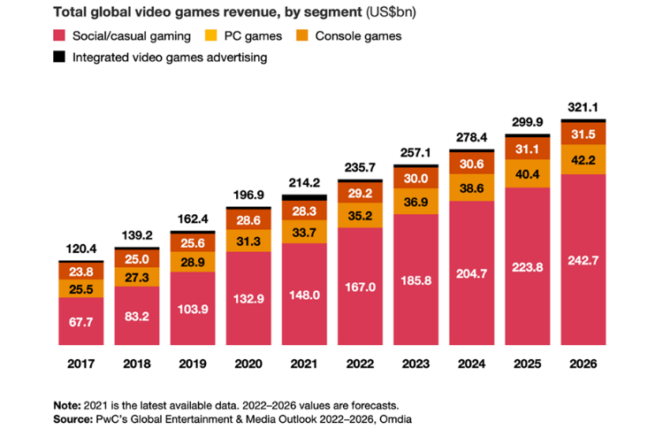

# 1.1 Problem Identification

## Growing Success of the Gaming Industry

Video games have become more popular than ever. In 2020 a survey of U.S adults showed 64% play video games - that's more than 214 million people in the U.S who play video games one hour or more per week. Video games have become a natural part of people's lives: 75% of U.S households have at least one gamer.  [(Fitzgerald, 2020)](../5-references/reference-list.md)

This popularity is reflected clearly in retail success. In 2021 alone, the global 'games market' had $180bn in revenue, making gaming bigger than Hollywood and the music industry combined. [(Patience, 2022)](../5-references/reference-list.md) The growth of the gaming industry is expected to continue and is forecast to be worth $321 billion by 2026. [(Read, 2022)](../5-references/reference-list.md)

<figure><figcaption>
Past and projected growth of the video game industry <a href="../5-references/reference-list.md#problem-identification">(Read, 2022)</a>
</figcaption></figure>

## The Impact of Lockdowns on Video Games

During the pandemic, many people began playing video games more frequently. This can likely be attributed to people spending more time at home. Many individuals turned to video games to avoid boredom, to socialise, or as a way to escape the stresses of the real world. [(Farokhmanesh, 2021)](../5-references/reference-list.md) A whopping 82% of global consumers played video game content during the height of COVID-19 lockdowns. [(Nielsen, 2020)](../5-references/reference-list.md)

Overall, the global time spent on video gaming increased by 39% during the COVID-19 pandemic. [(Clement, 2021)](../5-references/reference-list.md) This spike in video game consumption looks to have been sustained after the pandemic, with 9 out of 10 gamers playing the same amount or more than during the pandemic's peak. [(Entertainment Software Association, 2022)](../5-references/reference-list.md)&#x20;

<figure><figcaption>
% of UK adults who reported to having played a video game on any device. <a href="../5-references/reference-list.md">(Clement, 2023)</a>
</figcaption></figure>

A study [(Barr and Copeland-Stewart, 2021)](../5-references/reference-list.md) surveying 781 gamers during the pandemic found that time spent on video gaming increased for 71% of respondents.

<figure><figcaption>
Pre-outbreak gameplay habits
</figcaption></figure>

<figure><figcaption>
Post-outbreak gameplay habits
</figcaption></figure>

The above graphs show respondents’ gameplay habits before and after the COVID-19 outbreak, demonstrating a clear increase in the frequency of play. For example, 10.5% of respondents reported playing video games several times a day before the pandemic, which increased to 40% during the pandemic. Similarly, 5.4% of respondents stated they rarely played games before the outbreak, a figure that dropped to a mere 0.4% after the outbreak. [(Barr and Copeland-Stewart, 2021)](../5-references/reference-list.md)

## Cognitive Benefits of Video Games

Gaming often receives bad publicity because media coverage tends to focus on the minority of gamers who play to such an extent that it compromises other areas of their life (a 'gaming disorder'). However, millions of gamers play every day and many do so for the positives gaming brings. [(Griffiths, 2020)](../5-references/reference-list.md) Various studies have shown that cognitive skills such as perception, attentional control, and decision-making improve when subjects are trained with video games. [(Reynaldo et al., 2021)](../5-references/reference-list.md)

A study of nearly 2,000 children ages 9-10 found that those who reported playing video games for three hours per day or more performed better on cognitive skills tests involving impulse control and working memory compared to children who had never played video games. [(National Institutes of Health, 2022)](../5-references/reference-list.md) Furthermore, action games in particular have been shown to improve players' perceptual decision-making [(Green et al., 2010)](../5-references/reference-list.md) and their ability to recall visually presented information. [(Sungur and Boduroglu, 2012)](../5-references/reference-list.md)

Additionally, commercial video games have been shown to alleviate symptoms of depression and anxiety [(Kowal et al., 2021)](../5-references/reference-list.md) and improve well-being in individuals. [(Halbrook et al., 2019)](../5-references/reference-list.md) Playing video games also helps people build emotional resilience by learning how to deal with failure and can relieve stress and improve mood. [(Brennan, 2021)](../5-references/reference-list.md)
