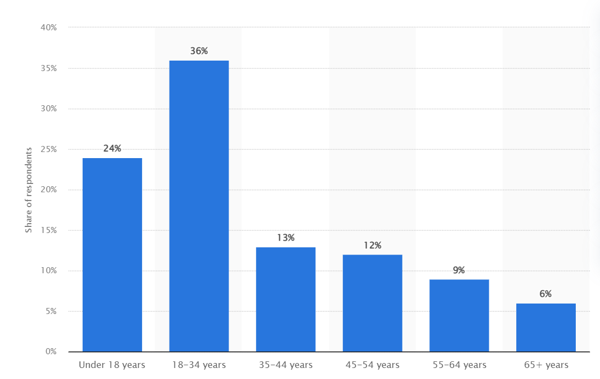
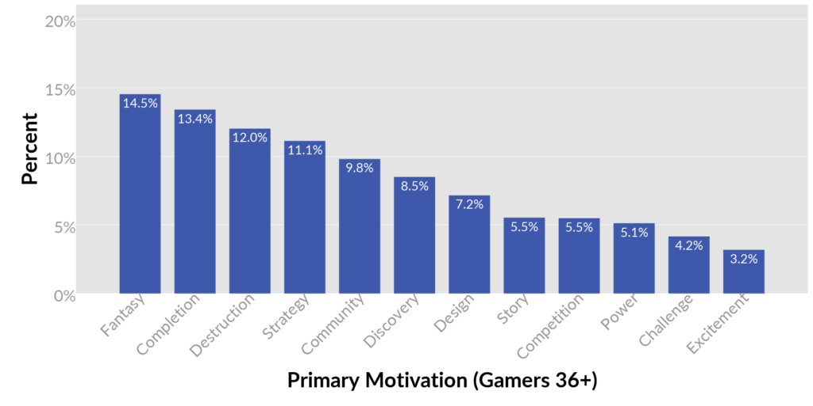
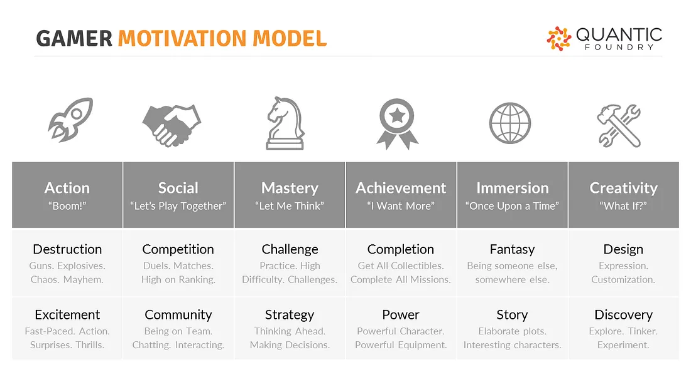
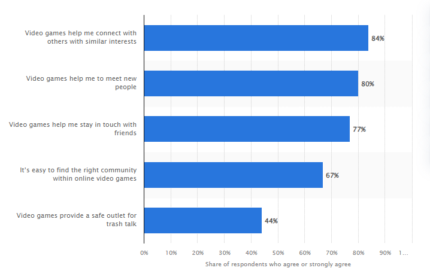
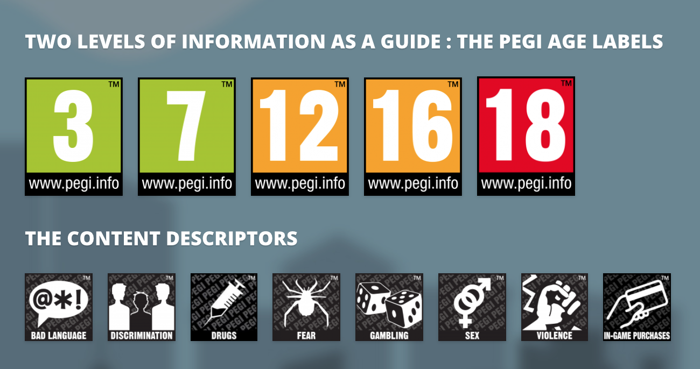

# 1.2 Stakeholders

## Who is the average gamer?

There are over 3 billion active video game players across the globe. [(Howarth, 2022)](../5-references/reference-list.md#1.2-stakeholders) However, the media portrays video gamers as stereotypically male and young. [(Williams et al., 2008)](../5-references/reference-list.md#1.2-stakeholders) The average gamer is very different. Three-quarters of video game players are over the age of 18 and the average age is 33. [(Entertainment Software Association, 2022)](../5-references/reference-list.md#1.2-stakeholders) 48% of people who play video games identify as female and 29% of gamers are people of colour. ([Rousseau, 2022](../5-references/reference-list.md#1.2-stakeholders)) To maximize the potential audience for a video game, you should consider the diversity of the consumer base to create a product that appeals to the widest possible range of potential customers.

<figure><figcaption>
Distribution of U.S gamers by age <a href="../5-references/reference-list.md#1.2-stakeholders">(Clement, 2022)</a>
</figcaption></figure>

## What is the motivation to play video games?

A survey conducted in 2019 assessed the "gamer motivation" of over 400,000 gamers. The survey found that for gamers over the age of 36, the most common primary motivations for playing video games tend to be _fantasy_ and _completion_, while the least common are _excitement_ and _challenge_. Gamers who score highly for the _fantasy_ motivation enjoy being immersed in the game world and lore. Meanwhile, gamers scoring highly for the _completion_ motivation are driven by quantifiable rewards that demonstrate clear progress. [(Yee, 2019)](../5-references/reference-list.md#1.2-stakeholders)

<figure><figcaption>
Fantasy and completion are the most popular motivations for 36+ year-olds. Destruction and strategy also score highly. <a href="../5-references/reference-list.md#1.2-stakeholders">(Yee, 2019)</a>
</figcaption></figure>

The _completion_ motivation is not only popular amongst older gamers but also across all age ranges and irrespective of sex. [(Yee, 2019)](../5-references/reference-list.md#1.2-stakeholders) Therefore, it is important for games to include completionist features in order to satisfy a wide range of consumers. For example, in-game achievements can help drive player engagement because many gamers find pleasure in fully completing a game. However if not done correctly, this can feel monotonous and boring if the player is forced to complete repetitive tasks for the sake of game completion. [(Hon, 2022)](../5-references/reference-list.md#1.2-stakeholders)

<figure><figcaption>
The gamer motivational model <a href="../5-references/reference-list.md#1.2-stakeholders">(Yee, 2021)</a>
</figcaption></figure>

People may also play video games as a way to improve their mental well-being or to wind down. 91% of Americans agree that video games provide mental stimulation and 89% say that playing video games acts as a form of stress relief. [(Entertainment Software Association, 2022)](../5-references/reference-list.md#1.2-stakeholders)

## The social element

The typical stereotype of online gamers is that they are socially withdrawn and inept, however, this stereotype is misplaced. [(Griffiths et al., 2003)](../5-references/reference-list.md#1.2-stakeholders) Multiplayer games bring people together from around the world with a common interest and help to create a sense of community and foster connections. Gamers often report that this common interest in a topic helps build friendships and relationships. More than three-quarters of players (83%) say that video games can introduce people to new friends and relationships, and nearly half (46%) have met a good friend, spouse or significant other through video games. [(Entertainment Software Association, 2022)](../5-references/reference-list.md#1.2-stakeholders)

<figure><figcaption>
A 2021 survey of gaming audiences found that the social side of gaming was very important to many gamers.<a href="../5-references/reference-list.md#1.2-stakeholders"> (Clement, 2021)</a>
</figcaption></figure>

In Rachel Kowert's collection called '_Video Games and Well-Being: Press Start'_, Kowert writes that online, game-rooted friendships “_are as real as any offline friendships and shouldn’t be discredited just because they’re mediated through technology_.” She also highlights that online friendships can be particularly valuable for people who are geographically isolated or in remote locations. [(Kowert, 2019)](../5-references/reference-list.md#1.2-stakeholders)

Engagement in multiplayer games has also been found to correlate with higher self-esteem, more social competence, and lower levels of loneliness and depression. [(Gossett, 2023)](../5-references/reference-list.md#1.2-stakeholders)

## PEGI ratings

The Pan-European Game Information (PEGI) age rating system was established to help European parents make informed decisions on buying computer games. The age rating on each video game confirms that game content is appropriate for players of each age group. PEGI considers the age suitability of a game but not the difficulty level. [(PEGI, 2023a)](../5-references/reference-list.md#1.2-stakeholders)

To be assigned a PEGI rating, video game publishers first complete a detailed questionnaire about the content of the product and the presence of any material that may not be appropriate for all ages. Based on these responses, PEGI's rating system automatically determines a provisional age rating with content descriptors. Then the PEGI administrators review the game content which is received from the publisher and either approve or alter the provisional age rating. [(PEGI, 2023b)](../5-references/reference-list.md#1.2-stakeholders)

<figure><figcaption>
The PEGI rating system
</figcaption></figure>

The game I will be making will include violence towards fantasy and humanoid characters. This is within the limits for a PEGI 12 game, as indicated by the rating description: "_Video games that show violence of a slightly more graphic nature towards fantasy characters or non-realistic violence towards human-like characters would fall in this age category. Sexual innuendo or sexual posturing can be present, while any bad language in this category must be mild."_ [(PEGI, 2023c)](../5-references/reference-list.md#1.2-stakeholders) I believe that a PEGI 12 rating will benefit my game because it is a rating that will appeal to both teenagers and adults alike.
