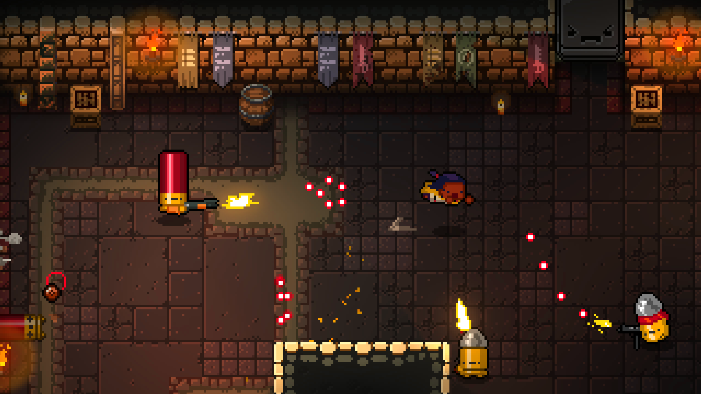
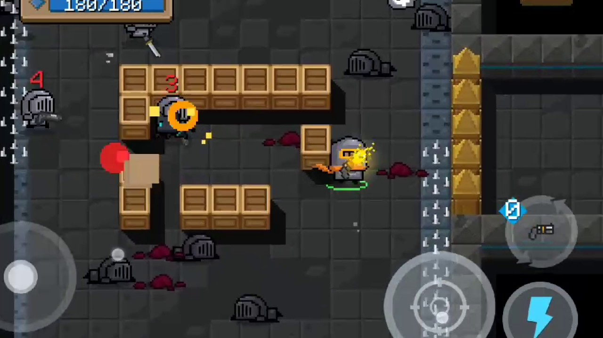

# 1.3 Research

Games i can compare to

* enter the gungeon
* soul knight
* spelunky
* other ?

## Enter the Gungeon

<figure><figcaption></figcaption></figure>

### Overview

[https://en.wikipedia.org/wiki/Enter\_the\_Gungeon](https://en.wikipedia.org/wiki/Enter\_the\_Gungeon)

### Controls

[https://www.yekbot.com/enter-the-gungeon-controls-key-bindings-settings/](https://www.yekbot.com/enter-the-gungeon-controls-key-bindings-settings/)

### Features



| Feature                       | Justification |
| ----------------------------- | ------------- |
| Permadeath                    |               |
| Different starting characters |               |
| Many projectiles              |               |
| AI enemies                    |               |
| Unique weapons                |               |



| Feature      | Justification |
| ------------ | ------------- |
| Dodge roll   |               |
| Blanks       |               |
| 200+ weapons |               |



## Soul Knight

<figure><figcaption></figcaption></figure>

### Overview

Soul Knight is a top-down rougelike dungeon crawler developed by ChillyRoom where the ultimate goal is to reach the end of the dungeon. Players achieve this by using weapons which can be found or bought throughout the dungeon to deafeat enemies in each room and eventually bosses too. Players start off with a character of their choice and collect crafting materials and gems as they go which can be used in the lobby outside the dungeon.

[https://soul-knight.fandom.com/wiki/About\_the\_Game](https://soul-knight.fandom.com/wiki/About\_the\_Game)

### Controls

[https://soul-knight.fandom.com/wiki/Controls](https://soul-knight.fandom.com/wiki/Controls)

### Features




| Feature            | Justification                                                                                                                                                                                                                     |
| ------------------ | --------------------------------------------------------------------------------------------------------------------------------------------------------------------------------------------------------------------------------- |
| Simple art style   | A simple art style works well in Soul Knight and I think it will be effective in my game too. It helps players to easily distinguish important elements and will make it easier when there are lots o fprojectiles flying around. |
| Destructible cover |                                                                                                                                                                                                                                   |
| Chests             |                                                                                                                                                                                                                                   |
| Melee weapons      | Melee weapons add diversity to Soul Knight and I would like to include them in mine to provide some contrast to using guns and make the game have a wider feel.                                                                   |
|                    |                                                                                                                                                                                                                                   |




| Feature      | Justification                                                                                                                                                                                                                                                                            |
| ------------ | ---------------------------------------------------------------------------------------------------------------------------------------------------------------------------------------------------------------------------------------------------------------------------------------- |
| Reviving     | By not introducing a revive system, dying feels more consequential as it causes the player to start over. Therefore the game will feel more exciting as the player may die at any moment.                                                                                                |
| Auto aim     | Being a mobile game, it makes sense for Soul Knight to simplify the aiming system in order to make the controls easier. However my game will be for PC so controls will not be an issue. I want players to aim for themselves as it will serve as a source of challenge within the game. |
| Skills       | In Soul Knight, each character has a unique skill which can be used with a cooldown. I am not going to include this because my game will not have that many characters and adding unique skills may be time consuming to implement, detracting from other aspects of the game.           |
| Mounts/mechs | Mounts and mechs allow the player to quickly move around the map to reach enemies quickly. This will not be necessary for my game because the map will be small enough so that the player will not have to travel far for each objective.                                                |



## Spelunky

### Overview

[https://en.wikipedia.org/wiki/Spelunky](https://en.wikipedia.org/wiki/Spelunky)

### Controls

[https://spelunky.fandom.com/wiki/Controls](https://spelunky.fandom.com/wiki/Controls)

### Features



| Feature | Justification |
| ------- | ------------- |
|         |               |
|         |               |
|         |               |



| Feature |   |
| ------- | - |
|         |   |
|         |   |
|         |   |


