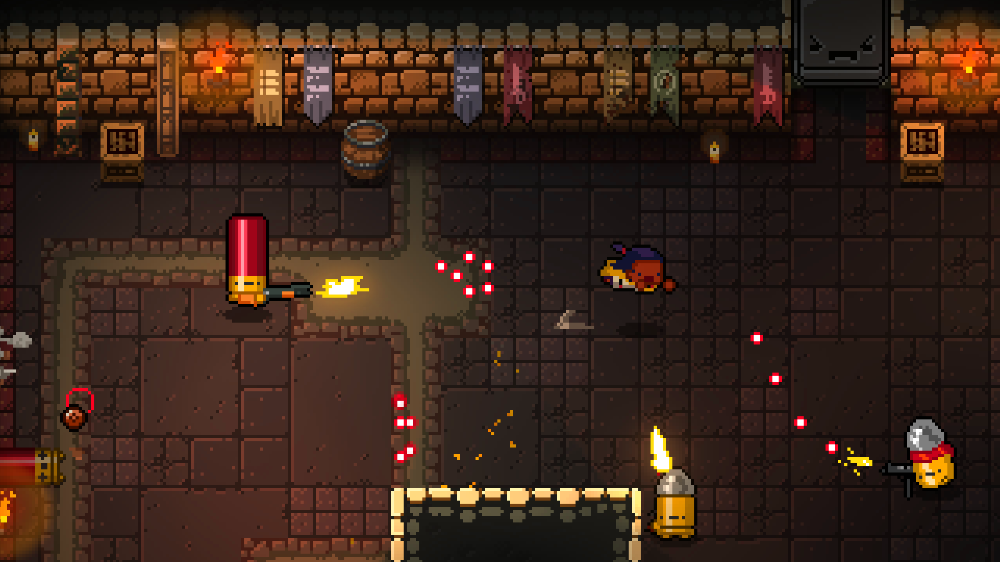
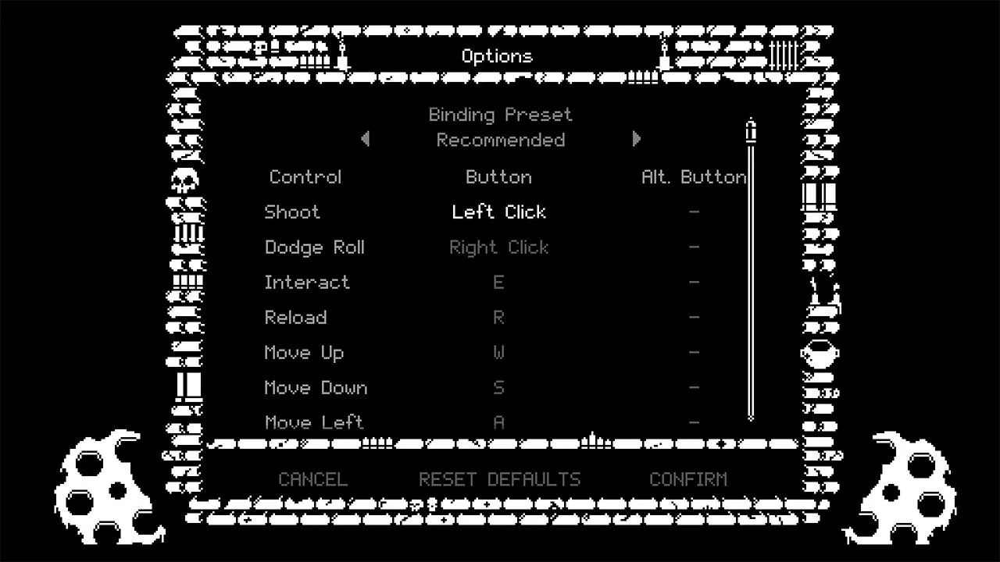
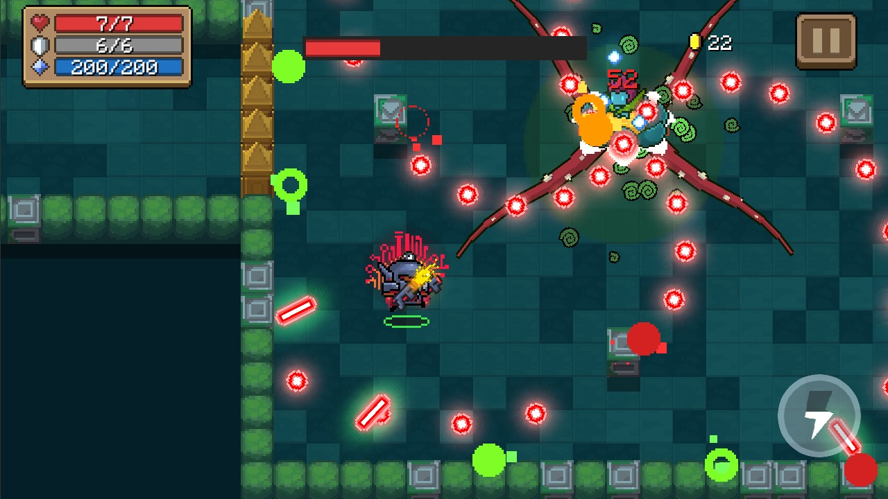
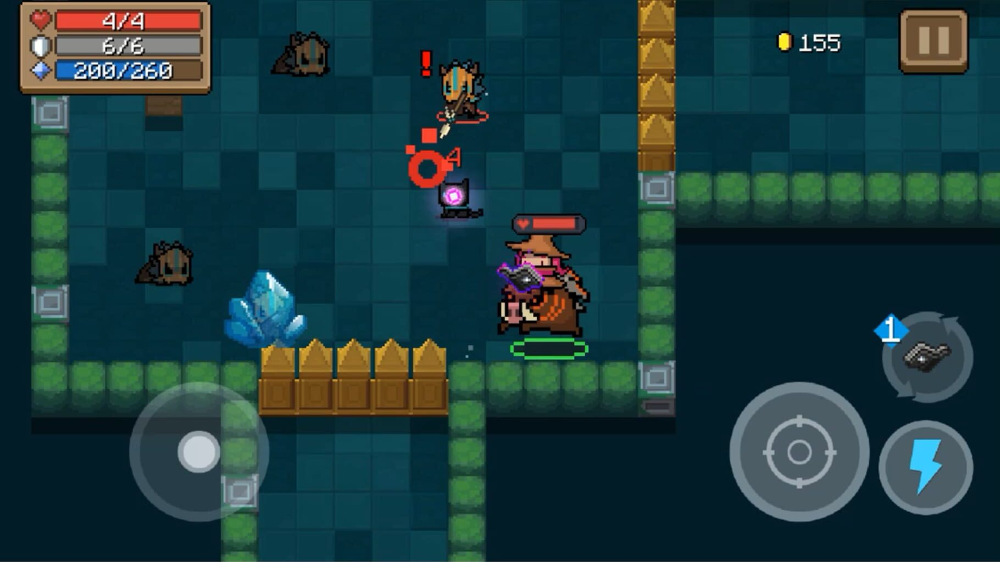
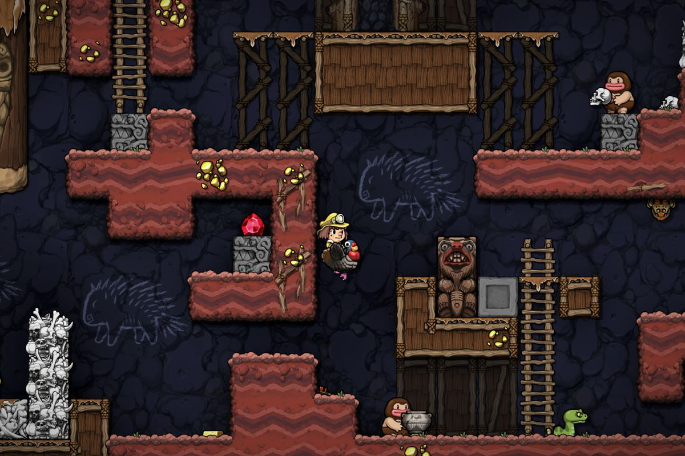

# 1.3 Research

In this section, I have researched three different roguelike games and analysed their features. The term roguelike refers to games that use specific mechanics modelled after the game Rogue, which became popular in the 1980s. Roguelike games typically feature hard-earned progression, procedural generation, and a high level of risk. [(Perry, 2023)](reference-list.md#research) The games I chose to research are _Enter the Gungeon_, _Soul Knight_ and _Spelunky 2_.

## Enter the Gungeon

<figure><figcaption></figcaption></figure>

### Overview

_Enter the Gungeon_ is a bullet hell roguelike shooter game developed by Dodge Roll. "B_ullet hell_" refers to a subgenre of shooters whose main gameplay focus is dodging seemingly endless waves of enemy projectiles. [(STANDS4 LLC, 2023)](reference-list.md#research)

In the game, players take on the role of one of several characters called Gungeoneers, each with different starting weapons and unique statistics. Players explore a procedurally generated dungeon known as the Gungeon with the goal of finding a powerful gun that can "_kill the past_". The Gungeon is filled with a variety of enemies which attack in different patterns and deal different amounts of hearts as damage. Players must use learn the attack patterns and use their weapons to defeat enemies while dodging many projectiles. New guns can be found in chests throughout the Gungeon or in the shop.

Bosses, which appear as the final challenge on each floor, are powerful enemies with high health, strong attacks and unpredictable attack patterns. They pose a great challenge for players to work to overcome. If the player dies, they lose all progress on a playthrough and must start again on the first floor. However, progress towards new characters or weapon unlocks is saved throughout runs. [(Messner, 2016)](reference-list.md#research)

### Controls

Enter the Gungeon uses the WASD movement system which is common in most PC games. Left click and right click are used to fire your weapon and dodge while the mouse scroll wheel is used to switch between weapons. A series of other keys are used for various actions, for example interacting with 'E' or opening the inventory with 'I'. Overall, the keybinds and controls for Enter the Gungeon are a little complex as there are many input options for the player to choose from. Newer players could find this a bit challenging. The table below lists the default controls but the keybinds can be changed in the settings menu.

| Control       | Button            |
| ------------- | ----------------- |
| Movement      | WASD              |
| Control       | Button/ALT Button |
| Shoot         | Left Click        |
| Dodge         | Right Click       |
| Interact      | E                 |
| Reload        | R                 |
| Use Item      | Space             |
| Use Blank     | Q                 |
| Map           | TAB               |
| Change weapon | Scroll Wheel      |
| Next Item     | Left SHIFT        |
| Gun Menu      | Left CTRL         |
| Drop Gun      | Hold F            |
| Drop Item     | Hold G            |
| Pause         | ESC               |
| Inventory     | I                 |

[(Ybot, 2018)](reference-list.md#research)

<figure><figcaption>
Enter the Gungeon's keybind customisation menu
</figcaption></figure>

### User Interface

<table data-card-size="large" data-column-title-hidden data-view="cards"><thead><tr><th></th><th data-hidden></th><th data-hidden></th><th data-hidden data-card-cover data-type="files"></th><th data-hidden></th><th data-hidden data-type="checkbox"></th></tr></thead><tbody><tr><td>Enter the Gungeon's start menu gives the player an easy way to start the game, access settings, or quit.</td><td></td><td></td><td><a href="../.gitbook/assets/enterthegungeonstartmenu.jpg">enterthegungeonstartmenu.jpg</a></td><td></td><td>false</td></tr><tr><td>Enter the Gungeons settings menu. Options are available to explore more detailed settings.</td><td></td><td></td><td><a href="../.gitbook/assets/enterthegungeonsettingsmenu.jpg">enterthegungeonsettingsmenu.jpg</a></td><td></td><td>false</td></tr><tr><td>Enter the Gungeon's HUD. Health, blanks and coins are displayed in the top left while the current gun and ammo count are displayed in the bottom right.</td><td></td><td></td><td><a href="../.gitbook/assets/enterthegungeonhud.jpg">enterthegungeonhud.jpg</a></td><td></td><td>false</td></tr><tr><td>Enter the Gungeon's end screen. It displays information about the player's latest run through the dungeon for example the number of enemies they killed and the Gungeoneer that they used.</td><td></td><td></td><td><a href="../.gitbook/assets/enterthegungeonendofgamesummary.png">enterthegungeonendofgamesummary.png</a></td><td></td><td>false</td></tr></tbody></table>

### Features



| Feature                       | Justification                                                                                                                                                                                                                                                                 |
| ----------------------------- | ----------------------------------------------------------------------------------------------------------------------------------------------------------------------------------------------------------------------------------------------------------------------------- |
| Permadeath                    | I will include permadeath in my game because it adds a sense of danger which you don't otherwise have. It forces players to learn the mechanics and helps the game to still feel dangerous even to someone who has played it for a while.                                     |
| Bullet-hell aspects           | Enter the Gungeon is a bullet hell roguelike game. I'd like to include aspects of this in my game.                                                                                                                                                                            |
| Different starting characters | Including different characters for players to play allows them to experiment with different playstyles and provides diversity to the game.                                                                                                                                    |
| AI enemies                    | Like in Enter the Gungeon, the enemies in my game will be controlled by an AI which can move around and attack the player. It's important that they behave somewhat predictably so as to not frustrate the player. Harder enemies will be more aggressive and harder to beat. |
| Unique weapons                | It's important for each weapon to feel unique and different because this keeps the game exciting and engaging. In order to do this each weapon needs to have unique statistics and characteristics.                                                                           |



| Feature      | Justification                                                                                                                                                                                                                                                                                                                              |
| ------------ | ------------------------------------------------------------------------------------------------------------------------------------------------------------------------------------------------------------------------------------------------------------------------------------------------------------------------------------------ |
| 200+ weapons | I don't want to confuse the player by having an endless amount of different weapons. However, there need to be enough distinct weapons to provide diversity and interest.                                                                                                                                                                  |
| Dodge roll   | In Enter the Gungeon the dodge roll is used to dodge through enemy projectiles without taking damage and jump over crevices. In my game, I want to include a dash mechanic which does not make the player impervious to incoming fire. Instead, it provides the player with a momentary burst of speed to quickly avoid sticky situations. |
| Blanks       | In Enter the Gungeon, blanks are used to clear the entire area of gunfire for a moment and damage and push away enemies. This would not be appropriate for my game because the number of projectiles will not be overwhelming so it would feel like a bit of a cheat.                                                                      |



## Soul Knight

<figure><figcaption></figcaption></figure>

### Overview

_Soul Knight_ is a top-down dungeon crawler developed by ChillyRoom - a type of game in which the ultimate goal is navigating to the end of the dungeon. Players achieve this by using weapons which can be found or bought throughout the dungeon to defeat enemies in each room and bosses at the end of certain stages. Bosses are essentially strong enemies with high amounts of health and powerful attacks. Players begin the game with a character of their choosing. As they play through the dungeon, players can collect crafting materials and gems which can be used in the lobby to create new weapons and unlock new characters to play as. Each character has different statistics and a different ability which can be activated after cooldown. [(Koziara, 2017)](reference-list.md#research)

### Controls

Like most mobile games Soul Knight uses touchscreen controls. A joystick controls movement and there are various buttons to change the weapon being held, fire the weapon and activate the character's skill. The position of these buttons can be customised in the settings menu.

In Soul Knight the player's character automatically aims weapons towards the nearest enemy. This means players have limited control over aiming, making the controls simpler to learn and play. [(Koziara, 2017)](reference-list.md#research)

<figure><figcaption>
Soul Knight's controls and UI. The lightning button activates the character's skill.
</figcaption></figure>

### User Interface

<table data-card-size="large" data-view="cards"><thead><tr><th></th><th data-hidden></th><th data-hidden></th><th data-hidden data-card-cover data-type="files"></th></tr></thead><tbody><tr><td>Soul Knight's start menu gives the option to play singleplayer, online multiplayer or on LAN.</td><td></td><td></td><td><a href="../.gitbook/assets/soulknightstartmenu.jpg">soulknightstartmenu.jpg</a></td></tr><tr><td>Soul Knight's pause menu allows you to see what buffs are currently active, return to the main menu or access settings.</td><td></td><td></td><td><a href="../.gitbook/assets/soulknightpausemenu.jpg">soulknightpausemenu.jpg</a></td></tr><tr><td>Soul Knight's HUD. In the top left it displays health, armour and energy while towards the bottom are the touchscreen controls.</td><td></td><td></td><td><a href="../.gitbook/assets/soulknighthud.jpg">soulknighthud.jpg</a></td></tr><tr><td>Soul Knight's end screen gives the player information about their latest run through the dungeon, such as how long it took them and what weapons they used in the run.</td><td></td><td></td><td><a href="../.gitbook/assets/soulknightendscreen.jpg">soulknightendscreen.jpg</a></td></tr></tbody></table>

### Features



| Feature            | Justification                                                                                                                                                                                                                                                                                                                                                                                                                                                                                                                                                                                       |
| ------------------ | --------------------------------------------------------------------------------------------------------------------------------------------------------------------------------------------------------------------------------------------------------------------------------------------------------------------------------------------------------------------------------------------------------------------------------------------------------------------------------------------------------------------------------------------------------------------------------------------------- |
| Simple art style   | A simple art style works well in Soul Knight and I think it will be effective in my game too. It helps players to easily distinguish important elements and looks good in its own right.                                                                                                                                                                                                                                                                                                                                                                                                            |
| Chests             | In Soul Knight some rooms are special chest rooms where players can find new weapons somewhat frequently. I want to include something similar so that players do not get bored from using the same weapon for a long time.                                                                                                                                                                                                                                                                                                                                                                          |
| Melee weapons      | Melee weapons add diversity to Soul Knight and I would like to include them in mine to provide some contrast to using guns and add another element to the game.                                                                                                                                                                                                                                                                                                                                                                                                                                     |
| Destructible cover | Destructible cover provides obstacles which players can hide behind but destroy to shoot through. It helps the game feel more immersive and forces the player to make decisions as to whether they want to destroy or use it.                                                                                                                                                                                                                                                                                                                                                                       |
| Exciting music     | Soul Knight has an exciting soundtrack for the game (eg. [1](https://soundcloud.com/au2agdvwnt0x/soul-knight-ost-forests?in=user-427880486/sets/soul-knight-ost\&utm\_source=clipboard\&utm\_medium=text\&utm\_campaign=social\_sharing), [2](https://soundcloud.com/au2agdvwnt0x/soul-knight-ost-floor-1-boss?in=user-427880486/sets/soul-knight-ost\&utm\_source=clipboard\&utm\_medium=text\&utm\_campaign=social\_sharing)) which plays while fighting in the dungeon. Similarly, I want to include exciting music in my game which complements the gameplay and helps keep the player engaged. |



| Feature          | Justification                                                                                                                                                                                                                                                                                                                                                   |
| ---------------- | --------------------------------------------------------------------------------------------------------------------------------------------------------------------------------------------------------------------------------------------------------------------------------------------------------------------------------------------------------------- |
| Reviving         | By not including a revive system, dying feels more consequential as it causes the player to start over. Therefore the game will feel more exciting as the player knows the consequences of dying at any moment.                                                                                                                                                 |
| Auto aim         | Being a mobile game, it makes sense for Soul Knight to simplify the aiming system in order to make the controls more accessible. However, my game will be for PC so controls will not be an issue. I want players to aim for themselves as it will serve as a source of challenge within the game.                                                              |
| Character skills | In Soul Knight, each character has a unique skill which can be used with a cooldown. I will not include this because my game will not have that many characters and adding unique skills may be time-consuming to implement, hence detracting from other aspects of the game. Instead, in my game,  all characters will be able to dash as their skill/ability. |
| Mounts/mechs     | Mounts and mechs allow the player to quickly move around the map to reach enemies quickly. This will not be necessary for my game because the map will be small enough so that the player will not have to travel far between rooms.                                                                                                                            |



## Spelunky 2

<figure><figcaption></figcaption></figure>

### Overview

_Spelunky 2_ is a 2D side-scrolling platformer game developed by Mossmouth and released in 2020. In the game, the player assumes control of a character called Ana, who must navigate through caves full of traps and enemies to reach treasures. If the player dies, they lose all their items and have to start the game again from the beginning. The layout is procedurally generated each time so that each playthrough feels unique and presents different challenges.

Players start with a finite number of hitpoints but can run out and die if they take too much damage or are instantly killed by a trap or the ghost. The ghost is an entity which appears after 3 minutes have elapsed in a level and it will chase the player until they either complete the level or die. Spelunky 2 also supports online multiplayer in both cooperative and competitive modes so you can play with friends or other players. [(Saltzman, 2020)](reference-list.md#research)

### Controls

Spelunky 2 is available on both PC and Xbox so there are different controls for keyboard and controller users. Overall the controls for Spelunky 2 are on the simpler side because there are fewer unique inputs the player has to contend with. Spelunky 2 benefits from this because it allows new players to pick up the game quickly and not feel overwhelmed. See the table below for a list default of controls. Keybinds can be changed in the settings menu for personalisation if required.

| Controls        | Keyboard   | Controller |
| --------------- | ---------- | ---------- |
| Movement        | Arrow keys | Left stick |
| Jump            | Z          | A          |
| Attack          | X          | X          |
| Bomb            | C          | B          |
| Rope            | D          | Y          |
| Use Door/Buy    | A          | RB         |
| Walk/Run (Hold) | LShift     | RT         |


[(Gamesgds, 2020)](reference-list.md#research)


#### Keyboard

The controls of Spelunky 2 are modelled around the ZX-Arrows control scheme that most 2D games use. The arrow keys are used for movement, while various other keys are used for different actions, for example, 'Z' is jump and 'X' is attack. The mouse serves little use in Spelunky 2, used only to navigate through menus.

### User Interface

<table data-card-size="large" data-view="cards"><thead><tr><th></th><th data-hidden></th><th data-hidden></th><th data-hidden data-card-cover data-type="files"></th></tr></thead><tbody><tr><td>Spelunky 2's start menu allows players to choose the game mode (multiplayer, seeded runs or daily challenge), as well as being able to select other options for example profile or leaderboards.</td><td></td><td></td><td><a href="../.gitbook/assets/spelunky2startmenu.jpg">spelunky2startmenu.jpg</a></td></tr><tr><td>Spelunky 2's cover screen artwork before going into the game. It is more welcoming for players when they see this after the game loads as opposed to going straight into a menu.m</td><td></td><td></td><td><a href="../.gitbook/assets/spelunky2coverscreen.jpg">spelunky2coverscreen.jpg</a></td></tr><tr><td>Spelunky 2's settings menu allows players to change control keybinds, adjust graphics and audio, change the language throughout the game and more.</td><td></td><td></td><td><a href="../.gitbook/assets/spelunky2settingsmenu.jpg">spelunky2settingsmenu.jpg</a></td></tr><tr><td>Dialogue box in Spelunky 2. The player can interact with many NPCs, which communicate in dialogue boxes like this. Dialogue can be important in video games because it gives personality to otherwise potentially boring characters and helps keep the game engaging. <a href="reference-list.md#research">(Farokhmanesh, 2014)</a></td><td></td><td></td><td><a href="../.gitbook/assets/spelunky2dialoguebox.webp">spelunky2dialoguebox.webp</a></td></tr></tbody></table>

### Features



| Feature     | Justification                                                                                                                                                                                                                                                                                 |
| ----------- | --------------------------------------------------------------------------------------------------------------------------------------------------------------------------------------------------------------------------------------------------------------------------------------------- |
| Boss fights | A boss fight provides a momentary rise in intensity or a climax in a game which tests the player in some way or another. [(Stout, 2010)](reference-list.md#research) I'd like to include a boss fight in my game to challenge the player as the ultimate end goal and achievement.            |
| Shop        | In Spelunky 2, players can find shops which sell various items, weapons or services to the player. I want to include a shop in my game where players can buy new weapons and power-ups. However, I don't want to include the stealing mechanic which Spelunky 2 features.                     |
| Traps       | I want to include traps which can harm the player if they are not too careful. This will add another layer of danger to my game and hopefully keep players on their toes. However, unlike in Spelunky 2, I don't want traps to instantly kill the player because it would be too unforgiving. |



| Feature        |                                                                                                                                                                                                                                                                                                                           |
| -------------- | ------------------------------------------------------------------------------------------------------------------------------------------------------------------------------------------------------------------------------------------------------------------------------------------------------------------------- |
| Multiplayer    | Online multiplayer will be too complicated for me to implement and local multiplayer will be too difficult on one set of controls. Despite this, my game will still be enjoyable without the social aspect which multiplayer brings.                                                                                      |
| Platforming    | I want the main focus of my game to be on defeating enemies and avoiding bullets rather than jumping over spikes or obstacles.                                                                                                                                                                                            |
| Fluid dynamics | Realistic fluid dynamics can help a game feel more detailed and immersive but can be challenging to simulate in terms of processing power. [(ZibraAI, 2021)](reference-list.md#research) Furthermore, it would be difficult for me to code and I don't think the trouble is worth implementing a fluid system in my game. |
| Ghost          | In Spelunky 2, the ghost encourages players to progress through the level as quickly as possible. While this can make the game more exciting, I want players to progress at their own pace and not be penalised for taking their time.                                                                                    |


