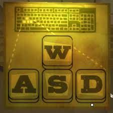

# 1.4a Features of Proposed Solution

## Broad Category 1

### Specific Feature 1

Description of some specific feature you wish to build

## Limitations

### Limitation 1

Description of a limitation, due to scope/time constraints or difficulty of implementation.

## Controls

### Player Movement

The character's movement will be controlled using the WASD keys.

<figure><figcaption>
Location of WASD on a keyboard
</figcaption></figure>

The player will also be able to perform a 'dash' with a cooldown using the right mouse button. This will provide a momentary burst of speed which briefly but quickly propels the player forward.

### Attack

Players can attack with their weapon using the left mouse button. This will either swing a melee weapon on fire a ranged weapon, depending on the weapon type the player is currently using.

### Interacting

## Enemies

### Enemy Types

#### Melee

#### Ranged

### Bosses

#### Mini-Bosses

#### Win Condition

## Dungeon Layout

### Generation

### Rooms

#### Combat Rooms

Most rooms in the dungeon will be combat rooms in which the player needs to defeat enemies to pass through These rooms may also include traps and will have cover in them which the player can hide behind.

#### Vendor Rooms

Some rooms found in the dungeon will be vendor rooms where players can purchase new weapons or powerups from a shop using coins which are collected from killing enemies.

#### Chest Rooms

A small number of rooms found in the dungeon will be chest rooms. A chest room will contain a chest which the player can open to be rewarded with some coins and a random weapon. Finding one of these will hopefully make the player feel lucky, especially if they find a good weapon.

## Weapons

I'd like each weapon the player picks up to have randomly a prefix for example 'rusted' or 'tempered' which affects the statistics of the weapon either making it weaker or stronger. The prefixes for ranged and melee weapons will be different so that it makes sense.

### Melee

Because melee weapons require the player to get close to enemies which could be difficult under a rain of projectiles. Therefore an attack with a melee weapon will destroy bullets which are just in front of the player.

Below is a list of potential melee weapons I could implement.

* Polearm
* Greatsword
* Battleaxe
* War Hammer
* Barbarian Club

### Ranged

Ranged weapons will have a reload system so that the player cannot simply fire all the time. Furthermore, I hope to include some automatic weapons in my game, where the player does not need to click each time to fire but instead can hold down the mouse button.

Below is a list of potential ranged weapons I could implement.

* Revolver
* Machine pistol
* Shotgun
* Sniper
* Bazooka
* Carbine
* SMG
* Plasma launcher

## Starting Characters

## Powerups

