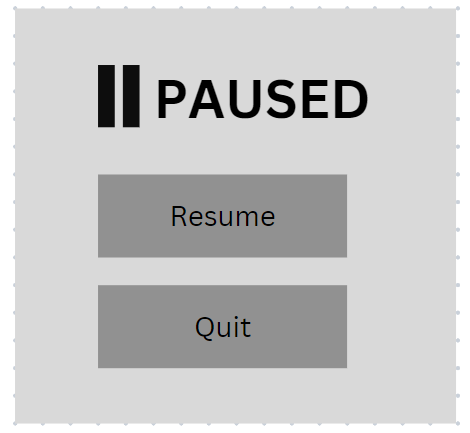

# 1.4a Features of Proposed Solution

For my project, I am creating a 2d roguelike game. The premise of the game is to progress through rooms by defeating enemies to make it to the final boss. By defeating this boss, you win the game and reach the end of the dungeon.

## Controls

The controls for my game will be made for the standard QWERTY keyboard because this is the most common keyboard format worldwide. [(KeySource China Limited, 2011)](../5-references/reference-list.md#1.4a-features-of-a-proposed-solution) My controls were influenced by [this discussion](https://forum.unity.com/threads/most-common-keyboard-mouse-inputs-for-pc-games.380594/) in the unity forums where players discuss their preferred keybinds for certain controls. I want to make sure that my controls are easy to use and somewhat similar to other games so that new players have no trouble quickly picking up how to play.

<figure><figcaption>
Controls for my game
</figcaption></figure>

### Player Movement

The character's movement will be controlled using the WASD keys corresponding to up, left, down and right. Pressing multiple keys at once can cause the player to move diagonally, for example by holding W and A. This is the standard movement control system for most modern games. [(Wilde, 2016)](../5-references/reference-list.md#1.4a-features-of-a-proposed-solution) By using controls familiar to most gamers I hope to make the game easier for newer players to ensure that they don't become frustrated and stop playing.

The player will also be able to perform a 'dash' with a cooldown using the right mouse button. This will provide a momentary burst of speed that propels the player forward. I chose to use the right mouse button over a keyboard key because people naturally rest their middle finger on it while holding a mouse so it should be easier for players to use.

### Combat

Players can attack with their weapon using the left mouse button. This will either swing a melee weapon or fire a ranged weapon in the direction of the mouse, depending on what the player is currently using. There will also be a cooldown on how often the player can attack.

The number keys 1, 2, and 3 will each correspond to selecting a weapon that the player has in their inventory. I chose these keys because they are close to WASD which means it will be easier for players to switch weapons while moving in a battle.

### Interacting

Players will be able to interact using 'E' for example opening chests or purchasing items from a shop. I chose E because it is near the WASD keys, making it easier for players to press while moving around.

### Other Controls

The shield powerup will be activated using the spacebar, providing immunity to damage for a brief period.

Pressing 'I' will open the inventory which will display the weapons the player currently has equipped and allow them to change which slot the weapons are in. This will allow the user to customise it in their own way to find what works best for them. I want this feature to look similar to what happens when you press CTRL in Enter the Gungeon but with more functionality.

 Enter the Gungeon's quick change menu

Pressing the escape key will pause the game and bring up the pause menu and pressing it again will resume.

## Menus

### Main Menu

The game will start in a main menu where players can select which character they want to play the game as. There will also be a section explaining the controls for the game so that players can easily find out how to play. It is really important that the main menu is easy to use and nice to look at because players will use it at the start of every run and it is also the first impression a new user will have of my game when they play it for the first time.

### Pause Menu

Pressing the escape key during the game will pause the game until the player clicks resume. This will make it easier for people to play my game if they become busy but want to come back to it later and it helps them reengage more effectively.

 Example pause menu

## Graphics

My game will have simple pixel graphics similar to [Enter the Gungeon](1.3-research-the-problem.md#enter-the-gungeon) and [Soul Knight](1.3-research-the-problem.md#soul-knight). This is because I want an art style which makes it easy for players to be able to see what is going on, which is especially important for increasing the number of people who can play my game. Ensuring colours properly contrast makes the game more accessible, for example for those who have a visual impairment.

I want the theme of my game to have a medievalesque feel with a bit of steampunk and magic mixed in. Below are some images showing some of the art styles which I want to try to recreate.

<figure><figcaption>
I would like to include animations if I have enough time.
</figcaption></figure>

 

<figure><figcaption>
Example character sprite.
</figcaption></figure>

<figure><figcaption>
My game will be in the same pixel art style but with less detail.
</figcaption></figure>

 

<figure><figcaption>
My game's scene will be based on tiles so the elements in my game will be square.
</figcaption></figure>

<figure><figcaption>
Example enemy sprite.
</figcaption></figure>

 

<figure><figcaption>
Examples of the weapon style.
</figcaption></figure>

<figure><figcaption>
The actual graphics will probably be more like this.
</figcaption></figure>

## Generation & Structure

The dungeon map will be generated differently each time from a selection of premade rooms so that each run of the game is unique. My approach to map generation is similar to Soul Knight except one room will lead directly into the next without corridors and the map will be a straight line instead of multiple paths so that it is much more clear.

<figure><figcaption>
Soul Knight map
</figcaption></figure>

The screen will display one room at a time and when the player walks through a door the next room is displayed. This should ensure that everything is big enough on the screen for the player to see properly, even when playing on smaller screen sizes.

### Rooms

#### Combat Rooms

Most rooms in the dungeon will be combat rooms in which the player needs to defeat enemies to pass. These rooms will include traps and will have cover in them that the player can hide behind and use to their advantage by avoiding enemies. After a player enters a combat room they cannot leave until they have defeated all the enemies.

#### Vendor Rooms

The first room on floors 2 and 3 will be vendor rooms where players can purchase new weapons or powerups from a shop using gold fragments which can be collected by killing enemies. I want the shop to be similar to the shop in Enter the Gungeon except the shopkeeper will always be peaceful so that the player does not get killed when they thought they were safe.

<figure><figcaption>
Shopkeeper in Enter the Gungeon
</figcaption></figure>

Things to buy in the shop:

* New weapons
* Restoring health points
* Boosts - damage, speed, reload

#### Chest Rooms

A small number of rooms found in the dungeon will be chest rooms. A chest room will contain a chest that the player can open to be rewarded with some coins and a random weapon.

### Floors

I will have 3 floors in my game so to win the objective is to beat the boss on the third floor. Each floor will have different enemies and bosses which get progressively more challenging as you go. The next floor will only be generated when the previous one has been completed.

Floors will act as the source of progression in the game because players will try to reach as high a floor as possible. I've decided to include floors instead of just a lot of levels before the boss because I think that players will feel a sense of achievement after reaching each floor and they will enjoy trying to explore further each time they play.

## Enemies

Enemies will spawn in combat rooms and players must defeat all enemies before moving into the next room. The player can defeat enemies by dealing damage using weapons that they find throughout the dungeon. Each enemy will have a set amount of health and when it reaches zero they will die. Enemies will either be armed with a melee or ranged weapon. Harder enemies will appear on harder floors to create more of a challenge as the player progresses.

#### &#x20;Note on Game Performance

It's important that my game has a stable performance since players will be dodging enemies and enemy projectiles. If the game lags or freezes this could be quite frustrating for the player. Therefore my game should have a stable framerate and not crash or freeze.

### Coins

Upon death, enemies will drop coins which can then be spent in the shop. The number of coins the player has will be displayed under the health bar (along with the number of shields and active powerups). Coins will serve as the currency in the game and provide positive reinforcement to help keep players enjoying the game.

### Enemy Attacks

Melee enemies will move toward the player and try to damage the player at close range. Meanwhile ranged enemies will shoot projectiles that can damage the player if they do not dodge fast enough. They'll shoot a projectile, and move towards the player before pausing and starting again. I want the enemy attacks to feel a bit predictable so that players will subconsciously learn the patterns over time and therefore will be able to get further in each run. This should give players the desire to complete the game and also make it feel like they are making progress and understand how the key mechanics work.

### Example Inspiration

The enemies will get stronger on higher floors so the game becomes more difficult the further you get. Below are some enemies from Soul Knight which I can use for inspiration.

<figure><figcaption></figcaption></figure>

 

<figure><figcaption></figcaption></figure>

 

<figure><figcaption></figcaption></figure>

 

<figure><figcaption></figcaption></figure>

 

<figure><figcaption></figcaption></figure>

 

<figure><figcaption></figcaption></figure>

 

<figure><figcaption></figcaption></figure>

 

<figure><figcaption></figcaption></figure>

### Bosses

#### Mini Bosses

To make gameplay more interesting, there will be bosses who appear at the ends of the first two floors. They won't be as strong as the final boss hence why I call them 'mini bosses' Some players may find satisfaction in defeating each boss because they are similar to completing levels/ achievements.

#### Win Condition

The win condition for the game will be defeating the final boss at the end of the game. I do want it to be quite challenging so that completing the game feels like a great achievement. During the fight, the final boss can summon additional enemies to help attack the player which adds to the challenge.

Below are some enemies from Soul Knight which I can use as inspiration for my final boss.

<figure><figcaption></figcaption></figure>

 

<figure><figcaption></figcaption></figure>

 

<figure><figcaption></figcaption></figure>

## Weapons

I don't want to include any weapons in my game which are too modern because I don't think that they would fit with the theme of my game.

As described in the controls section, players will be able to carry multiple weapons which they can switch between using the number keys. This means players will be able to experiment with different weapons and devise their own strategies for what weapon combinations they want to use

### Melee Weapons

Because melee weapons require the player to get close to enemies which could be difficult when being attacked with projectiles. Therefore an attack with a melee weapon will destroy bullets that are just in front of the player.

Below is some inspiration I can use for melee weapons in my game.

<figure><figcaption>
Inspiration for weapons
</figcaption></figure>

### Ranged Weapons

Ranged weapons will have a cooldown so that the player cannot simply click really fast to fire all the time. Furthermore, I hope to include some automatic weapons in my game, where the player does not need to click each time to fire but instead can hold down the mouse button.

All ranged weapons will have different statistics such as rate of fire, damage, accuracy etc but all weapons will have unlimited range in that they will travel until colliding with an enemy wall or obstacle.

Below is some inspiration I can use for ranged weapons in my game.

<figure><figcaption>
Inspiration for weapons
</figcaption></figure>

### Weapon Ideas

Below I've listed some basic ideas I have for weapons which I could include in my game.

#### Melee

* Polearm (spear)
* Shortsword/ dagger
* Steel Broadsword
* King's Blade
* Battleaxe
* War Hammer
* Spiked Mace
* Infernal Blade

#### Ranged

* Geargun (basic pistol)
* Clockwork Revolver
* Slingshot
* Crossbow
* Boomstick (Shotgun)
* Ironclad Carbine (rifle)
* Arm Cannon (rocket launcher)
* Brass Spraygun (submachine gun)

## Story

[(Thompson, 2019)](../5-references/reference-list.md#1.4a-features-of-a-proposed-solution) writes "_The narrative in a video game is essential as it ensures a gamer is immersed and actively participates in determining the outcome of the game_". Therefore I want my game to include small elements of a background story to help set the scene of the game and make it feel more immersive. This will be in the form of a brief introduction level at the start of the game where the shopkeeper explains the basic objective of the game while also including an element of story to make the game more immersive.&#x20;

## Characters

### Starting Characters

Before starting the game, I want the player to choose a character to enter the dungeon within the character selection menu. Each character will start with a different weapon and have different statistics for example variations in health, speed, and dash cooldown.

The characters to choose from will be:

#### 1.  Sir Galahad

* Knight of the Sacred Order
* Committed to ridding the world of evil
* High hp but low speed
* Starts the game with a shortsword (75%) or steel broadsword (25%)

#### 2. Scarlett Blackthorn

* Infamous bandit and rapscallion
* Only interested in the dungeon for the riches she may find
* High speed but low hp
* Starts the game with a slingshot (75%) or crossbow (25%)

#### 3. Deadeye Dave

* Gunslinger and expeditionist
* Loves the thrill of adventure
* Medium hp and speed and fast dash cooldown
* Starts the game with a Geargun (75%) or a Clockwork Revolver (25%)

## Health

At the beginning of the dungeon, the player starts with a full health bar which depletes as they get damaged by enemies until it reaches zero and the player dies.

Health can be replenished by purchasing healing potions in the shop or found rarely in chests.

<figure><figcaption>
Example health bar
</figcaption></figure>

During the boss fight, there will be a large health bar which displays the boss' health. This will add to the excitement of boss fights because players can see when the boss's health is low which is when they are close to winning.

<figure><figcaption>
Example boss health bar
</figcaption></figure>

Each enemy will also obviously have a set health however they won't have individual health bars because they are not significant enough.

## Powerups

Different powerups will be available for purchase in vendor rooms and they may also be found rarely in chests. Powerups will provide either a boost for a few seconds or last until the end of the run. These boosts can be in the form of faster movement speed, quicker reloading, or increased damage.

Additionally, a shield powerup will provide immunity to incoming damage for a short duration when activated with the spacebar. The player can hold up to 3 shields at once and use them when they like, however, there will be a cooldown. Shields can be obtained in the same way as an ordinary powerup.

Powerups should be quite strong so that they make players feel powerful when they are active and enjoy using them.

## Traps

In combat rooms there will be certain small-scale traps that can damage the player, posing a mini challenge alongside fighting the enemies. The traps will be little spikes on the floor and if the player walks over them then they will take a small amount of damage.

These traps will allow for more engaging room layouts, acting as a barrier that can be crossed but at a small expense to the player which should make gameplay a bit more exciting.

<figure><figcaption>
Spike trap in Soul Knight
</figcaption></figure>

 

<figure><figcaption>
Spear trap in <a href="1.3-research-the-problem.md#spelunky-2">Spelunky 2</a>
</figcaption></figure>

## Limitations

### Multiplayer

Many games benefit from the social aspects of multiplayer gaming, however, I think online multiplayer will be too difficult and time-consuming for me to implement into my game. Additionally, local multiplayer is not possible for my game on one set of controls. Despite this limitation, I anticipate my game will remain fun and engaging in single-player.

### Graphics

Due to time constraints, I will be prioritising gameplay over graphics because gameplay is the most important aspect of a game since without gameplay there is no game. I may have to change the theme for my game to something more basic if I do not have enough time. Ideally, I would like to include sprite animations and maybe other effects but I am aware that this might not be possible in time.

<figure><figcaption>
Example idle animation
</figcaption></figure>

I have no prior experience with graphic design or modelling so creating detailed sprites and assets could be quite a challenge for me. Therefore having simpler graphics will save time which I can use to develop important features for gameplay.

### Weapons

Including lots of different weapons as possible would make the game more engaging because the player would continually encounter new content, even after having played the game for a while. However, I do not want to waste a lot of time creating so many weapons, therefore I plan to have fewer than 10 weapons to begin with. If I have the opportunity to introduce more weapons then I will do so but on the flip side I want to make sure that the game remains easy to understand for users and adding too many weapons may compromise that.

