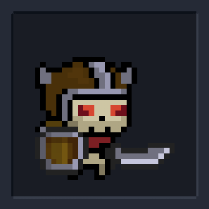

# 1.4a Features of Proposed Solution

For my project, I am creating a 2d roguelike dungeon crawler - a game in which you play as a hero who must navigate a dungeon. The premise of the game is to progress through rooms by defeating enemies to make it to the final boss. By defeating this boss, you win the game and reach the end of the dungeon.

## Controls

The controls for my game will be made for the standard QWERTY keyboard because this is the most common keyboard layout worldwide. [(KeySource China Limited, 2011)](reference-list.md#features-of-a-proposed-solution) My controls were influenced by [this discussion](https://forum.unity.com/threads/most-common-keyboard-mouse-inputs-for-pc-games.380594/) in the unity forums where players discuss their preferred keybinds for certain controls. I want to make sure that my controls are easy to use and somewhat similar to other similar games so that new players have no trouble quickly picking up how to play.

<figure><figcaption>
Controls for my game
</figcaption></figure>

### Player Movement

The character's movement will be controlled using the WASD keys corresponding to up, left, down and right. Pressing multiple keys at once can cause the player to move diagonally, for example by holding W and A. This is the standard movement control system for most modern games. [(Wilde, 2016)](reference-list.md#features-of-a-proposed-solution) By using controls familiar to most gamers I hope to make the game easier for newer players to ensure that they don't become frustrated and stop playing.

The player will also be able to perform a 'dash' with a cooldown using the right mouse button. This will provide a momentary burst of speed which propels the player forward. I chose the right mouse button over a keyboard key because it is easier to use when the hand is already on the mouse. This means that they can attack and dash together easily.

### Combat

Players can attack with their weapon using the left mouse button. This will either swing a melee weapon or fire a ranged weapon in the direction of the mouse, depending on what the player is currently using. There will also be a cooldown on how often the player can attack.

If the weapon has an ammo capacity then the 'R' key can be used to reload a clip. Otherwise, the weapon will automatically reload the clip when it runs out of ammo.

The number keys 1, 2 and 3 will each correspond to selecting a weapon which the player has in their inventory. I chose these keys because they are close to WASD which means it will be easier to switch weapons while moving in a battle.

### Interacting

Players will be able to interact using 'E' for example opening chests or purchasing items from a shop. I chose E because it is near the WASD keys which means it is easier for players to press while moving around. This is important because it will be a frequently used key.

Pressing 'G' will drop/swap the weapon the player is currently holding. If they are standing near a weapon on the ground then it will swap, otherwise, it will drop. I chose this key because it is far enough away from WASD so that players don't accidentally press it while in combat.

### Other

The shield powerup will be activated using the spacebar, providing immunity to damage for a brief period.

Pressing 'I' will open the inventory which will display the weapons which the player currently has equipped and allow them to change which slot the weapons are in. This will allow the user to customise their experience. I want this feature to look similar to what happens when you press CTRL in Enter the Gungeon but with more functionality.

 Enter the Gungeon's quick change menu

Pressing the escape key will pause the game and bring up the pause menu which allows the player to start over or return to the main menu.

 Example pause menu

## Graphics

My game will have pixel graphics similar to [Enter the Gungeon](1.3-research-the-problem.md#enter-the-gungeon) and [Soul Knight](1.3-research-the-problem.md#soul-knight).

Below is a series of images of the style which I want to try to create.

<figure><figcaption>
I would like to include animations if I have enough time.
</figcaption></figure>

 

<figure><figcaption>
Example character sprite.
</figcaption></figure>

<figure><figcaption>
My game will be in the same art style but with less detailed graphics.
</figcaption></figure>

 

<figure><figcaption>
My game's scene will be based on tiles so the rooms will have this square, pixel look.
</figcaption></figure>

<figure><figcaption>
Example enemy sprite.
</figcaption></figure>

 

<figure><figcaption>
Examples of the weapon style.
</figcaption></figure>

<figure><figcaption>
My graphics are more likely to be akin to this.
</figcaption></figure>

 

<figure><figcaption>
More room examples.
</figcaption></figure>

## Generation & Structure

The dungeon map will be generated from a selection of premade rooms so that each run of the game is unique. My approach to map generation is similar to Soul Knight except one room will lead directly into the next without corridors.

<figure><figcaption>
Soul Knight map
</figcaption></figure>

The screen will display one room at a time and when the player walks through a door the next room is displayed.

### Rooms

#### Combat Rooms

Most rooms in the dungeon will be combat rooms in which the player needs to defeat enemies to pass through. These rooms may also include traps and will have cover in them that the player can hide behind and use to their advantage by avoiding enemies. After a player enters a combat room they cannot leave until they have defeated all the enemies.

#### Vendor Rooms

Some rooms found in the dungeon will be vendor rooms where players can purchase new weapons or powerups from a shop using gold fragments which can be collected by killing enemies. I want the shop to be similar to the shop in Enter the Gungeon except the shopkeeper will always be peaceful.

<figure><figcaption>
Shopkeeper in Enter the Gungeon
</figcaption></figure>

Things to buy in the shop:

* New weapons
* Restoring health points
* Boosts - damage, speed, reload

#### Chest Rooms

A small number of rooms found in the dungeon will be chest rooms. A chest room will contain a chest which the player can open to be rewarded with some coins and a random weapon. There could be a mini-puzzle the player has to complete to unlock the chest to make it a bit more fun, for example, finding the hidden key.

### Floors

I will have 3 floors in my game so to win you need to beat the boss on the third floor. They will act similarly to levels since each floor will have different enemies and bosses which get progressively more challenging as you go.

## Enemies

Enemies will spawn in combat rooms and to move into the next room the player must defeat all enemies. The player can defeat enemies by dealing damage using weapons which they find throughout the dungeon. Each enemy will have a set amount of health and when it reaches zero they will die.

Upon death, enemies may drop gold fragments which can then be spent in the shop.

Enemies will be armed with either a melee weapon or a ranged weapon.

#### Melee

Melee enemies will move towards the player and try to damage the player at close range. Some melee enemies will be armed with the same weapons the can player use in the dungeon. They may have a small chance to drop the weapon upon death so the player can use it.

#### Ranged

Ranged enemies will shoot projectiles which can damage the player if they do not dodge. They'll hang back from the player to create distance but not constantly run away all the time. To ensure this, there will be short periods of time enemies stand still, and they won't be excessively fast. Ranged enemies may also drop the weapon they are using upon death.

#### Enemy List

Below is a list of enemies I'd like to implement into my game. I've listed them in order of difficulty.

* Zombies & skeletons
* Accursed fiends
* Cloaked bandits
* Dark knights
* Infernal brutes
* Infernal guard (During the boss fight only)

#### Enemy Inspiration

My enemies will look somewhat similar to these enemies from [Soul Knight](1.3-research-the-problem.md#soul-knight).

<figure><figcaption></figcaption></figure>

 

<figure><figcaption></figcaption></figure>

 

<figure><figcaption></figcaption></figure>

 

<figure><figcaption></figcaption></figure>

 

<figure><figcaption></figcaption></figure>

 

<figure><figcaption></figcaption></figure>

 

<figure><figcaption></figcaption></figure>

 

<figure><figcaption></figcaption></figure>

### Bosses

#### Mini-Bosses

To make gameplay more interesting, there will be periodic, small bosses which appear at the end of each floor. Also, it would provide satisfaction to the player to defeat each boss, similar to completing levels/ achievements.

#### Win Condition

The win condition for the game will be defeating the final boss at the end of the game. I do want it to be quite challenging so that completing the game feels like a great achievement. The final boss will be the Demon Lord. During the fight, he will do special attack moves (which are stronger and harder to avoid than normal) and summon infernal guards which attack the player.

#### Boss Inspiration

My Demon Lord boss will look somewhat similar to these enemies from Soul Knight.

<figure><figcaption></figcaption></figure>

 

<figure><figcaption></figcaption></figure>

 

<figure><figcaption></figcaption></figure>

<figure><figcaption>
Boss inspiration
</figcaption></figure>

## Weapons

I want my game to have a medievalesque feel with a bit of steampunk and magic mixed in. Therefore I don't want to include any weapons which are too modern.

Players will be able to carry 3 different weapons at once. This will provide players with tactical versatility by being able to choose the most suitable weapon for a given scenario and employ various strategies. Using multiple weapons also adds variety which prevents gameplay from becoming stale.

### Melee

Because melee weapons require the player to get close to enemies which could be difficult when being attacked with projectiles. Therefore an attack with a melee weapon will destroy bullets which are just in front of the player.

Below is a list of potential melee weapons I could implement.

* Polearm (spear)
* Shortsword/ dagger
* Steel Broadsword
* King's Blade
* Battleaxe
* War Hammer
* Spiked Mace
* Infernal Blade

<figure><figcaption>
Inspiration for weapons
</figcaption></figure>

### Ranged

Ranged weapons will have a reload system so that the player cannot simply fire all the time. Furthermore, I hope to include some automatic weapons in my game, where the player does not need to click each time to fire but instead can hold down the mouse button.

Below is a list of potential ranged weapons I could implement.

* Geargun (basic pistol)
* Clockwork Revolver
* Slingshot
* Crossbow
* Boomstick (Shotgun)
* Ironclad Carbine (rifle)
* Arm Cannon (rocket launcher)
* Brass Spraygun (submachine gun)

<figure><figcaption>
Inspiration for weapons
</figcaption></figure>

## Story

[(Thompson, 2019)](reference-list.md#features-of-a-proposed-solution) writes "_The narrative in a video game is essential as it ensures a gamer is immersed and actively participates in determining the outcome of the game_". Therefore I want my game to include small elements of a background story to help set the scene of the game and make it feel more immersive. This will be in the form of a brief introduction at the start of the game by Tobias and some dialogue after the final boss fight is resolved.&#x20;

### Lore

Tobias, a novice wizard, began experimenting with channelling spells from other dimensions to boost his power but during one such experiment, things got out of control. He accidentally opened a gateway from the depths of the underworld. This allowed the Demon Lord to travel to the mortal realm, raising an army to fight along the way. Every day he grows more powerful thanks to his dark energy. Tobias set a reward of ten thousand imperial riyals to the one who can defeat the Demon Lord and restore balance to the world before it is too late. You've volunteered for this daring quest! So good luck adventurer, because you're going to need it!

## Characters

### Starting Characters

Before starting the game, I want the player to choose a character to enter the dungeon with.  Each character will start with a different weapon and have different statistics for example variations in health, speed and dash cooldown.

The characters to choose from will be:

#### 1.  Sir Galahad

* Knight of the Sacred Order
* Committed to ridding the world of evil
* High hp but low speed
* Starts the game with a shortsword (75%) or steel broadsword (25%)

#### 2. Scarlett Blackthorn

* Infamous bandit and rapscallion
* Only interested in the dungeon for the riches she may find
* High speed but low hp
* Starts the game with a slingshot (75%) or crossbow (25%)

#### 3. Deadeye Dave

* Gunslinger and expeditionist
* Loves the thrill of adventure
* Medium hp and speed and fast dash cooldown
* Starts the game with a Geargun (75%) or a Clockwork Revolver (25%)

### Shopkeeper

As described in the 'Map' tab, there will be an old shopkeeper NPC from whom the player can purchase items to aid their journey through the dungeon. The shopkeeper will be Tobias, the same wizard who introduces the player to the game at the beginning by explaining the story. Tobias will also congratulate the player at the end of the dungeon after beating the final boss. Essentially Tobias is a way to integrate elements of the story into the game.

<figure><figcaption>
Example shopkeeper
</figcaption></figure>

## Health

At the beginning of the dungeon, the player starts with a full health bar which depletes as they get damaged by enemies, until it reaches zero and the player dies.

Health can be replenished by eating food items which can be purchased in the shop or found rarely in chests.

<figure><figcaption>
Example health bar
</figcaption></figure>

During the boss fight, there will be a large health bar at the top of the screen which displays the boss' name and current health.

<figure><figcaption>
Example boss health bar
</figcaption></figure>

## Powerups

Different powerups will be available for purchase in vendor rooms and they may also be found rarely in chests. Powerups will provide either a boost for a few seconds or last until the end of the run. These boosts can be in the form of faster movement speed, quicker reloading or increased damage.

Additionally, a shield powerup will provide immunity to incoming damage for a short duration when activated with the spacebar. The player can hold up to 3 shields at once and use them when they like, however, there will be a cooldown. Shields can be obtained in the same way as an ordinary powerup.

## Traps

In combat rooms there may be certain small-scale traps which can damage the player, posing a mini challenge alongside fighting the enemies. The traps will be little spikes on the floor and if the player walks over them then they will take a small amount of damage.

These traps will allow for more engaging room layouts, acting as a barrier which can be crossed but at a small expense to the player.

<figure><figcaption>
Spike trap in Soul Knight
</figcaption></figure>

 

<figure><figcaption>
Spear trap in <a href="1.3-research-the-problem.md#spelunky-2">Spelunky 2</a>
</figcaption></figure>

## Limitations

### Multiplayer

Many games benefit from the social aspects of multiplayer gaming, however online multiplayer is too difficult and time-consuming for me to implement into my game. Additionally, local multiplayer is not possible for my game on one set of controls. Despite this&#x20;

### Graphics

Due to time limitations, I will be prioritising gameplay over graphics so certain aspects may look quite basic. Ideally, I would like to include movement and idle animations for characters and enemies and also particle effects but this may not be possible.

<figure><figcaption>
Example idle animation
</figcaption></figure>

This is because I don't have any prior experience with graphic design or modelling so creating good sprites and assets could be quite a challenge for me. Therefore having simpler graphics will save time which I can use to develop important features.

### Weapons

Including as many different weapons as possible would make the game more complex and interesting because the player would continue encountering new features even after having played the game for a while. However, it would take a lot of time to implement so many weapons therefore I only plan to have around 5 melee weapons and 5 ranged weapons. If I have the opportunity to introduce more weapons then I will do so.

