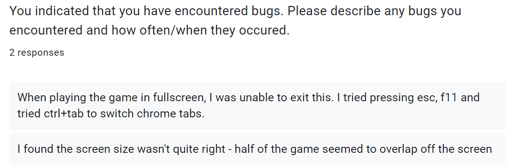

# 1.4a Features of Proposed Solution

For my project I am creating a rougelike game similar to [Enter the Gungeon](1.3-research-the-problem.md#enter-the-gungeon). The premise of the game is to beat enemies to progress through the rooms, defeat the final boss and reach the end of the dungeon.

## Features



The controls for my game will be made for the standard QWERTY keyboard because this is the most common keyboard layout worldwide. [(KeySource China Limited, 2011)](reference-list.md#features-of-a-proposed-solution) My controls were influenced by [this discussion](https://forum.unity.com/threads/most-common-keyboard-mouse-inputs-for-pc-games.380594/) in the unity forums where players discuss their preferred keybinds for certain controls. I want to make sure that my controls are easy to use and somewhat similar to other similar games so that new players have no trouble quickly picking up how to play.

<figure><figcaption>
Controls for my game
</figcaption></figure>

### Player Movement

The character's movement will be controlled using the WASD keys corresponding to up, left, down and right. Pressing multiple keys at once can cause the player to move diagonally, for example by holding W and A. This is the standard movement control system for most modern games. [(Wilde, 2016)](reference-list.md#features-of-a-proposed-solution) By using controls familiar to most gamers I hope to make the game easier for newer players to ensure that they don't become frustrated and stop playing.

The player will also be able to perform a 'dash' with a cooldown using the right mouse button. This will provide a momentary burst of speed which briefly but quickly propels the player forward.

### Attack

Players can attack with their weapon using the left mouse button. This will either swing a melee weapon or fire a ranged weapon, depending on the weapon type the player is currently using. There will also be a cooldown on how often the player can attack.

If the weapon has an ammo capacity then the 'R' key can be used to reload. Otherwise, the weapon will automatically reload the clip when it runs out of ammo.

### Interacting

Players will be able to interact using 'E' for example opening chests or purchasing items from a shop. I chose E because it is near the WASD keys which means it is easier for players to press while moving around.

### Other

The number keys 1, 2 and 3 will each correspond to selecting a weapon which the player has in their inventory. I chose these keys because they are close to WASD which means it will be easier to switch weapons while moving in a battle.

Pressing 'I' will open the inventory which will display the weapons which the player currently has equipped and allow them to change which slot the weapons are in. This will allow the user to customise their experience. I want this feature to look similar to what happens when you press CTRL in Enter the Gungeon but with more functionality.

 Enter the Gungeon's quick change menu

Pressing 'G' will drop/swap the weapon the player is currently holding. If they are standing near a weapon on the ground then it will swap, otherwise, it will drop. I chose this key because it is far enough away from WASD so that players don't accidentally press it while in combat.

Pressing the escape key will pause the game and bring up the pause menu which allows the player to start over or return to the main menu.



### Enemy Types

#### Melee

#### Ranged

### Bosses

#### Win Condition

I would like the win condition for the game to be defeating the final boss at the end of the game. I do want it to be quite challenging so that completing the game feels like a great achievement.

#### Mini-Bosses

I think it would make the gameplay more interesting if occasionally there were periodic bosses to challenge the player. Also, it would provide satisfaction to the player to defeat each boss, similar to completing levels/ achievements. However, I think it would take a lot of time to implement lots of different bosses so I will only include this feature if I have enough time.



### Generation & Structure

The dungeon map will be generated from a selection of premade rooms so that each run of the game is unique. My approach to map generation is similar to Soul Knight except one room will lead directly into the next so there will not be corridors.

<figure><figcaption>
Soul Knight map
</figcaption></figure>

The screen will display one room at a time and when the player walks through a door the next room is displayed.

### Rooms

#### Combat Rooms

Most rooms in the dungeon will be combat rooms in which the player needs to defeat enemies to pass through. These rooms may also include traps and will have cover in them that the player can hide behind and use to their advantage. After a player enters a combat room they cannot leave until they have defeated all the enemies.

#### Vendor Rooms

Some rooms found in the dungeon will be vendor rooms where players can purchase new weapons or powerups from a shop using gold fragments which are can be scrounged throughout the dungeon and collected from enemies after they die. I want the shop to be similar to the shop in Enter the Gungeon except the shopkeeper will always be peaceful.

<table data-view="cards"><thead><tr><th></th><th></th><th></th><th data-hidden data-card-cover data-type="files"></th></tr></thead><tbody><tr><td>Shopkeeper in Enter the Gungeon</td><td></td><td></td><td><a href="../.gitbook/assets/enterthegungeonshop.jpg">enterthegungeonshop.jpg</a></td></tr><tr><td>My shopkeeper will look old, similar to this</td><td></td><td></td><td><a href="../.gitbook/assets/oldmanhobo.webp">oldmanhobo.webp</a></td></tr></tbody></table>

Things to buy in the shop:

* New weapons
* Restoring health points
* Boosts - damage, speed, reload
* Helpful NPCs who fight for you (maybe)

#### Chest Rooms

A small number of rooms found in the dungeon will be chest rooms. A chest room will contain a chest which the player can open to be rewarded with some coins and a random weapon. There may also be a mini-puzzle the player has to complete to unlock the chest to make it a bit more fun.




The player will be limited to carrying only 3 different weapons at once so that they have to make choices between the different weapons which they want to use.

I'd like each weapon the player picks up to have randomly a prefix for example 'rusted' or 'tempered' which affects the statistics of the weapon: either making it stronger or weaker. The prefixes for ranged and melee weapons will be different so that it makes sense.

### Melee

Because melee weapons require the player to get close to enemies which could be difficult under a rain of projectiles. Therefore an attack with a melee weapon will destroy bullets which are just in front of the player.

Below is a list of potential melee weapons I could implement.

* Polearm
* Greatsword
* Battleaxe
* War Hammer
* Barbarian Club

### Ranged

Ranged weapons will have a reload system so that the player cannot simply fire all the time. Furthermore, I hope to include some automatic weapons in my game, where the player does not need to click each time to fire but instead can hold down the mouse button.

Below is a list of potential ranged weapons I could implement.

* Revolver
* Machine pistol
* Shotgun
* Sniper
* Bazooka
* Carbine
* SMG
* Plasma launcher



[(Thompson, 2019)](reference-list.md#features-of-a-proposed-solution) writes "_The narrative in a video game is essential as it ensures a gamer is immersed and actively participates in determining the outcome of the game_". Therefore I want my game to include small elements of a background story to help set the scene of the game and make it feel more immersive. This will be in the form of a brief introduction at the start of the game; after the final boss fight is resolved at the end and little notes or tattered books of lore inside the game.

















## Limitations



















