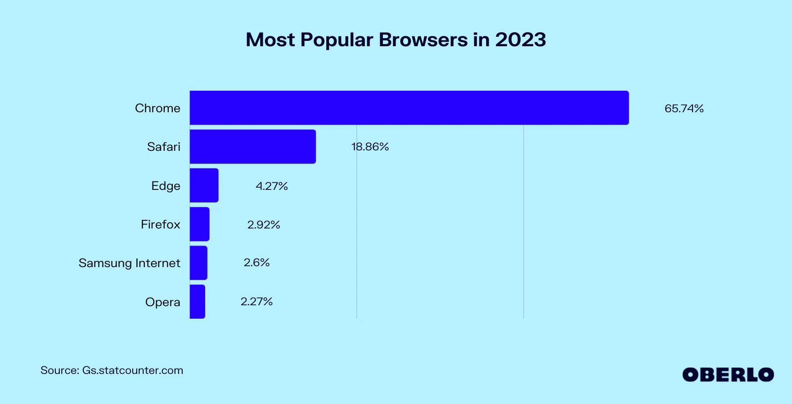

# 1.6 Hardware and Software Requirements

## Development Requirements

Development requirements are the tools or conditions needed when developing a game. The requirements for my game are quite simple.

I will be using Kaboom.js to create my game since it is simple and lightweight. Kaboom.js can be used on low-end laptops since the only requirement is access to a web browser. [(Schardon, 2023)](reference-list.md#hardware-and-software-requirements) I will be using Repl.it for my Kaboom.js project since it takes care of all the initialisation code and asset loading. [(Replit, n.d.)](reference-list.md#hardware-and-software-requirements) This means that I can focus time on writing the game logic and making graphics. Replit is supported by any major web browser however I will be using Google Chrome on my Windows laptop.

| Browser       | Requirements                                                                                            |
| ------------- | ------------------------------------------------------------------------------------------------------- |
| Google Chrome | <ul><li>Windows 10 or later</li><li>An Intel Pentium 4 processor or later that's SSE3 capable</li></ul> |

[(Google Inc., n.d.)](reference-list.md#hardware-and-software-requirements)

## User Requirements

My game will be web-based which means the user will need to have an internet connection to access my game. Additionally, the controls for my game use a keyboard and mouse which means that the user needs access to a PC/laptop with keyboard and mouse inputs.

<figure><figcaption>
Most popular web browsers in terms of market share <a href="reference-list.md#hardware-and-software-requirements">(Gaubys, 2023)</a>
</figcaption></figure>

The user will need a web browser installed on their machine to access my game. As per the figure above the most popular web browsers in terms of market share are Google Chrome (65.74%), Safari (18.86%), Microsoft Edge (4.27%), and Mozilla Firefox (2.92%). Below is a table listing their minimum requirements on various operating systems.



| Browser | Requirements                                                                                                                                                                                                                                                           |
| ------- | ---------------------------------------------------------------------------------------------------------------------------------------------------------------------------------------------------------------------------------------------------------------------- |
| Chrome  | <ul><li>Windows 10 or later</li><li>An Intel Pentium 4 processor or later that's SSE3 capable</li></ul>                                                                                                                                                                |
| Safari  | Apple discontinued development for Safari on Windows in 2012. Safari 5.1.7 is the latest version available and can run on Windows 7 or later. [(OSXDaily, 2017)](reference-list.md#hardware-and-software-requirements)                                                 |
| Edge    | 

Microsoft Edge comes pre-installed with Windows, so the Windows 10 system requirements are the minimum requirements.
<ul><li>Processor: 1 gigahertz (GHz) or faster processor or SoC</li><li>RAM: 1 gigabyte (GB) for 32-bit or 2 GB for 64-bit</li></ul> |
| Firefox | <ul><li>Windows 7 or later</li></ul>
Recommended:
<ul><li>Pentium 4 or newer processor that supports SSE2</li><li>512MB of RAM / 2GB of RAM for the 64-bit OS</li></ul>                                                                                           |



| Browser | Requirements                                                                                                                                               |
| ------- | ---------------------------------------------------------------------------------------------------------------------------------------------------------- |
| Chrome  | <ul><li>macOS High Sierra 10.13 or later</li></ul>                                                                                                         |
| Safari  | Latest version of MacOS                                                                                                                                    |
| Edge    | <ul><li>High Sierra (10.13) and later</li></ul>                                                                                                            |
| Firefox | <ul><li>macOS 10.12 or later</li></ul>
Recommended:
<ul><li>Mac computer with an Intel x86 or Apple silicon processor</li><li>512 MB of RAM</li></ul> |



| Browser | Requirements                                                                                                                                                                                                                                                                                                                                                                                                                                                                                                                                                                                                                                                     |
| ------- | ---------------------------------------------------------------------------------------------------------------------------------------------------------------------------------------------------------------------------------------------------------------------------------------------------------------------------------------------------------------------------------------------------------------------------------------------------------------------------------------------------------------------------------------------------------------------------------------------------------------------------------------------------------------- |
| Chrome  | <ul><li>64-bit Ubuntu 18.04+, Debian 10+, openSUSE 15.2+, or Fedora Linux 32+</li><li>An Intel Pentium 4 processor or later that's SSE3 capable</li></ul>                                                                                                                                                                                                                                                                                                                                                                                                                                                                                                        |
| Safari  | Not available                                                                                                                                                                                                                                                                                                                                                                                                                                                                                                                                                                                                                                                    |
| Edge    | Not available                                                                                                                                                                                                                                                                                                                                                                                                                                                                                                                                                                                                                                                    |
| Firefox | 

GNU/Linux distributors may provide packages which have different requirements.
<ul><li>
Firefox will not run at all without the following libraries or packages:
<ul><li>glibc 2.17 or higher</li><li>GTK+ 3.14 or higher</li><li>libdbus-glib 0.6.0 or higher</li><li>libglib 2.42 or higher</li><li>libstdc++ 4.8.1 or higher</li><li>libxtst 1.2.3 or higher</li><li>X.Org 1.0 or higher (1.7 or higher is recommended)</li></ul></li><li>
For optimal functionality, the following libraries or packages are also recommended:
<ul><li>DBus 1.0 or higher</li><li>NetworkManager 0.7 or higher</li><li>PulseAudio</li></ul></li></ul> |



[(Google Inc., n.d.)](reference-list.md#hardware-and-software-requirements), [(Apple Inc., 2022)](reference-list.md#hardware-and-software-requirements), [(Microsoft Corporation, 2023)](reference-list.md#hardware-and-software-requirements), [(Mozilla Corporation, n.d.)](reference-list.md#hardware-and-software-requirements)
