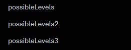

# 2.2.12 Cycle 12 - Proper Enemy Spawning & Improved Levels

## Design

### Objectives

In this cycle, my goal is to make some proper levels with enemies spawning in the correct places. My objectives in this cycle are to:

* [x] Make some proper level layouts
* [x] Change level spawning so that it chooses levels from 3 lists, one for each floor, so that the enemy difficulty can increase on each level
* [x] Enemies spawn in proper locations within the level
* [x] Text appears in the corner of your screen when entering a new floor saying the floor number
* [x] Text appears declaring when you have entered a boss fight
* [x] The player can advance through a door if all enemies have been killed
* [x] Make player and enemy bullets destroy the boxes (mushrooms) when colliding with them

### Usability Features

The text for boss fights and new floors will help players keep track of how far they are into the game and what they are likely to expect next.

### Key Variables

| Variable Name      | Use                                                                                                                                                                        |
| ------------------ | -------------------------------------------------------------------------------------------------------------------------------------------------------------------------- |
| `floorNumber`      | This variable is used to store and track the current floor number. It is updated based on the chosen level index and used to display the floor number in `newFloorText`.   |
| `enemiesRemaining` | This variable tracks the number of remaining enemies in a level. It is checked to determine whether the player can progress to the next level after defeating all enemies. |

### Pseudocode

```
# Initialize game variables
InitializeGameVariables()

# Boss Fight Text
bossFightText = CreateBossFightText()

if (chosenLevelIndex is 6 or chosenLevelIndex is 13 or chosenLevelIndex is 20):
    DisplayBossFightText()
    WaitAndHideBossFightText()

# New Floor Text
newFloorText = CreateNewFloorText()

if (chosenLevelIndex is 0):
    SetFloorNumberTo1()
    DisplayNewFloorText()
    WaitAndHideNewFloorText()
elif (chosenLevelIndex is 7):
    SetFloorNumberTo2()
    DisplayNewFloorText()
    WaitAndHideNewFloorText()
elif (chosenLevelIndex is 14):
    SetFloorNumberTo3()
    DisplayNewFloorText()
    WaitAndHideNewFloorText()

# Box Collision Handling
HandleBoxCollisions()

# "door" Object
doorObject = CreateDoorObject()

HandlePlayerCollisionsWithDoor()

# Player Bullets and Enemy Bullets
DefineTagsForBullets()

# Remaining Enemies Tracking
enemiesRemaining = CountRemainingEnemies()

if (enemiesRemaining is 0):
    ProceedToNextLevel()
```

## Development

### Outcome

I created levels for each floor which are stored in separate files for ease of access.

<figure><figcaption><p>Files for possible levels of each floor</p></figcaption></figure>

Below are a couple of possible example levels from floor 2. As the floor increases, the levels become more difficult with more boxes and spikes and harder enemies spawn.

<pre class="language-typescript" data-title="possibleLevels2.ts"><code class="lang-typescript"><strong>export const possibleLevels2 = [
</strong>    {
        id: 11,
        enemy1Spawns: [],
        enemy2Spawns: [
            [397, 556],
            [1297, 343],
            [822, 273],
        ],
        enemy3Spawns: [
            [816, 580],
            [826, 111],
        ],
        enemy4Spawns: [],
        enemy5Spawns: [],
        enemy6Spawns: [],
        layout: [
            "====================",
            "= +    ^ +         =",
            "=  +            ^  =",
            "=   +     +        =",
            "= ^           +    =",
            "= +     +  ^       =",
            "=       ^     +    =",
            "= +   +         ^  =",
            "=@      +          #",
            "=                  =",
            "= +     ^      +   =",
            "=         +  ^ +   =",
            "= +           +  ++=",
            "=   ^              =",
            "=         ^^       =",
            "====================",
        ],
    },
    {
        id: 12,
        enemy1Spawns: [],
        enemy2Spawns: [
            [1152, 234],
        ],
        enemy3Spawns: [
            [1099, 94],
            [1189, 759],
        ],
        enemy4Spawns: [
            [405, 264],
        ],
        enemy5Spawns: [],
        enemy6Spawns: [],
        layout: [
            "====================",
            "=   +              =",
            "=  +  ^      +     =",
            "= + ^ +   ^        =",
            "=   +      +     + =",
            "=     + ^      ^   =",
            "=  +            +  =",
            "=     + +  +    +  =",
            "=@  +              #",
            "=                  =",
            "= + ^   +    ^  +  =",
            "=      +        +  =",
            "= +         +   +++=",
            "=   ^              =",
            "=         ^^       =",
            "====================",
        ],
    },
    
    ... //rest of the levels
];
</code></pre>

Below is the updated level selection code which now handles the three lists to draw for each floor. I moved it into a separate file since it got so long.


```typescript
import { possibleLevels } from "./possibleLevels";
import { possibleLevels2 } from "./possibleLevels2";
import { possibleLevels3 } from "./possibleLevels3";
import { fixedLevels } from "./fixedLevels";


export function chooseLevels(chosenLevels) {
// Add the first fixed level to the chosen levels
    chosenLevels.push({
        id: fixedLevels[0].id,
        layout: fixedLevels[0].layout,
        enemy1Spawns: fixedLevels[0].enemy1Spawns,
        enemy2Spawns: fixedLevels[0].enemy2Spawns,
        enemy3Spawns: fixedLevels[0].enemy3Spawns,
        enemy4Spawns: fixedLevels[0].enemy4Spawns,
        enemy5Spawns: fixedLevels[0].enemy5Spawns,
        enemy6Spawns: fixedLevels[0].enemy6Spawns,
    });
    
    // Add 5 random levels from possibleLevels array to chosen levels
    for (let i = 0; i < 5; i++) {
        let randomIndex = Math.floor(Math.random() * possibleLevels.length);
        let randomLevel = {
            id: possibleLevels[randomIndex].id,
            layout: possibleLevels[randomIndex].layout,
            enemy1Spawns: possibleLevels[randomIndex].enemy1Spawns,
            enemy2Spawns: possibleLevels[randomIndex].enemy2Spawns,
            enemy3Spawns: possibleLevels[randomIndex].enemy3Spawns,
            enemy4Spawns: possibleLevels[randomIndex].enemy4Spawns,
            enemy5Spawns: possibleLevels[randomIndex].enemy5Spawns,
            enemy6Spawns: possibleLevels[randomIndex].enemy6Spawns,
        };
        chosenLevels.push(randomLevel);
    };
    
    // Add the second fixed level to the chosen levels
    chosenLevels.push({
        id: fixedLevels[1].id,
        layout: fixedLevels[1].layout,
        enemy1Spawns: fixedLevels[1].enemy1Spawns,
        enemy2Spawns: fixedLevels[1].enemy2Spawns,
        enemy3Spawns: fixedLevels[1].enemy3Spawns,
        enemy4Spawns: fixedLevels[1].enemy4Spawns,
        enemy5Spawns: fixedLevels[1].enemy5Spawns,
        enemy6Spawns: fixedLevels[1].enemy6Spawns,
    });
    
    // Add the first fixed level to the chosen levels again
    chosenLevels.push({
        id: fixedLevels[0].id,
        layout: fixedLevels[0].layout,
        enemy1Spawns: fixedLevels[0].enemy1Spawns,
        enemy2Spawns: fixedLevels[0].enemy2Spawns,
        enemy3Spawns: fixedLevels[0].enemy3Spawns,
        enemy4Spawns: fixedLevels[0].enemy4Spawns,
        enemy5Spawns: fixedLevels[0].enemy5Spawns,
        enemy6Spawns: fixedLevels[0].enemy6Spawns,
    });
    
     // Add 5 random levels from possibleLevels2 array to chosen levels
    for (let i = 0; i < 5; i++) {
        let randomIndex = Math.floor(Math.random() * possibleLevels2.length);
        let randomLevel = {
            id: possibleLevels2[randomIndex].id,
            layout: possibleLevels2[randomIndex].layout,
            enemy1Spawns: possibleLevels2[randomIndex].enemy1Spawns,
            enemy2Spawns: possibleLevels2[randomIndex].enemy2Spawns,
            enemy3Spawns: possibleLevels2[randomIndex].enemy3Spawns,
            enemy4Spawns: possibleLevels2[randomIndex].enemy4Spawns,
            enemy5Spawns: possibleLevels2[randomIndex].enemy5Spawns,
            enemy6Spawns: possibleLevels2[randomIndex].enemy6Spawns,
        };
        chosenLevels.push(randomLevel);
    };
    
     // Add the second fixed level to the chosen levels again
    chosenLevels.push({
        id: fixedLevels[1].id,
        layout: fixedLevels[1].layout,
        enemy1Spawns: fixedLevels[1].enemy1Spawns,
        enemy2Spawns: fixedLevels[1].enemy2Spawns,
        enemy3Spawns: fixedLevels[1].enemy3Spawns,
        enemy4Spawns: fixedLevels[1].enemy4Spawns,
        enemy5Spawns: fixedLevels[1].enemy5Spawns,
        enemy6Spawns: fixedLevels[1].enemy6Spawns,
    });
    
     // Add the first fixed level to the chosen levels once more
    chosenLevels.push({
        id: fixedLevels[0].id,
        layout: fixedLevels[0].layout,
        enemy1Spawns: fixedLevels[0].enemy1Spawns,
        enemy2Spawns: fixedLevels[0].enemy2Spawns,
        enemy3Spawns: fixedLevels[0].enemy3Spawns,
        enemy4Spawns: fixedLevels[0].enemy4Spawns,
        enemy5Spawns: fixedLevels[0].enemy5Spawns,
        enemy6Spawns: fixedLevels[0].enemy6Spawns,
    });
    
     // Add 5 random levels from possibleLevels3 array to chosen levels
    for (let i = 0; i < 5; i++) {
        let randomIndex = Math.floor(Math.random() * possibleLevels3.length);
        let randomLevel = {
            id: possibleLevels3[randomIndex].id,
            layout: possibleLevels3[randomIndex].layout,
            enemy1Spawns: possibleLevels3[randomIndex].enemy1Spawns,
            enemy2Spawns: possibleLevels3[randomIndex].enemy2Spawns,
            enemy3Spawns: possibleLevels3[randomIndex].enemy3Spawns,
            enemy4Spawns: possibleLevels3[randomIndex].enemy4Spawns,
            enemy5Spawns: possibleLevels3[randomIndex].enemy5Spawns,
            enemy6Spawns: possibleLevels3[randomIndex].enemy6Spawns,
        };
        chosenLevels.push(randomLevel);
    };
    
     // Add the second fixed level to the chosen levels one final time
    chosenLevels.push({
        id: fixedLevels[1].id,
        layout: fixedLevels[1].layout,
        enemy1Spawns: fixedLevels[1].enemy1Spawns,
        enemy2Spawns: fixedLevels[1].enemy2Spawns,
        enemy3Spawns: fixedLevels[1].enemy3Spawns,
        enemy4Spawns: fixedLevels[1].enemy4Spawns,
        enemy5Spawns: fixedLevels[1].enemy5Spawns,
        enemy6Spawns: fixedLevels[1].enemy6Spawns,
    });
};
```


Here is the code within the level scene which is responsible for the boss and floor text which appears. The text entities are created with their `opacity` set to 0 and when the desired level appears, the `opacity` is set to 1 for a short duration which reveals the text before it is hidden again.

<pre class="language-typescript" data-title="main.ts"><code class="lang-typescript">    // Create a text entity for the boss fight announcement
<strong>    const bossFightText = add([
</strong>        text("Boss Fight", {
            size: 70,
        }),
        pos(1550, 60),
        area({ cursor: "pointer" }),
        z(10),
        opacity(0),
        "bossFightText",
    ]);

    // Check if the current level index corresponds to a boss fight level
    if (chosenLevelIndex === 6 || chosenLevelIndex === 13 || chosenLevelIndex === 20) {
          // Display the boss fight text and then remove it after 2 seconds
        bossFightText.opacity = 1;
        wait(2, () => {
            bossFightText.opacity = 0;
        });
    };

    // Create a text entity for displaying the new floor number
        const newFloorText = add([
        text("Floor " + floorNumber, {
        size: 70,
        }),
        pos(1550, 60),
        z(10),
        opacity(0),
        "newFloorText",
    ]);
    
    // Check the chosen level index to determine the floor number and display appropriate text
    if (chosenLevelIndex === 0) {
        floorNumber = 1;
        newFloorText.text = "Floor " + floorNumber,
        newFloorText.opacity = 1;
        wait(2, () => {
            newFloorText.opacity = 0;
        });
    } else if (chosenLevelIndex === 7) {
        floorNumber = 2;
        newFloorText.text = "Floor " + floorNumber,
        newFloorText.opacity = 1;
        wait(2, () => {
            newFloorText.opacity = 0;
        });
    } else if (chosenLevelIndex === 14) {
        floorNumber = 3;
        newFloorText.text = "Floor " + floorNumber,
        newFloorText.opacity = 1;
        wait(2, () => {
            newFloorText.opacity = 0;
        });
    };
</code></pre>

When a `player_bullet` or `enemy_bullet` collides with a `box`, both the bullet and box are destroyed.


```typescript
    //Box-bullet collision handling

    onCollide("player_bullet", "box", (p_bullet, box) => {
        destroy(p_bullet); // Destroy the player bullet
        destroy(box);   // Destroy the box
    });

    onCollide("enemy_bullet", "box", (e_bullet, box) => {
        destroy(e_bullet); // Destroy the enemy bullet
        destroy(box);   // Destroy the box
    });
```


Doors are added as part of the level tile map are are represented by a `#`.

<pre class="language-typescript" data-title="main.ts"><code class="lang-typescript"><strong>    "#": () => [
</strong>          sprite("door"),
          area(),
          anchor("center"),
          z(2),
          body(),
          "door",
      ],
</code></pre>

When the player touches the door, the game checks if there are any enemies present and if they have all been killed it advances to the next level. Otherwise, nothing happens.

```typescript
 onCollide("player", "door", (bullet, box) => {
        enemiesRemaining = get("enemy").length;
        if (enemiesRemaining === 0) {
            chosenLevelIndex += 1;
            destroyAll("entity");
            if (chosenLevelIndex > chosenLevels.length - 1) {
                go("win");
            } else {
                go("level", chosenLevelIndex);
            };
        };
    });
```

### Challenges

It would have taken a very long time to type out each level individually so I used a random generator for the tile map and enemy spawn positions. This undoubtedly saved me a lot of time.

## Testing

### Tests

| Test | Instructions                                                      | What I expect                                                                                                                                                                                                                                                                        | What actually happens                                                                         | Pass/Fail |
| ---- | ----------------------------------------------------------------- | ------------------------------------------------------------------------------------------------------------------------------------------------------------------------------------------------------------------------------------------------------------------------------------ | --------------------------------------------------------------------------------------------- | --------- |
| 1    | Cycle through levels.                                             | <ol><li>When starting a new floor, the floor test appears displaying the floor number.</li><li>When entering a boss fight, the boss fight text appears.</li><li>Each level has a seemingly random layout of spikes and boxes.</li><li>All enemies spawn withing the walls.</li></ol> | <ol><li>As expected.</li><li>As expected.</li><li>As expected.</li><li>As expected.</li></ol> | Pass.     |
| 2    | Shoot at the boxes.                                               | Boxes are destroyed by bullets.                                                                                                                                                                                                                                                      | As expected.                                                                                  | Pass.     |
| 3    | Let the enemies shoot boxes.                                      | Boxes are destroyed by enemy bullets.                                                                                                                                                                                                                                                | As expected.                                                                                  | Pass.     |
| 4    | Attempt to go through a door while there are still enemies alive. | Nothing happens.                                                                                                                                                                                                                                                                     | As expected.                                                                                  | Pass.     |
| 5    | Attempt to go through a door when all the enemies are dead.       | Game advances to next level.                                                                                                                                                                                                                                                         | As expected.                                                                                  | Pass.     |

### Evidence


