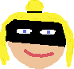
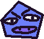
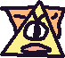

# 2.2.13 Cycle 13 - Shop & More Weapons

## Design

### Objectives

In this cycle, I plan to add the shop feature. My objectives in this cycle are to:

* [x] Make the shopkeeper unmoveable when you walk into him
* [x] Add 2 new weapons (Clockwork Revolver and Ironclad Carbine)
* [x] Touching the shopkeeper at a shop level will display a message that says the prices for each item
* [x] Each item can be bought with each key if the player has enough coins to meet the price
* [x] All the locked weapons are in the shop
* [x] Add healing potion in the shop
* [x] Add doors to shop and boss fight levels
* [x] Change the first shop level to an introduction level which displays a starting message when touching the shopkeeper
* [x] Pressing 'm' key will add a coin. This is a temporary feature which will make it easier for me to test each weapon works correctly.

#### Smaller Changes

* [x] Fix the health bar bug with it not updating correctly
* [x] Add a new sprite for enemy 4
* [x] Add a new sprite for enemy 5
* [x] Add a new sprite for enemy 6
* [x] Add a new sprite for Scarlet Blackthorn character

### Usability Features

### Key Variables

| Variable Name                   | Use                                                                                                                                                                                                |
| ------------------------------- | -------------------------------------------------------------------------------------------------------------------------------------------------------------------------------------------------- |
| `shopText` and `message`        | These variables are used to create and display a shop dialogue box with a black background and text. `shopText` is the black background, and `message` is the text displayed in the shop dialogue. |
| `loreText` and `message`        | These variables are used to create and display a lore dialogue box with a black background and text. `loreText` is the black background, and `message` is the text displayed in the lore dialogue. |
| `weapons` and `unlockedWeapons` | These arrays store information about the available weapons in the game and the weapons that the player has unlocked, respectively.                                                                 |
| `currentWeapon`                 | This variable represents the weapon currently equipped by the player.                                                                                                                              |

### Pseudocode

```
# Display Shop and Lore Text
function showShopText():
    Create shopText (black background)
    Create message (shop dialogue text)

function showLoreText():
    Create loreText (black background)
    Create message (lore dialogue text)

# Hide Shop and Lore Text
function hideShopText():
    Destroy all entities with tag "shopDialogue"

function hideLoreText():
    Destroy all entities with tag "loreDialogue"

# Handle Player Collisions
onCollide("player", "shopkeeper"):
    If chosenLevelIndex is 7 or 14:
        ShowShopText()
    Else if chosenLevelIndex is 0:
        ShowLoreText()

onCollideEnd("player", "shopkeeper"):
    HideShopText()
    HideLoreText()

# Unlock Weapons
function unlockWeapon(index):
    If canUnlockWeapon(index):
        Mark weapon as unlocked
        Add unlocked weapon to the player's inventory
        Deduct weapon cost from player's coins
        Update coin counter
        Update inventory text

# Handle Key Press Events
onKeyPress("o"):
    UnlockWeapon(1) # Machine gun

onKeyPress("p"):
    UnlockWeapon(2) # Shotgun

onKeyPress("u"):
    UnlockWeapon(3) # Machine pistol

onKeyPress("i"):
    UnlockWeapon(4) # Rifle

onKeyPress("l"):
    RestoreHealth() # Restore player's health

onKeyPress("1"):
    EquipWeapon(1) # Equip weapon 1

# Additional Equip Weapon Key Presses (2, 3, 4, 5)...

onKeyPress("m"):
    UpdateCoinCounter() # Add a coin

# Update Health Bar
function updateHealthBar():
    Calculate new health bar width based on playerHP
    Set healthBar's width to the new width

# Define Health Bar Components
Create healthBarBorder (border of health bar)
Create healthBarBg (background of health bar)
Create healthBar (actual health bar)
```

## Development

### Outcome

The introduction text and the shop text are handled in the same way. In the introduction level and shop levels respectively, when the player touches the shopkeeper the message and background are added. When the player stops touching the shopkeeper they are removed.

```typescript
// Function to show shop text
    function showShopText() {
        const shopText = add([
            rect(1250,300), // Create a black background for the text
            pos(width() / 2, height() / 2),
            z(11),
            anchor("center"),
            opacity(0.5),
            color(0, 0, 0),
            "shopDialogue",
        ]);

        // Create and display the shop dialogue message
        const message = add([
            text("Welcome back adventurer! I can sell you some of my wares.\nIf you have enough coins you can buy an item in my shop with the corresponding key press.\n10 coins - Brass Spraygun: O key\n10 coins - Boomstick: P key\n15 coins - Clockwork Revolver: U key\n15 coins - Ironclad Carbine: I key\nAdditionally for 5 coins you can restore 10 health with a potion - L key.",  {
                size: 30,
                width: width() - 40,
                align: "center",
            }),
            pos(width() / 2, height() / 2),
            z(12),
            anchor("center"),
            color(255, 255, 255),
            "shopDialogue",
        ]);
    }

    // Function to show lore text
    function showLoreText() {
    // Create a black background for the lore text
    const loreText = add([
        rect(1600, 150),
        pos(width() / 2, height() / 2),
        z(11),
        anchor("center"),
        color(0, 0, 0),
        "loreDialogue",
    ]);

    // Create and display the lore dialogue message
    const message = add([
        text("The Evil Shapes are invading our world from another dimension!\nYou must defeat The Evil Shapes through 3 floors and defeat the Shape King to restore balance before it is too late.\nEnemies get stronger the further you go. If you find me later I can sell you some items to help.\nGood luck!",  {
                size: 30,
                width: width() - 40,
                align: "center",
            }),
        pos(width() / 2, (height() / 2)),
        z(12),
        opacity(0.5),
        anchor("center"),
        color(255, 255, 255),
        "loreDialogue",
    ]);
}

    // Function to hide shop text
    function hideShopText() {
        // Destroy all entities with the "shopDialogue" tag
        destroyAll("shopDialogue",);
    }

        // Function to hide shop text
    function hideLoreText() {
        // Destroy all entities with the "loreDialogue" tag
        destroyAll("loreDialogue",);
    }

    // Handle collision between player and shopkeeper
    onCollide("player", "shopkeeper", () => {
        if (chosenLevelIndex === 7 || chosenLevelIndex === 14) {
        showShopText(); // Show shop text if on certain levels
        } else if (chosenLevelIndex === 0) {
            showLoreText(); // Show lore text if on level 0
        }
    })
    
    // Handle the end of collision between player and shopkeeper
    onCollideEnd("player", "shopkeeper", () => {
        hideShopText();
        hideLoreText();
    })
```

I modified the function to unlock a weapon so that there must be enough coins to purchase the desired weapon. If there are enough coins then the amount of coins gets subtracted from the total coin balance.

```typescript
    // Attempt to unlock a weapon
    function unlockWeapon(index) {
        if (canUnlockWeapon(index)) {
            weapons[index].unlocked = true;
            unlockedWeapons.push(weapons[index]);
            coins -= weapons[index].cost;
            updateCoinCounter();
            inventoryText.updateText();
        }
    }

    // Key press events to unlock weapons
    onKeyPress("o", () => {
        unlockWeapon(1);
    }); // Unlock machine gun
    onKeyPress("p", () => {
        unlockWeapon(2);
    }); // Unlock shotgun
        onKeyPress("u", () => {
        unlockWeapon(3);
    }); // Unlock machine pistol
    onKeyPress("i", () => {
        unlockWeapon(4);
    }); // Unlock rifle


    // Key press events to equip weapons (1, 2, 3, 4, 5, etc.)
    onKeyPress("1", () => {

    ... // Other weapon equip keys
    
    onKeyPress("4", () => {
        if (unlockedWeapons[3]) {
            currentWeapon = unlockedWeapons[3];
        }
    })
    onKeyPress("5", () => {
        if (unlockedWeapons[4]) {
            currentWeapon = unlockedWeapons[4];
        }
    })
```

If the player has enough coins, they can restore a portion of their health.

```typescript
    function restoreHealth() {
        if (coins >= 5) {
            coins -= 5; // Deduct 5 coins
            playerHP += 10; // Restore 10 health
            updateHealthBar(); // Update the health bar
            updateCoinCounter(); // Update the coin counter
        };
    };

// Listen for the "l" key press to restore health
onKeyPress("l", () => {
    restoreHealth();
});
```

I added this temporary feature to make testing each weapon during development easier. Pressing m adds a coin to the coin count.

```typescript
    // Key press event to add a coin
    onKeyPress("m", () => {
        updateCoinCounter();
    });
```

I adjusted `healthBar`'s width simply to be equal to `playerHP` instead of using the maths which I had come before. This fixed the bug with the health bar increasing instead of decreasing after getting damaged.

```typescript
    // Health bar components
    const healthBarBorder = add([
        rect(ORIGINALHP + 4, HEALTHBARHEIGHT + 4),
        pos(10, 10),
        z(3),
        color(0, 0, 0),
    ]);
    const healthBarBg = add([
        rect(ORIGINALHP, HEALTHBARHEIGHT),
        pos(12, 12),
        z(4),
        color(79, 75, 75),
    ]);
    const healthBar = add([
        rect(playerHP, HEALTHBARHEIGHT),
        pos(12, 12),
        z(5),
        color(92, 204, 12),
    ]);
    
    //health bar updater
    function updateHealthBar() {
        const newWidth = playerHP;
        healthBar.width = newWidth;
    }
```

#### New Sprites

Over the coming cycles, I will be replacing some of the sprites in the game with proper versions. Below are the new sprites I added in this cycle.

<div>

<figure><figcaption><p>Scarlet Blackthorn</p></figcaption></figure>

 

<figure><figcaption><p>Enemy 4</p></figcaption></figure>

 

<figure><figcaption><p>Enemy 5</p></figcaption></figure>

 

<figure><figcaption><p>Enemy 6</p></figcaption></figure>

</div>

## Testing

### Tests

| Test | Instructions                                               | What I expect                                                                                     | What actually happens | Pass/Fail |
| ---- | ---------------------------------------------------------- | ------------------------------------------------------------------------------------------------- | --------------------- | --------- |
| 1    | Start game and touch shopkeeper.                           | Introduction text appears.                                                                        | As expected.          | Pass.     |
| 2    | Move away from shopkeeper.                                 | Message disappears.                                                                               | As expected.          | Pass.     |
| 3    | Cycle through levels and observe enemy sprites.            | Enemies 4, 5 and 6 should be using the new sprites.                                               | As expected.          | Pass.     |
| 4    | Touch the shopkeeper in shop levels.                       | Shop message appears.                                                                             | As expected.          | Pass.     |
| 5    | Repeat test 2 for shop levels.                             | Message disappears.                                                                               | As expected.          | Pass.     |
| 6    | Attempt to buy each item in the shop without enough coins. | Nothing happens and items are not bought.                                                         | As expected.          | Pass.     |
| 7    | Add coins with m and attempt to buy each item.             | Each item can be bought and weapons appear in the inventory in the order that they are purchased. | As expected.          | Pass.     |
| 8    | Buy health restorations.                                   | Health increases by the same amount each time.                                                    | As expected.          | Pass.     |
| 9    | Restart game as Scarlett Blackthorn character.             | Game uses her new sprite.                                                                         | As expected.          | Pass.     |

The new sprite for my Scarlett Blackthorn character is a bit big so I will scale her down and make sure when I add new sprites for other characters that they are scaled down too.

### Evidence


