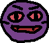
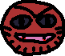

# 2.2.14 Cycle 14 - Boss Fights

## Design

### Objectives

In this cycle, my main goal is to add boss fights to the game. My objectives in this cycle are to:

* [x] Add boss enemies as new enemy types to the enemy class
* [x] Bosses are bigger and stronger than normal enemies
* [x] Boss 1 shoots like a regular enemy
* [x] Boss 2 shoots in bursts
* [x] Boss 3 shoots like a shotgun
* [x] Bosses can spawn enemies around them with a % chance
* [x] Harder bosses will spawn more challenging enemies
* [x] Bosses have custom sprites
* [x] Add spikes to boss levels

#### Smaller Changes

* [x] Destroy enemy and player bullets when they collide with a wall
* [x] Make the door unmoveable
* [x] Reduce the number of spikes and boxes on floor 3
* [x] Remove spikes next to the player spawn location in all levels
* [x] Make the background for the introduction message partially transparent
* [x] Add bullet speed to enemy class parameters
* [x] Somewhat balance the guns and enemies

### Usability Features

### Key Variables

| Variable Name     | Use                                                                                                                                        |
| ----------------- | ------------------------------------------------------------------------------------------------------------------------------------------ |
| `BOSSSPAWNINGPOS` | This constant holds the position where boss enemies spawn. It is used to ensure that boss enemies consistently spawn at the same location. |

### Pseudocode

```
// Import necessary modules and functions

// Define the Enemy class
class Enemy {
    // Properties declaration

    // Constructor method
    constructor(sprite, type) {
        // Initialize properties based on the enemy type
    }

    // Method to spawn the enemy at a given position
    spawn(position, player) {
        // Create the enemy entity
        // Set entity properties and behaviors
        // Activate the enemy
    }

    // Method to update the enemy's health
    updateHealth(amount) {
        // Update the enemy's health and check for death
    }

    // Method to destroy the enemy
    destroy() {
        // Destroy the entity, mark as not alive, and update the coin counter
    }

    // Method to activate the enemy's behavior
    activate(player) {
        // Register an update event for the enemy
        // Implement the enemy's movement, shooting, and spawning behavior
    }

    // Method to shoot a projectile at a target position
    shootProjectile(targetPos) {
        // Calculate the shooting direction and spread angle
        // Create a projectile entity and set its properties
    }

    // Method to spawn minions
    spawnMinions(player) {
        // Define positions for minions relative to the boss
        // Check if the boss is alive
        // Spawn minions at specified positions based on boss species
    }
}

// Export the Enemy class


...


// Define a constant for the boss enemy spawning position
const BOSSSPAWNINGPOS = vec2(1200, 450);

// Check the current level to determine boss spawns and boss fight text display
if (chosenLevelIndex === 6) {
    // Create a boss enemy instance of type 7
    const enemy7 = new Enemy("firstboss", 7);
    
    // Spawn the boss enemy at the specified position
    enemy7.spawn(BOSSSPAWNINGPOS, player);
    
    // Display boss fight text
    bossFightText.opacity = 1;

    // Wait for 2 seconds and then hide the boss fight text
    wait(2, () => {
        bossFightText.opacity = 0;
    });
} else if (chosenLevelIndex === 13) {
    // Create a boss enemy instance of type 8
    const enemy8 = new Enemy("secondboss", 8);
    
    // Spawn the boss enemy at the specified position
    enemy8.spawn(BOSSSPAWNINGPOS, player);
    
    // Display boss fight text
    bossFightText.opacity = 1;

    // Wait for 2 seconds and then hide the boss fight text
    wait(2, () => {
        bossFightText.opacity = 0;
    });
} else if (chosenLevelIndex === 20) {
    // Create a boss enemy instance of type 9
    const enemy9 = new Enemy("thirdboss", 9);
    
    // Spawn the boss enemy at the specified position
    enemy9.spawn(BOSSSPAWNINGPOS, player);
    
    // Display boss fight text
    bossFightText.opacity = 1;

    // Wait for 2 seconds and then hide the boss fight text
    wait(2, () => {
        bossFightText.opacity = 0;
    });
}
```

## Development

### Outcome

I added the boss enemies as strong enemies within the `Enemy` class. Bosses will shoot differently. The first boss shoots normally, the second boss shoots in bursts, and the third boss shoots like a shotgun. After shooting, each boss has a chance to spawn a couple of enemies next to them, the strength of which depends on the boss.


```typescript
import { updateCoinCounter } from "./main";

export class Enemy {
    sprite: string;
    maxHealth: number;
    currentHealth: number;
    entity: any;
    isMoving: boolean;
    idleTime: number;
    shootDamage: number;
    isAlive: boolean;
    numSteps: number;
    moveSpeed: number;
    bulletSpeed: number;
    inaccuracy: number;
    species: number;

    constructor(sprite: string, type: number) {
        // Initialize properties based on the enemy type
        if (type === 1) { // Enemy type 1
            this.maxHealth = 50;
            this.idleTime = (Math.random() * (4 - 2) + 2);
            this.shootDamage = 7;
            this.numSteps = 20;
            this.moveSpeed = 100;
            this.bulletSpeed = 650;
            this.inaccuracy = 1;
            this.species = 1;
        } else if (type === 2) { // Enemy type 2
            this.maxHealth = 75;
            this.idleTime = (Math.random() * (2 - 0.5) + 0.5);
            this.shootDamage = 10;
            this.numSteps = 20;
            this.moveSpeed = 100;
            this.bulletSpeed = 700;
            this.inaccuracy = 1;
            this.species = 2;
        } else if (type === 3) { // Enemy type 3
            this.maxHealth = 100;
            this.idleTime = (Math.random() * (4.5 - 3) + 3);
            this.shootDamage = 14;
            this.numSteps = 20;
            this.moveSpeed = 100;
            this.bulletSpeed = 700;
            this.inaccuracy = 1;
            this.species = 3;
        } else if (type === 4) { // Enemy type 4
            this.maxHealth = 150;
            this.idleTime = (Math.random() * (3 - 1.5) + 1.5);
            this.shootDamage = 17;
            this.numSteps = 20;
            this.moveSpeed = 100;
            this.bulletSpeed = 750;
            this.inaccuracy = 1;
            this.species = 4;
        } else if (type === 5) { // Enemy type 5
            this.maxHealth = 200;
            this.idleTime = (Math.random() * (2.5 - 1) + 1);
            this.shootDamage = 20;
            this.numSteps = 20;
            this.moveSpeed = 100;
            this.bulletSpeed = 750;
            this.inaccuracy = 8;
            this.species = 5;
        } else if (type === 6) { // Enemy type 6
            this.maxHealth = 250;
            this.idleTime = (Math.random() * (5 - 3.5) + 3.5);
            this.shootDamage = 25;
            this.numSteps = 20;
            this.moveSpeed = 100;
            this.bulletSpeed = 750;
            this.inaccuracy = 3;
            this.species = 6;
        } else if (type === 7) { // Boss type 1, enemy type 7
            this.maxHealth = 350;
            this.idleTime = (Math.random() * (3 - 2) + 2);
            this.shootDamage = 25;
            this.numSteps = 20;
            this.moveSpeed = 100;
            this.bulletSpeed = 800;
            this.inaccuracy = 3;
            this.species = 7;
        } else if (type === 8) { // Boss type 2, enemy type 8
            this.maxHealth = 600;
            this.idleTime = (Math.random() * (2.5 - 1.5) + 1.5);
            this.shootDamage = 16;
            this.numSteps = 20;
            this.moveSpeed = 100;
            this.bulletSpeed = 1000;
            this.inaccuracy = 7;
            this.species = 8;
        } else if (type === 9) { // Boss type 3, enemy type 9
            this.maxHealth = 1200;
            this.idleTime = (Math.random() * (2.5 - 1) + 1);
            this.shootDamage = 20;
            this.numSteps = 20;
            this.moveSpeed = 100;
            this.bulletSpeed = 750;
            this.inaccuracy = 20;
            this.species = 9;
        };
        this.sprite = sprite;
        this.currentHealth = this.maxHealth;
        this.entity = null;
        this.isMoving = false;
        this.isAlive = true;
    }

    spawn(position: Vec2, player: any) {
        this.entity = add([
            sprite(this.sprite),
            body(),
            area(),
            pos(position),
            anchor("center"),
            z(2),
            "enemy",
        ]);
        this.entity.instance = this
        this.activate(player);
    }

    updateHealth(amount: number) {
        this.currentHealth -= amount;
        if (this.currentHealth <= 0) {
            this.destroy();
        }
    }

    destroy() {
        destroy(this.entity);
        this.isAlive = false;
        updateCoinCounter();
    }

    activate(player: any) {
        this.entity.on("update", async () => {
            if (!this.isMoving) {
                this.isMoving = true;
                this.entity.color = rgb(255, 0, 0);
                const targetPos = player.pos.add(vec2(350, 50));
                const direction = targetPos.sub(this.entity.pos).unit();

                for (let i = 0; i < this.numSteps; i++) {
                    const moveAmount = this.moveSpeed / this.numSteps;
                    this.entity.moveBy(direction.scale(moveAmount));
                    await wait(0.02); // Adjust the wait period between each step
                };

                await wait(1);
                this.entity.color = rgb(0, 0, 255);
                let latestTargetPos = player.pos.add(vec2(350, 50));
                if (this.species <= 7) {
                    this.shootProjectile(latestTargetPos);

                    // 50% chance to spawn minions after shooting
                    if (Math.random() < 0.5) {
                        this.spawnMinions(player);
                    }
                } else if (this.species === 8) {
                    for (let p = 0; p < 5; p++) {
                        latestTargetPos = player.pos.add(vec2(350, 50));
                        this.shootProjectile(latestTargetPos);
                        await wait(0.25);
                    };

                    // 50% chance to spawn minions after shooting
                    if (Math.random() < 0.5) {
                        this.spawnMinions(player);
                    }
                } else if (this.species === 9) {
                    // Shoot 5 bullets at once for shotgun effect
                    this.shootProjectile(latestTargetPos);
                    this.shootProjectile(latestTargetPos);
                    this.shootProjectile(latestTargetPos);
                    this.shootProjectile(latestTargetPos);
                    this.shootProjectile(latestTargetPos);

                    // 25% chance to spawn minions after shooting
                    if (Math.random() < 0.25) {
                        this.spawnMinions(player);
                    }
                }
                await wait(this.idleTime);
                this.isMoving = false;
            }
        });
    }


    shootProjectile(targetPos: Vec2) {
        let direction = this.entity.pos.angle(targetPos) + 180;
        const spreadAngle = Math.random() * this.inaccuracy - this.inaccuracy / 2;
        if (this.isAlive) {
            add([
                sprite("egg"),
                pos(this.entity.pos),
                area(),
                scale(0.65, 0.65),
                color(255, 0, 0),
                anchor("center"),
                z(2),
                rotate(this.entity.pos.angle(targetPos) + 270),
                move(direction + spreadAngle, this.bulletSpeed),
                "enemy_bullet",
                { shootDamage: this.shootDamage },
                offscreen({ destroy: true }),
            ]);
        };
    };

    spawnMinions(player: any) {
        // Define the positions for the minions relative to the boss
        const minionPositions: vec2[] = [
            vec2(50, 0),
            vec2(-50, 0),
        ];

        // Check to make sure boss is still alive before spawning enemies
        if (this.isAlive) {
            // Spawn minions at specified positions
            for (const position of minionPositions) {
                if (this.species === 7) {
                    const enemy2 = new Enemy("bobo", 2);
                    enemy2.spawn(this.entity.pos.add(position), player);
                } else if (this.species === 8) {
                    const enemy4 = new Enemy("dino", 4);
                    enemy4.spawn(this.entity.pos.add(position), player);
                } else if (this.species === 9) {
                    const enemy6 = new Enemy("gigagantrum", 6);
                    enemy6.spawn(this.entity.pos.add(position), player);
                };
            };
        };
    };

};
```


When the current level is a boss level (`chosenLevelIndex` is 6, 13, or 20) then a boss is spawned. The strength of the boss depends on the level.

```typescript
const BOSSSPAWNINGPOS = vec2(1200, 450);
    if (chosenLevelIndex === 6) {
        const enemy7 = new Enemy("firstboss", 7);
        enemy7.spawn(BOSSSPAWNINGPOS, player);
        
        bossFightText.opacity = 1;
        wait(2, () => {
            bossFightText.opacity = 0;
        });
    } else if (chosenLevelIndex === 13) {
        const enemy8 = new Enemy("secondboss", 8);
        enemy8.spawn(BOSSSPAWNINGPOS, player);
        
        bossFightText.opacity = 1;
        wait(2, () => {
            bossFightText.opacity = 0;
        });
    } else if (chosenLevelIndex === 20) {
        const enemy9 = new Enemy("thirdboss", 9);
        enemy9.spawn(BOSSSPAWNINGPOS, player);
        
        bossFightText.opacity = 1;
        wait(2, () => {
            bossFightText.opacity = 0;
        });
    };
```

The door was made stationary with `isStatic:true`.

```typescript
            "#": () => [
                sprite("door"),
                area(),
                anchor("center"),
                z(2),
                body({ isStatic: true }),
                "door",
            ],
```

Player and enemy bullets are destroyed when they collide with a wall.

```typescript
    onCollide("enemy_bullet", "wall", (bullet, wall) => {
        destroy(bullet); // Destroy the bullet
    });

    onCollide("player_bullet", "wall", (bullet, wall) => {
        destroy(bullet); // Destroy the bullet
    });
```

#### Boss Sprites


<div>

<figure><figcaption><p>Boss 1</p></figcaption></figure>

 

<figure><figcaption><p>Boss 2</p></figcaption></figure>

 

<figure><figcaption><p>Boss 3</p></figcaption></figure>

</div>

### Challenges

Initially, I planned to implement bosses using a separate boss class with the special boss behaviour which I could then call when a boss level started.


```typescript
import { updateCoinCounter } from "./main";
import { Enemy } from "./enemy class";

export class Boss {
    sprite: string;
    maxHealth: number;
    currentHealth: number;
    entity: any;
    isMoving: boolean;
    idleTime: number;
    shootDamage: number;
    isAlive: boolean;
    numSteps: number;
    moveSpeed: number;
    accuracy: number;
    bulletSpeed: number;
    type: number;

    constructor(sprite: string, type: number) {
        // Initialize properties based on the enemy type
        if (type === 1) { // Boss type 1
            this.maxHealth = 300;
            this.idleTime = (Math.random() * (4 - 2.5) + 2.5);
            this.shootDamage = 25;
            this.numSteps = 20;
            this.moveSpeed = 100;
            this.accuracy = 3;
            this.bulletSpeed = 800;
            this.type = 1;
        } else if (type === 2) { // Boss type 2
            this.maxHealth = 500;
            this.idleTime = (Math.random() * (4 - 2.5) + 2.5);
            this.shootDamage = 10;
            this.numSteps = 20;
            this.moveSpeed = 100;
            this.accuracy = 6;
            this.bulletSpeed = 800;
            this.type = 2;
        } else if (type === 3) { // Boss type 3
            this.maxHealth = 1000;
            this.idleTime = (Math.random() * (3.5 - 2) + 2);
            this.shootDamage = 12;
            this.numSteps = 20;
            this.moveSpeed = 100;
            this.accuracy = 20;
            this.bulletSpeed = 800;
            this.type = 3;
        };
        this.sprite = sprite;
        this.currentHealth = this.maxHealth;
        this.entity = null;
        this.isMoving = false;
        this.isAlive = true;
    }

    spawn(position: Vec2, player: any) {
        this.entity = add([
            sprite(this.sprite),
            body(),
            area(),
            pos(position),
            anchor("center"),
            z(2),
            "boss",
        ]);
        this.entity.instance = this;
        this.activate(player);
    }

    updateHealth(amount: number) {
        this.currentHealth -= amount;
        if (this.currentHealth <= 0) {
            this.destroy();
        }
    }

    destroy() {
        this.isAlive = false;
        if (this.type === 1) {
            for (let i = 0; i < 10; i++) {
                updateCoinCounter(); //will give 10 coins
            }
        } else if (this.type === 2) {
            for (let i = 0; i < 15; i++) {
                updateCoinCounter(); //will give 15 coins
            }
        }
        destroy(this.entity);
    }

    activate(player: any) {
            this.entity.on("update", async () => {
                if (!this.isMoving) {
                    this.isMoving = true;
                    this.entity.color = rgb(255, 0, 0);
                    const targetPos = player.pos.add(vec2(350, 50));
                    const direction = targetPos.sub(this.entity.pos).unit();
    
                    for (let i = 0; i < this.numSteps; i++) {
                        const moveAmount = this.moveSpeed / this.numSteps;
                        this.entity.moveBy(direction.scale(moveAmount));
                        await wait(0.02); // Adjust the wait period between each step
                    };
    
                    await wait(1);
                    this.entity.color = rgb(0, 0, 255);
                    const latestTargetPos = player.pos.add(vec2(350, 50));
                    //this.shootProjectile(latestTargetPos);
                    await wait(this.idleTime);
                    this.isMoving = false;
                }
            });
        }

    shootProjectile(targetPos: Vec2) {
        const spreadAngle = Math.random() * this.accuracy - this.accuracy / 2;
        const direction = targetPos.sub(this.entity.pos);
        if (this.isAlive) {
            add([
                sprite("egg"),
                pos(this.entity.pos),
                area(),
                scale(0.65, 0.65),
                color(255, 0, 0),
                anchor("center"),
                z(2),
                rotate(this.entity.pos.angle(targetPos) + 270),
                move(direction + spreadAngle, this.bulletSpeed),
                "enemy_bullet",
                { shootDamage: this.shootDamage },
                offscreen({ destroy: true }),
            ]);
        }
    }

    spawnMinions(player: any) {
        // Define the positions for the minions relative to the boss
        const minionPositions: vec2[] = [
            vec2(50, 0),
            vec2(-50, 0),
        ];

        // Spawn minions at specified positions
        for (const position of minionPositions) {
            if (this.type === 1) {
                const enemy2 = new Enemy("bobo", 2);
                enemy2.spawn(this.entity.pos.add(position), player)
            } else if (this.type === 2) {
                const enemy4 = new Enemy("dino", 4);
                enemy4.spawn(this.entity.pos.add(position), player)
            } else if (this.type === 3) {
                const enemy6 = new Enemy("gigagantrum", 6);
                enemy6.spawn(this.entity.pos.add(position), player)
            };
        }
    }
}
```


However, I was experiencing strange behaviour despite most of the code being copied from the `Enemy` class. I realised that it would be much simpler to use the `Enemy` class for bosses and add a few special functions which only the boss enemies call. Below is a video of some of the issues experienced.



## Testing

### Tests

| Test | Instructions                                            | What I expect                                                                                                                          | What actually happens | Pass/Fail |
| ---- | ------------------------------------------------------- | -------------------------------------------------------------------------------------------------------------------------------------- | --------------------- | --------- |
| 1    | Start levels and cycle to first boss fight.             | Boss has correct sprite and shoots towards enemy. Every so often spawns 2 enemies next to it after shooting.                           | As expected.          | Pass.     |
| 2    | Cycle to second boss fight.                             | Boss has correct sprite and shoots a series of 5 bullets each attacks. Every so often spawns 2 enemies next to it after shooting.      | As expected.          | Pass.     |
| 3    | Cycle to third boss fight.                              | Boss has correct sprite and shoots 5 bullets at once with a shotgun spread. Every so often spawns 2 enemies next to it after shooting. | As expected.          | Pass.     |
| 4    | Shoot at each boss until it dies.                       | Boss dies and you can move to next room.                                                                                               | As expected.          | Pass.     |
| 5    | Shoot at the walls and let enemy bullets hit the walls. | Bullets get destroyed by walls.                                                                                                        | As expected.          | Pass.     |

### Evidence


