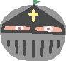

# 2.2.15 Cycle 15 - Dash Cooldown Bar & Improved UI & Menus

## Design

### Objectives

In this cycle, my goal is to improve the game UI and menus. My objectives are:

* [x] Add a dash cooldown bar
* [x] Make boss fight text and new floor text last until the next level
* [x] Move around all the elements of the HUD so that it fits better
* [x] Add a proper win screen
* [x] Add a proper death screen
* [x] Be able to return to the main menu from win or death
* [x] The game should be fully repeatable after restarting
* [x] Make main menu buttons and text bigger
* [x] Add character descriptions in character selection
* [x] Add menu titles to the main menu (including a name for the game)
* [x] Add a background colour to the main menu

#### Smaller Changes

* [x] Add a new sprite for Sir Galahad character
* [x] Add a new sprite for Deadeye Dave character
* [x] Move shopkeeper messages to the bottom of the screen
* [x] Reduce the size of player sprites so that they can move in the level easier

### Usability Features

### Key Variables

| Variable Name                                                   | Use                                                                                                                  |
| --------------------------------------------------------------- | -------------------------------------------------------------------------------------------------------------------- |
| `winTitle`, `backButton`, `winText`, `loseTitle` and `loseText` | These variables are used to create text elements for the titles, and informational texts in the win and lose scenes. |
| `menuBackground`                                                | This variable is a background rectangle for all the menu scenes to give them a background colour.                    |
| `dashCooldownBarBackground` and `dashCooldownBarBorder`         | These are graphical elements for the cooldown bar.                                                                   |
| `dashCooldownBar`                                               | Represents the actual cooldown progress bar.                                                                         |
| `dashCooldown`                                                  | A boolean flag to check if the dash ability is on cooldown.                                                          |
| `dashDuration`                                                  | Defines how long a dash lasts.                                                                                       |
| `dashRecharge`                                                  | Defines the total recharge time for the dash ability.                                                                |

### Pseudocode

```
// Define global variables
let coins
let enemiesRemaining
let weapons
let unlockedWeapons
let currentWeapon
let chosenLevels
let dashCooldown
let playerSpeed
let dashDuration
let dashRecharge
let floorNumber

// Define game scenes
scene("win", () => {
    // Create win screen elements
    // Handle "Return to Main Menu" button click
});

scene("lose", () => {
    // Create lose screen elements
    // Handle "Return to Main Menu" button click
    // Cleanup erroneous enemies
});

scene("mainMenu", () => {
    // Initialize game state
    coins = 0
    enemiesRemaining = 0
    unlockedWeapons = []
    
    // Unlock the first weapon (e.g., pistol)
    unlockWeapon(0)

    // Choose random levels
    chooseLevels(chosenLevels)

    // Set up main menu elements
    // Handle menu interactions (e.g., selecting levels, choosing weapons)
});

// Define game loop
loop(() => {
    // Update game logic
    // Handle player input (e.g., dashing)
    // Update enemy behavior
    // Check win or lose conditions
    // Update UI elements (e.g., coin count, cooldown bar)
});

// Define functions
function unlockWeapon(index) {
    // Unlock a weapon and add it to unlockedWeapons
}

function chooseLevels(chosenLevels) {
    // Randomly select levels and add them to chosenLevels
}

function wait(time, callback) {
    // Wait for a specified time and then execute a callback
}

// Define event handlers
onMousePress("right", () => {
    // Handle right mouse button click (e.g., player dash)
});

// Start the game in the main menu scene
go("mainMenu")
```

## Development

### Outcome

The win and lose scenes are very similar since they are both made up of a background, title, text and menu button. Below is the win scene.

```typescript
// win scene -------------------------------------------------------------------
scene("win", () => {
    const menuBackground = add([
        rect(width(), height()),
        pos(width() / 2, height() / 2),
        z(1),
        anchor("center"),
        color(168, 69, 12),
        "menuBackground",
    ]);

    const winTitle = add([
        text("You Win!", {
            size: 80,
        }),
        pos(width() / 2, 180),
        anchor("center"),
        z(10),
        color(22, 219, 55),
    ]);

    const backButton = add([
        text("Return to Main Menu", {
            size: 40,
        }),
        pos(width() / 2, height() - 200),
        anchor("center"),
        area({ cursor: "pointer" }),
        z(10),
    ]);

    const winText = add([
        text("Well done adventurer!\nYou defeated the Shape King and his minions and restored balance to the world once more!\nLet us hope that he never returns!",
            {
                size: 50,
                width: 1000,
                align: "center",
            }),
        pos(width() / 2, height() / 2),
        anchor("center"),
        z(10),
    ]);

    backButton.onClick(() => {
        go("mainMenu");
    });
});
```

Below is the lose scene.

```typescript
// lose scene ---------------------------------------------------------------------
scene("lose", () => {

    const menuBackground = add([
        rect(width(), height()),
        pos(width() / 2, height() / 2),
        z(1),
        anchor("center"),
        color(168, 69, 12),
        "menuBackground",
    ]);

    const loseTitle = add([
        text("You Died!", {
            size: 80,
        }),
        pos(width() / 2, 180),
        anchor("center"),
        z(10),
        color(252, 7, 3),
    ]);

    const backButton = add([
        text("Return to Main Menu", {
            size: 40,
        }),
        pos(width() / 2, height() - 200),
        anchor("center"),
        area({ cursor: "pointer" }),
        z(10),
    ]);

    const winText = add([
        text("The Shape King lives on! You made it to floor " + floorNumber + " of 3.\nThe Shape King must perish, try again to defeat him!",
            {
                size: 50,
                align: "center",
            }),
        pos(width() / 2, height() / 2),
        anchor("center"),
        z(10),
    ]);

    backButton.onClick(() => {
        go("mainMenu");
    });

    // Incase an errenous enemies spawn from a boss
    wait(1, () => {
        destroyAll("enemy");
        destroyAll("enemy_bullet")
    });
    
});
```

The dash cooldown bar is created similarly to the player's health bar in [Cycle 5](cycle-1-5.md).

```typescript
const dashCooldownBarBackground = add([
        rect(150, 14),
        pos(1500, 50),
        z(9),
        anchor("left"),
        color(79, 75, 75),
    ]);

    const dashCooldownBarBorder = add([
        rect(154, 16),
        pos(1498, 50),
        anchor("left"),
        z(3),
        color(0, 0, 0),
    ]);

    const dashCooldownBar = add([
        rect(150, 14),
        pos(1500, 50),
        z(10),
        color(0, 0, 255),
        anchor("left"),
    ]);

    
```

The dashing code was modified to include the dash cooldown bar. When a dash has ended, the cooldown bar's width is set near zero and then set to increasingly greater widths in set steps, making it look like it is moving smoothly.

```typescript
let dashCooldown = false;
    //dash
    onMousePress("right", () => {
        if (!dashCooldown) {
            dashCooldown = true;
            dashCooldownBar.width = 0;

            playerSpeed += 300;
            wait(dashDuration, () => {
                playerSpeed -= 300;
            });

            const steps = 100;
            const increment = 150 / steps;
            const stepDuration = dashRecharge / steps * 1000;
            let currentStep = 0;

            function rechargeStep() {
                currentStep++;
                dashCooldownBar.width = increment * currentStep;

                if (currentStep < steps) {
                    setTimeout(rechargeStep, stepDuration);
                } else {
                    dashCooldown = false;
                }
            }

            rechargeStep();

        }
    });
```

To make the game replayable after dying or winning, I added/moved code which initialises a lot of aspects.

```typescript
scene("mainMenu", () => {

    coins = 0;
    enemiesRemaining = 0;

        // Lock every weapon
    for (const weapon of weapons) {
        weapon.unlocked = false;
    }

        // Function to unlock a weapon
    function unlockWeapon(index) {
        unlockedWeapons.push(weapons[index]);
        unlockedWeapons[index].unlocked = true;
    }

    unlockedWeapons = [];
    unlockWeapon(0); // Unlock pistol
    let currentWeapon = unlockedWeapons[0];


        //Choose random levels
    chosenLevels = [];
    chooseLevels(chosenLevels);
    
    ... // Rest of the main menu code

}
```

#### New Sprites

<div align="center" data-full-width="false">

<figure><figcaption><p>Deadeye Dave</p></figcaption></figure>

 

<figure><figcaption><p>Sir Galahad</p></figcaption></figure>

</div>

### Challenges

For my initial attempt at resizing the player sprites, I tried using `scale()` to reduce the size when the player was added. However, this made the player collision very strange in that you could clip into the walls and other objects for some reason. To avoid this, I instead shrunk the sprites themselves using an image resizer and added them to the game as the version which the player plays.

## Testing

### Tests

| Test | Instructions                                                                             | What I expect                                                                                                                                | What actually happens                               | Pass/Fail |
| ---- | ---------------------------------------------------------------------------------------- | -------------------------------------------------------------------------------------------------------------------------------------------- | --------------------------------------------------- | --------- |
| 1    | Start game and look around each menu.                                                    | Text sizes and titles are correct and in the right places.                                                                                   | As expected.                                        | Pass.     |
| 2    | Go into character selection menu and click on different characters.                      | <ol><li>Character outline is correct size, position and colour.</li></ol><ol start="2"><li>Each character is using the new sprite.</li></ol> | <ol><li>As expected.</li><li>As expected.</li></ol> | Pass.     |
| 3    | Start levels and activate dash.                                                          | Dash cooldown bar becomes empty and replenishes over time.                                                                                   | As expected.                                        | Pass.     |
| 4    | Try to dash while bar is recharging.                                                     | Nothing happens. Cannot dash until bar has recharged.                                                                                        | As expected.                                        | Pass.     |
| 5    | Cycle through the levels to reach the win screen.                                        | Win screen appears after the final boss and is correct.                                                                                      | As expected.                                        | Pass.     |
| 6    | Restart game by using the menu button to go back into the main menu. Then play the game. | Game works without issue after being restarted.                                                                                              | As expected.                                        | Pass.     |
| 7    | Get the player killed when health reaches 0.                                             | Lose screen appears with the correct floor number reached.                                                                                   | As expected.                                        | Pass.     |
| 8    | Touch shopkeeper.                                                                        | Messages appear in the correct place.                                                                                                        | As expected.                                        | Pass.     |

### Evidence


