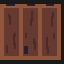

# 2.2.17 Cycle 17 - Pause Menu & Damage Effect

## Design

### Objectives

In this cycle, my goal is to add a working pause menu which pauses the entire game and an effect to make it obvious when the player takes damage. My objectives in this cycle are to:

* [x] Add pause menu with escape key
* [x] Update how to play menu with pause info
* [x] Small screen shake when taking damage
* [x] Red screen effect when taking damage
* [x] Add background for the floor in levels
* [x] Change game background colour to fit for the HUD around the level

#### Smaller Features

* [x] Fix the boss healthbar ending early
* [x] Add a new door sprite
* [x] Add notch lines to the boss health bar
* [x] When starting a new game after death, reset the weapon to gear gun
* [x] Fix buying a health potion deducting 4 coins instead of 5
* [x] Reduce spikes in boss levels

### Usability Features

### Key Variables

| Variable Name      | Use                                                                                                                                                               |
| ------------------ | ----------------------------------------------------------------------------------------------------------------------------------------------------------------- |
| `floorBackground`  | Represents the background of the `level` scene's floor. It's a rectangle with specific dimensions, position, colour, and z-index.                                 |
| `gameState`        | A variable that stores the current state of the game (either "playing" or "paused"). It is used to control the game flow and manage pause functionality.          |
| `pauseBackground`  | A background element displayed when the game is paused. It's a semi-transparent rectangle that covers the entire game area.                                       |
| `pauseTitle`       | Text element displaying "Game Paused" in the pause menu. It's centred at the top of the screen when the game is paused.                                           |
| `pauseText`        | Text element displaying instructions for resuming the game. It's centred on the screen when the game is paused.                                                   |
| `playerBullets`    | An array containing all the player's bullets. It is used to pause and unpause player bullets when the game state changes.                                         |
| `enemyBullets`     | An array containing all the enemy's bullets. It is used to pause and unpause enemy bullets when the game state changes.                                           |
| `flashOverlay`     | A red-coloured rectangle that flashes to create a damage effect on the screen when the player takes damage.                                                       |
| `BARLINEINCREMENT` | A constant variable defining the vertical spacing between notches on the boss health bar. It determines the intervals at which lines are drawn on the health bar. |

### Pseudocode

```
// Initialize the game with a specific font and background color
InitializeGame({
    font: "sans-serif",
    background: [62, 82, 115],
});

// Create the floor background for the level scene
CreateFloorBackground();

// Define a function to toggle the game pause state
Function TogglePause() {
    If (gameState is "playing") {
        Set gameState to "paused";
        CreatePauseMenuElements();
        PauseAllBullets();
    } Else If (gameState is "paused") {
        Set gameState to "playing";
        DestroyAllPauseMenuElements();
        ResumeAllBullets();
    }
}

// Listen for the "escape" key press to toggle pause
OnKeyPress("escape", TogglePause);

// Initialize the game state as "playing" by default
Let gameState = "playing";

// Update enemy activity based on the game state
OnUpdate("enemy", UpdateEnemyActivity);

// Create a red flash overlay for player damage effect
CreateFlashOverlay();

// Define a function to handle player damage effect
Function PlayerDamageEffect() {
    ShakeScreen();
    FlashRedOverlay();
}

// Handle collision between player bullets and enemies
OnCollide("player_bullet", "enemy", HandlePlayerBulletCollision);

// Create the boss health bar and "Boss Fight!" text
CreateBossUI();

// Main game loop
While (game is running) {
    If (gameState is "playing") {
        UpdateGameLogic();
    }
    RenderGame();
}
```

## Development

### Outcome

I changed the background colour of the game and then added a background rectangle in the level scene to have a separate background colour for within the walls of the game.

```typescript
kaboom({
    font: "sans-serif",
    background: [62, 82, 115],
});


// Floor background in level scene
    const floorBackground = add([
        rect(1160, 880),
        pos(320, 40),
        z(-10),
        color(143, 106, 106),
        "HUDBackground",
    ]);
```

Function for toggling the pause menu. If the `gameState` is 'playing' it's set to 'paused' and vice versa. When being paused, the pause menu elements are added to the screen. I added a check for all the key actions in the game (for example player movement) which requires `gameState` to be playing to do anything. To pause the movement of bullets, I use `.paused` which can stop and start their movement. When the game is resumed, the pause menu elements are destroyed and bullet movement is resumed. All of the actions in the game will be able to happen again.

```typescript
function togglePause() {
        if (gameState === "playing") {
            gameState = "paused";

            // Add pause menu elements

            // Background
            const pauseBackground = add([
                rect(width(), height()),
                pos(width() / 2, height() / 2),
                anchor("center"),
                z(11),
                opacity(0.5),
                "pauseMenu",
            ]);

            // Title
            const pauseTitle = add([
                text("Game Paused", {
                    size: 100,
                }),
                color(0, 0, 0),
                pos(width() / 2, 180),
                anchor("center"),
                z(12),
                "pauseMenu",
            ]);

            // Text
            const pauseText = add([
                text("Press the escape key again to resume.", {
                    size: 35,
                }),
                color(0, 0, 0),
                pos(width() / 2, height() / 2),
                anchor("center"),
                z(12),
                "pauseMenu",
            ]);

            let playerBullets = get("player_bullet")
            playerBullets.forEach((bullet) => {
                bullet.paused = true;
            });

            let enemyBullets = get("enemy_bullet")
            enemyBullets.forEach((bullet) => {
                bullet.paused = true;
            });


        } else if (gameState === "paused") {
            gameState = "playing";
            destroyAll("pauseMenu");

            let playerBullets = get("player_bullet")
            playerBullets.forEach((bullet) => {
                bullet.paused = false;
            });

            let enemyBullets = get("enemy_bullet")
            enemyBullets.forEach((bullet) => {
                bullet.paused = false;
            });
        };
    };
```

Pausing and unpausing are toggled using the escape key. By default when starting a level the `gameState` will be 'playing'.

```typescript
    onKeyPress("escape", () => {
        togglePause();
    });

    let gameState = "playing"; // Default game state
```

If the game is paused, set the active parameter of each enemy to false. This is used in the enemy class functions to prevent actions when the game is paused (for example moving and shooting).

```typescript
 onUpdate("enemy", (enemy) => {
        if (gameState === "playing") {
            enemy.instance.active = true;
        } else if (gameState === "paused") {
            enemy.instance.active = false;
        };
    });
```

When the player takes damage, shake the screen and flash the red `flashOverlay` quickly on screen which acts like a blood effect.

<pre class="language-typescript"><code class="lang-typescript"><strong>const flashOverlay = add([
</strong>        rect(width(), height()),
        pos(width() / 2, height() / 2),
        z(50), // Make sure it's above other elements
        color(255, 0, 0), // Red color
        anchor("center"),
        opacity(0), // Initially invisible
    ]);

    function playerDamageEffect() {
        shake(15);
        flashOverlay.opacity = 0.5;
        for (let k = 0; k &#x3C; 5; k++) {
            wait(0.075, () => {
                flashOverlay.opacity -= 0.1;
            });
        };
    };

</code></pre>

I combined the enemy update health `onCollide` and the boss health bar `onCollide` into one to fix the issue of the boss health bar updating early.

```typescript
    // Update the enemies' health when hit by a bullet
    onCollide("player_bullet", "enemy", (bullet, enemy) => {
        destroy(bullet);
        enemy.instance.updateHealth(bullet.playerBulletDamage);
        if (enemy.instance.species >= 7) {
            const newHeight = (enemy.instance.currentHealth / enemy.instance.maxHealth) * BOSSHEALTHBARHEIGHT;
            bossHealthBar.height = newHeight;
        };
    });
```

I modified the addBossUI function to bring in some components of the boss health bar. This means that there will be less hidden elements when playing a normal level, which should improve performance slightly.&#x20;

To add notches to the boss healthbar, I added a small horizontal line at 3 locations which represent 75%, 50% and 25% boss health.

```typescript
 const bossHealthBar = add([
        rect(80, BOSSHEALTHBARHEIGHT),
        pos(160, 240),
        z(10),
        color(255, 0, 0),
        opacity(0),
        anchor("top"),
        "bossHealthBar",

    ]);

    const bossFightText = add([
        text("Boss\nFight!", {
            size: 80,
        }),
        pos(65, 45),
        color(255, 255, 255),
        opacity(0),
        z(10),
        "bossFightText",
    ]);


    function addBossUI() {

        const bossHealthBarBackground = add([
            rect(80, BOSSHEALTHBARHEIGHT),
            pos(160, 240),
            z(9),
            color(79, 75, 75),
            anchor("top"),
            "bossHealthBar",
        ]);

        const bossHealthBarBorder = add([
            rect(80 + 10, BOSSHEALTHBARHEIGHT + 10),
            pos(160, 235),
            anchor("top"),
            z(8),
            color(0, 0, 0),
            "bossHealthBar",
        ]);

        bossHealthBar.height = BOSSHEALTHBARHEIGHT;
        bossHealthBar.opacity = 1;
        bossFightText.opacity = 1;

        let lineSpawnY = 240;
        const BARLINEINCREMENT = BOSSHEALTHBARHEIGHT / 4
        for (let v = 0; v < 3; v++) {
            lineSpawnY += BARLINEINCREMENT;
            const bossHealthBarNotches = add([
                rect(80, 6),
                pos(120, lineSpawnY),
                anchor("left"),
                z(11),
                color(0, 0, 0),
                "bossHealthBar",
            ]);
        };
    };
```

#### New Sprites


<figure><figcaption><p>Door sprite</p></figcaption></figure>

### Challenges

I found it challenging to pause and unpause the movement of the player and enemy bullets. Initially, I tried removing the move component and re-adding it with saved values when resuming. However, the bullets would not move again after pausing. I was becoming sceptical that it was possible and I was going to resort to letting the bullets move but not dealing any damage to the player if they hit while paused. Thankfully though, I found that Kaboom has `.paused`, which made it super easy to stop and start the bullet movement.

## Testing

### Tests

| Test | Instructions                                     | What I expect                                                                                                              | What actually happens                               | Pass/Fail |
| ---- | ------------------------------------------------ | -------------------------------------------------------------------------------------------------------------------------- | --------------------------------------------------- | --------- |
| 1    | Start levels and press escape.                   | <ul><li>Floor for levels has different background colour to the HUD.</li><li>Game pauses and pause menu appears.</li></ul> | <ul><li>As expected.</li><li>As expected.</li></ul> | Pass.     |
| 2    | Press escape again.                              | Game unpauses.                                                                                                             | As expected.                                        | Pass.     |
| 3    | Dash before pausing game.                        | Dash cooldown bar stops moving mid-cooldown.                                                                               | As expected.                                        | Pass.     |
| 4    | Take damage by getting shot and touching spikes. | <p>Each time the player gets damaged:</p><ul><li>Screen shakes.</li><li>Screen flashes red.</li></ul>                      | <ul><li>As expected.</li><li>As expected.</li></ul> | Pass.     |
| 5    | Kill boss in boss fight.                         | Boss health bar scales correctly and is empty when the boss dies.                                                          | As expected.                                        | Pass.     |
| 6    | Buy health potion.                               | Deducts 5 coins.                                                                                                           | As expected.                                        | Pass.     |

### Evidence


