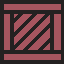

# 2.2.16 Cycle 16 - Smaller Features and Error Prevention \[IN PROGRESS]

## Design

### Objectives

In this cycle, I will make some smaller changes and fixes. First, I would like to:

* [x] &#x20;Change the player bullets to rectangles, except for  the shotgun which fires small pellets
* [x] Enemies and bosses fire red rectangles
* [x] Make the machine pistol and brass spraygun automatic weapons (you can hold down click to shoot them)

I would also like to add a boss healthbar to display how much of a boss's health is left.

* [ ] Add boss healthbar to boss fights

Currently, my game is missing many checks which causes bugs or crashes when carrying out unexpected behaviour. I will fix these issues in this cycle, which should help improve the robustness of my game.

* [x] Starting the game without selecting a character throws an error
* [x] Dashing into the next level does not reset the speed after the dash
* [x] Players can purchase weapons which they already own, which get put in the inventory twice
* [x] Purchasing items will deduct one less coin than required
* [ ] Players can purchase items from the shop even when not in a shop level

#### Smaller Changes

* [x] Add new sprites for the walls, spikes and boxes
* [x] Further reduce the number of spikes and boxes in levels
* [x] Adjust some of the enemy spawn locations in levels so that they are not too close to the player
* [x] Rename Ironclad Carbine to Ironclad Rifle (easier name for players to understand)
* [x] Adjust coin counter position

### Usability Features

### Key Variables

| Variable Name | Use                   |
| ------------- | --------------------- |
| foo           | does something useful |

### Pseudocode

```
procedure do_something
    
end procedure
```

## Development

### Outcome

explain the code

```typescript
// Some code
```

explain some more

```typescript
// Some more code
```

explain another part

```typescript
// Some code
```

and another

```typescript
// Some code
```

#### New Sprites


<div>

<figure><figcaption><p>Wall</p></figcaption></figure>

 

<figure><figcaption><p>Box</p></figcaption></figure>

 

<figure><figcaption><p>Spike</p></figcaption></figure>

</div>

### Challenges

Describe challenges you faced and how they were overcome

## Testing

### Tests

| Test | Instructions   | What I expect      | What actually happens | Pass/Fail |
| ---- | -------------- | ------------------ | --------------------- | --------- |
| 1    | Run code.      | Thing happens.     | As expected.          | Pass.     |
| 2    | Press buttons. | Something happens. | As expected.          | Pass.     |

Comment on any failed tests and how you plan to resolve them

### Evidence

Put YouTube video testing link here
