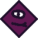
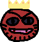
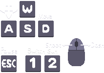
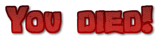

# 2.2.18 Cycle 18 - Sound & Redone Menus

## Design

### Objectives

In this cycle, my goal is to add sound effects and music and make the menus look much better. My objectives in this cycle are to:

* [x] Add sound effects for key events
* [x] Add music
* [x] Update credits for music and sound effects
* [x] Music becomes quieter when the game is paused
* [x] Music stops in the lose and win scenes

Now for redesigning the menus. I am still unhappy with how the main menu looks when you enter the game. I want it to feel nicer with buttons which look properly clickable.

* [x] Turn menu buttons into actual buttons
* [x] Remove the menu background colour
* [x] Replace how to play menu text with a graphic I made
* [x] Add an exciting font for the titles of each menu

#### Smaller Changes

* [x] Player and enemy bullets are destroyed when colliding with the door
* [x] Killing a boss gives 5 coins instead of 1
* [x] Add a new enemy 3 sprite
* [x] Add a crown to the final boss sprite
* [x] Add a new shopkeeper sprite

### Usability Features

Redone buttons in the menus make it clear where the actual buttons are and how to navigate the menus.

### Key Variables

| Variable Name | Use                                                                                                                                                                                                                                                      |
| ------------- | -------------------------------------------------------------------------------------------------------------------------------------------------------------------------------------------------------------------------------------------------------- |
| `gameMusic`   | This variable is used to store the reference to the game's background music sound. It is created using the `play` function and set to loop indefinitely. This variable allows me to control the game's background music, such as stopping or pausing it. |

### Pseudocode

```
// Define and load game sounds
loadSound("menuclick", "/sounds/select-sound-121244.mp3");
loadSound("shoppurchase", "/sounds/collectcoin.mp3");
// ... (other sound loading statements)

// Play background music with looping
const gameMusic = play("music", { loop: true });

// Function to create and configure buttons
function addButton(txt, position, func) {
  // Create a button object
  const button = createButton(txt, position);
  
  // Set button hover and click behavior
  button.onHoverUpdate(() => {
    // Scale and cursor change on hover
  });
  button.onHoverEnd(() => {
    // Reset scale on hover end
  });
  button.onClick(func);
  
  return button;
}

// Create Play button
addButton("Play", vec2(width() / 2, height() / 2 - 40), () => { 
  play("menuclick"); // Play a sound
  go("characterSelect"); // Navigate to character select screen
});

// Create How to Play button
addButton("How to Play", vec2(width() / 2, height() / 2 + 60), () => { 
  play("menuclick"); // Play a sound
  go("howToPlay"); // Navigate to how to play screen
});

// Create Credits button
addButton("Credits", vec2(width() / 2, height() / 2 + 160), () => {
  play("menuclick"); // Play a sound
  go("credits"); // Navigate to credits screen
});

// Display the game title
const gameTitle = createGameTitle();
```

## Development

### Outcome

All the sounds are loaded at the start of the project.

```typescript
loadSound("menuclick", "/sounds/select-sound-121244.mp3");
loadSound("shoppurchase", "/sounds/collectcoin.mp3");
loadSound("startfloor", "/sounds/mixkit-casino-bling.wav");
loadSound("equipweapon", "/sounds/item-equip-6904.mp3");
loadSound("opendoor", "/sounds/open door - Made with Clipchamp.mp3");
loadSound("gamewin", "/sounds/grand-final-orchestral-tutti-9927.mp3");
loadSound("enemyhit","/sounds/hitHurt1.wav");
loadSound("playerdeath", "/sounds/failure notification.wav");
loadSound("playerhurt", "/sounds/hitHurt.wav");
loadSound("music", "/sounds/cruising-down-8bit-lane-159615.mp3");
loadSound("bosslevel", "/sounds/boss horn.mp3");
loadSound("shopkeepernote", "/sounds/pickupCoin.wav");
loadSound("recoverhealth", "/sounds/health-pickup-6860.mp3");
```

The music begins playing when you start and it will loop indefinitely.

<pre class="language-typescript"><code class="lang-typescript"><strong>const gameMusic = play("music", {loop: true}); 
</strong></code></pre>

The music is paused in the win and lose scenes and unpaused in the main menu scene. Below is also an example of one of the sounds which is played when the win scene starts.

```typescript
gameMusic.paused = true;
play("gamewin");
```

I created a new function that adds all the parts of a button and controls what happens on click depending on what is passed into the function. This makes buttons much nicer and makes my code more concise and efficient because the code doesn't have to be duplicated for each button.

<pre class="language-typescript"><code class="lang-typescript"><strong>function addButton(txt, position, func) {
</strong>  // add a parent background object
  const button = add([
    rect(240, 80, { radius: 8 }),
    pos(position),
    area(),
    scale(1),
    color(242,132,39),
    anchor("center"),
    outline(4),
  ]);

  // add a child object that displays the text
  button.add([
    text(txt),
    anchor("center"),
    color(0, 0, 0),
  ]);

  // onHoverUpdate() comes from area() component
  // it runs every frame when the object is being hovered
  button.onHoverUpdate(() => {
    button.scale = vec2(1.2);
    setCursor("pointer");
  });

  // onHoverEnd() comes from area() component
  // it runs once when the object stopped being hovered
  button.onHoverEnd(() => {
    button.scale = vec2(1);
  });

  // onClick() comes from area() component
  // it runs once when the object is clicked
  button.onClick(func);
    
  return button;
};
</code></pre>

Examples of how the buttons are called in the main menu.

```typescript
addButton("Play", vec2(width() / 2, height() / 2 - 40), () => { 
        play("menuclick");
        go("characterSelect");
    });
    addButton("How to Play", vec2(width() / 2, height() / 2 + 60), () => { 
        play("menuclick");
        go("howToPlay");
    });
    addButton("Credits", vec2(width() / 2, height() / 2 + 160), () => {
        play("menuclick");
        go("credits");
    });
```

The title for each menu is now a sprite object rather than a text object.

```typescript
const gameTitle = add([
        sprite("gametitle"),
        pos(width() / 2, height() / 2 - 290),
        anchor("center"),
        scale(3),
        z(10),
    ]);
```

Bullets are destroyed when they collide with the door.

```typescript
// Destroy bullets when they collide with the door
        onCollide("enemy_bullet", "door", (bullet, door) => {
        destroy(bullet); // Destroy the bullet
    });

    onCollide("player_bullet", "door", (bullet, door) => {
        destroy(bullet); // Destroy the bullet
    });
```

If the enemy is a boss, it will give 5 coins on death, otherwise, it will give one.


```typescript
destroy() {
        this.isAlive = false;
        if (this.species >= 7) {
            updateCoinCounter();
            updateCoinCounter();
            updateCoinCounter();
            updateCoinCounter();
            updateCoinCounter();
        } else {
            updateCoinCounter();
        };
        destroy(this.entity);
    };
```


#### New Sprites

<div>

<figure><figcaption><p>Enemy 2</p></figcaption></figure>

 

<figure><figcaption><p>Shopkeeper</p></figcaption></figure>

 

<figure><figcaption><p>Final Boss</p></figcaption></figure>

</div>

#### How to Play Graphic

<figure><figcaption></figcaption></figure>

#### Menu Titles


<figure><figcaption></figcaption></figure>

<figure><figcaption></figcaption></figure>

<figure><figcaption></figcaption></figure>

<figure><figcaption></figcaption></figure>

<figure><figcaption></figcaption></figure>

## Testing

### Tests

| Test | Instructions               | What I expect                                                                                                                                                | What actually happens                                                                         | Pass/Fail |
| ---- | -------------------------- | ------------------------------------------------------------------------------------------------------------------------------------------------------------ | --------------------------------------------------------------------------------------------- | --------- |
| 1    | Start game.                | <ul><li>Music plays.</li><li>New buttons look correct.</li></ul>                                                                                             | <ul><li>As expected.</li><li>As expected.</li></ul>                                           | Pass.     |
| 2    | Click on each menu.        | <ul><li>Each title is correct.</li><li>How to play menu uses new graphic.</li><li>Credit text is updated.</li><li>Each button functions correctly.</li></ul> | <ul><li>As expected.</li><li>As expected.</li><li>As expected.</li><li>As expected.</li></ul> | Pass.     |
| 3    | Play through the game.     | Sound effects play for each of the events I added.                                                                                                           | As expected.                                                                                  | Pass.     |
| 4    | Pause and unpause game.    | Music is quieter when paused.                                                                                                                                | As expected.                                                                                  | Pass.     |
| 5    | Shoot door.                | Bullets are destroyed.                                                                                                                                       | As expected.                                                                                  | Pass.     |
| 6    | Kill boss.                 | Gives 5 coins.                                                                                                                                               | As expected.                                                                                  | Pass.     |
| 7    | Go to lose and win scenes. | <ul><li>Music stops.</li><li>Same checks as in test 2.</li></ul>                                                                                             | <ul><li>As expected.</li><li>As expected.</li></ul>                                           | Pass.     |

### Evidence


