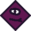
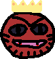
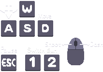

# 2.2.18 Cycle 18 - Sound & Redone Menus \[IN PROGRESS]

## Design

### Objectives

In this cycle, I will. My objectives in this cycle are:

* [x] Add sound effects for key events
* [x] Add music
* [x] Update credits for music and sound effects
* [x] Music becomes quieter when the game is paused
* [x] Music stops in the lose and win scenes

Now for redesigning the menus. I am still unhappy with how the main menu looks when you enter the game. I want it to feel nicer with buttons which look properly clickable.

* [x] Turn menu buttons into actual buttons
* [x] Remove the menu background colour
* [x] Replace how to play menu text with a graphic I made
* [x] Add an exciting font for the titles of each menu

#### Smaller Features

* [x] Player and enemy bullets are destroyed when colliding with the door
* [x] Remove debug logging for when the game is paused and unpaused
* [x] Killing a boss gives 5 coins instead of 1
* [x] Add a new enemy 3 sprite
* [x] Add a crown to final boss sprite
* [x] Add a new shopkeeper sprite

### Usability Features

### Key Variables

| Variable Name | Use                   |
| ------------- | --------------------- |
| foo           | does something useful |

### Pseudocode

```
procedure do_something
    
end procedure
```

## Development

### Outcome

explain the code

```typescript
loadSound("menuclick", "/sounds/select-sound-121244.mp3");
loadSound("shoppurchase", "/sounds/collectcoin.mp3");
loadSound("startfloor", "/sounds/mixkit-casino-bling.wav");
loadSound("equipweapon", "/sounds/item-equip-6904.mp3");
loadSound("opendoor", "/sounds/open door - Made with Clipchamp.mp3");
loadSound("gamewin", "/sounds/grand-final-orchestral-tutti-9927.mp3");
loadSound("enemyhit","/sounds/hitHurt1.wav");
loadSound("playerdeath", "/sounds/failure notification.wav");
loadSound("playerhurt", "/sounds/hitHurt.wav");
loadSound("music", "/sounds/cruising-down-8bit-lane-159615.mp3");
loadSound("bosslevel", "/sounds/boss horn.mp3");
loadSound("shopkeepernote", "/sounds/pickupCoin.wav");
loadSound("recoverhealth", "/sounds/health-pickup-6860.mp3");
```

explain some more

```typescript
const gameMusic = play("music", {loop: true}); 
```

explain another part

```typescript
gameMusic.paused = false;
volume(1);
```

and another

```typescript
gameMusic.paused = true;
play("gamewin");
```

aa

```typescript
function addButton(txt, position, func) {
  // add a parent background object
  const button = add([
    rect(240, 80, { radius: 8 }),
    pos(position),
    area(),
    scale(1),
    color(242,132,39),
    anchor("center"),
    outline(4),
  ]);

  // add a child object that displays the text
  button.add([
    text(txt),
    anchor("center"),
    color(0, 0, 0),
  ]);

  // onHoverUpdate() comes from area() component
  // it runs every frame when the object is being hovered
  button.onHoverUpdate(() => {
    button.scale = vec2(1.2);
    setCursor("pointer");
  });

  // onHoverEnd() comes from area() component
  // it runs once when the object stopped being hovered
  button.onHoverEnd(() => {
    button.scale = vec2(1);
  });

  // onClick() comes from area() component
  // it runs once when the object is clicked
  button.onClick(func);
    
  return button;
};
```

bb

```typescript
addButton("Play", vec2(width() / 2, height() / 2 - 40), () => { 
        play("menuclick");
        go("characterSelect");
    });
    addButton("How to Play", vec2(width() / 2, height() / 2 + 60), () => { 
        play("menuclick");
        go("howToPlay");
    });
    addButton("Credits", vec2(width() / 2, height() / 2 + 160), () => {
        play("menuclick");
        go("credits");
    });
```

cc

```typescript
const gameTitle = add([
        sprite("gametitle"),
        pos(width() / 2, height() / 2 - 290),
        anchor("center"),
        scale(3),
        z(10),
    ]);
```

dd

```typescript
// Destroy bullets when they collide with the door
        onCollide("enemy_bullet", "door", (bullet, door) => {
        destroy(bullet); // Destroy the bullet
    });

    onCollide("player_bullet", "door", (bullet, door) => {
        destroy(bullet); // Destroy the bullet
    });
```

ee


```typescript
destroy() {
        this.isAlive = false;
        if (this.species >= 7) {
            updateCoinCounter();
            updateCoinCounter();
            updateCoinCounter();
            updateCoinCounter();
            updateCoinCounter();
        } else {
            updateCoinCounter();
        };
        destroy(this.entity);
    };
```


#### New Sprites

<div>

<figure><figcaption><p>Enemy 3</p></figcaption></figure>

 

<figure><figcaption><p>Final Boss</p></figcaption></figure>

 

<figure><figcaption><p>Shopkeeper</p></figcaption></figure>

</div>

#### How to Play Graphic

<figure><figcaption></figcaption></figure>

### Challenges

Describe challenges you faced and how they were overcome

## Testing

### Tests

| Test | Instructions   | What I expect      | What actually happens | Pass/Fail |
| ---- | -------------- | ------------------ | --------------------- | --------- |
| 1    | Run code.      | Thing happens.     | As expected.          | Pass.     |
| 2    | Press buttons. | Something happens. | As expected.          | Pass.     |

Comment on any failed tests and how you plan to resolve them

### Evidence

Put YouTube video testing link here
