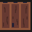

# 2.2.17 Cycle 17 - Pause Menu & Damage Effect

## Design

### Objectives

In this cycle, my goal is to add a working pause menu which pauses the entire game and an effect to make it obvious when the player takes damage. My objectives in this cycle are to:

* [x] Add pause menu with escape key
* [x] Update how to play menu with pause info
* [x] Small screen shake when taking damage
* [x] Red screen effect when taking damage
* [x] Add background for the floor in levels
* [x] Change game background colour to fit for the HUD around the level

#### Smaller Features

* [x] Fix the boss healthbar ending early
* [x] Add a new door sprite
* [x] Add notch lines to the boss health bar
* [x] When starting a new game after death, reset the weapon to gear gun
* [x] Fix buying a health potion deducting 4 coins instead of 5
* [x] Reduce spikes in boss levels

### Usability Features

maybe put something here

### Key Variables

| Variable Name      | Use                                                                                                                                                               |
| ------------------ | ----------------------------------------------------------------------------------------------------------------------------------------------------------------- |
| `floorBackground`  | Represents the background of the `level` scene's floor. It's a rectangle with specific dimensions, position, colour, and z-index.                                 |
| `gameState`        | A variable that stores the current state of the game (either "playing" or "paused"). It is used to control the game flow and manage pause functionality.          |
| `pauseBackground`  | A background element displayed when the game is paused. It's a semi-transparent rectangle that covers the entire game area.                                       |
| `pauseTitle`       | Text element displaying "Game Paused" in the pause menu. It's centred at the top of the screen when the game is paused.                                           |
| `pauseText`        | Text element displaying instructions for resuming the game. It's centred on the screen when the game is paused.                                                   |
| `playerBullets`    | An array containing all the player's bullets. It is used to pause and unpause player bullets when the game state changes.                                         |
| `enemyBullets`     | An array containing all the enemy's bullets. It is used to pause and unpause enemy bullets when the game state changes.                                           |
| `flashOverlay`     | A red-coloured rectangle that flashes to create a damage effect on the screen when the player takes damage.                                                       |
| `BARLINEINCREMENT` | A constant variable defining the vertical spacing between notches on the boss health bar. It determines the intervals at which lines are drawn on the health bar. |

### Pseudocode

```
procedure do_something
    
end procedure
```

## Development

### Outcome

explain the code

```typescript
kaboom({
    font: "sans-serif",
    background: [62, 82, 115],
});


// Floor background in level scene
    const floorBackground = add([
        rect(1160, 880),
        pos(320, 40),
        z(-10),
        color(143, 106, 106),
        "HUDBackground",
    ]);
```

explain some more

```typescript
function togglePause() {
        if (gameState === "playing") {
            gameState = "paused";
            debug.log(gameState);

            // Add pause menu elements

            // Background
            const pauseBackground = add([
                rect(width(), height()),
                pos(width() / 2, height() / 2),
                anchor("center"),
                z(11),
                opacity(0.5),
                "pauseMenu",
            ]);

            // Title
            const pauseTitle = add([
                text("Game Paused", {
                    size: 100,
                }),
                color(0, 0, 0),
                pos(width() / 2, 180),
                anchor("center"),
                z(12),
                "pauseMenu",
            ]);

            // Text
            const pauseText = add([
                text("Press the escape key again to resume.", {
                    size: 35,
                }),
                color(0, 0, 0),
                pos(width() / 2, height() / 2),
                anchor("center"),
                z(12),
                "pauseMenu",
            ]);

            let playerBullets = get("player_bullet")
            playerBullets.forEach((bullet) => {
                bullet.paused = true;
            });

            let enemyBullets = get("enemy_bullet")
            enemyBullets.forEach((bullet) => {
                bullet.paused = true;
            });


        } else if (gameState === "paused") {
            gameState = "playing";
            debug.log(gameState);
            destroyAll("pauseMenu");

            let playerBullets = get("player_bullet")
            playerBullets.forEach((bullet) => {
                bullet.paused = false;
            });

            let enemyBullets = get("enemy_bullet")
            enemyBullets.forEach((bullet) => {
                bullet.paused = false;
            });
        };
    };

    onKeyPress("escape", () => {
        togglePause();
    });

    let gameState = "playing"; // Default game state
```

explain another part

```typescript
 onUpdate("enemy", (enemy) => {
        if (gameState === "playing") {
            enemy.instance.active = true;
        } else if (gameState === "paused") {
            enemy.instance.active = false;
        };
    });
```

and another

<pre class="language-typescript"><code class="lang-typescript"><strong>const flashOverlay = add([
</strong>        rect(width(), height()),
        pos(width() / 2, height() / 2),
        z(50), // Make sure it's above other elements
        color(255, 0, 0), // Red color
        anchor("center"),
        opacity(0), // Initially invisible
    ]);

    function playerDamageEffect() {
        shake(15);
        flashOverlay.opacity = 0.5;
        for (let k = 0; k &#x3C; 5; k++) {
            wait(0.075, () => {
                flashOverlay.opacity -= 0.1;
            });
        };
    };

</code></pre>

a

```typescript
    // Update the enemies' health when hit by a bullet
    onCollide("player_bullet", "enemy", (bullet, enemy) => {
        destroy(bullet);
        enemy.instance.updateHealth(bullet.playerBulletDamage);
        if (enemy.instance.species >= 7) {
            const newHeight = (enemy.instance.currentHealth / enemy.instance.maxHealth) * BOSSHEALTHBARHEIGHT;
            bossHealthBar.height = newHeight;
        };
    });
```

b

```typescript
 const bossHealthBar = add([
        rect(80, BOSSHEALTHBARHEIGHT),
        pos(160, 240),
        z(10),
        color(255, 0, 0),
        opacity(0),
        anchor("top"),
        "bossHealthBar",

    ]);

    const bossFightText = add([
        text("Boss\nFight!", {
            size: 80,
        }),
        pos(65, 45),
        color(255, 255, 255),
        opacity(0),
        z(10),
        "bossFightText",
    ]);


    function addBossUI() {

        const bossHealthBarBackground = add([
            rect(80, BOSSHEALTHBARHEIGHT),
            pos(160, 240),
            z(9),
            color(79, 75, 75),
            anchor("top"),
            "bossHealthBar",
        ]);

        const bossHealthBarBorder = add([
            rect(80 + 10, BOSSHEALTHBARHEIGHT + 10),
            pos(160, 235),
            anchor("top"),
            z(8),
            color(0, 0, 0),
            "bossHealthBar",
        ]);

        bossHealthBar.height = BOSSHEALTHBARHEIGHT;
        bossHealthBar.opacity = 1;
        bossFightText.opacity = 1;

        let lineSpawnY = 240;
        const BARLINEINCREMENT = BOSSHEALTHBARHEIGHT / 4
        for (let v = 0; v < 3; v++) {
            lineSpawnY += BARLINEINCREMENT;
            const bossHealthBarNotches = add([
                rect(80, 6),
                pos(120, lineSpawnY),
                anchor("left"),
                z(11),
                color(0, 0, 0),
                "bossHealthBar",
            ]);
        };
    };
```

#### New Sprites


<figure><figcaption><p>Door sprite</p></figcaption></figure>

### Challenges

Describe challenges you faced and how they were overcome

## Testing

### Tests

| Test | Instructions   | What I expect      | What actually happens | Pass/Fail |
| ---- | -------------- | ------------------ | --------------------- | --------- |
| 1    | Run code.      | Thing happens.     | As expected.          | Pass.     |
| 2    | Press buttons. | Something happens. | As expected.          | Pass.     |

Comment on any failed tests and how you plan to resolve them

### Evidence

Put YouTube video testing link here
