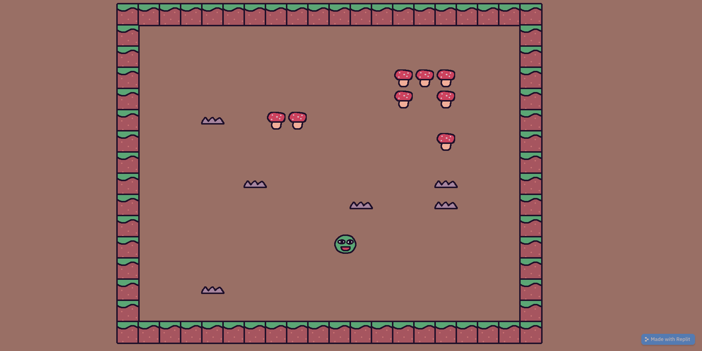

# 2.2.4 Cycle 4 - Bug Fixes & Changes

## Design

### Objectives

My objectives in this cycle are:

* [x] Fix the bullet spawn position
* [x] Change the stage background
* [x] Increase the player movement speed
* [x] Add a check for beating the last level

### Usability Features

Add this section

### Key Variables

| Variable Name  | Use                                                                                                                                |
| -------------- | ---------------------------------------------------------------------------------------------------------------------------------- |
| `playerSpeed`  | Determines the movement speed of the player character in the game.                                                                 |
| `truePosition` | The calculated position relative to the player's position, used to determine where the bullet should be spawned in the game scene. |

### Pseudocode

For pseudocode on bullet spawning, see [Cycle 2](cycle-1-1.md). Below is the updated pseudocode for level incrementation.&#x20;

```
On "r" key press
    Increment the levelId by 1
    Destroy all entities with the "entity" tag
    If levelId is greater than the number of possibleLevels minus 1
        Go to the "win" scene
    Else
        Go to the "level" scene with the updated levelId
```

## Development

### Outcome

```javascript
kaboom({
    font: "sans-serif", // Set game font to "sans-serif"
    background: [153, 111, 101], // Set game background color to [153, 111, 101]
});
```

<pre class="language-javascript" data-full-width="false"><code class="lang-javascript"><strong>    // Movement speed
</strong>    let playerSpeed = 250;
</code></pre>

I updated the bullet spawning function to receive the actual position to spawn at called `truePosition` and to use that for calculations. This replaces the use of `playerPosition`.

```javascript
// Spawns the bullet
function spawnBullet(truePosition) {
    // Gets the direction
    const POINT_CURSOR = truePosition.angle(mousePos()) + 180; // Calculate the angle between truePosition and mouse position, adjusted by 180 degrees

    // Adds the bullet
    add([
        pos(truePosition), // Set the position of the bullet to truePosition
        sprite("egg"), // Assign the sprite "egg" to the bullet entity
        area(), // Add a collision area to the bullet entity
        scale(0.65, 0.65), // Scale the bullet entity to 65% of its original size
        color(127, 127, 255), // Set the color of the bullet entity to a shade of purple
        anchor("center"), // Set the anchor point of the bullet entity to its center
        rotate(POINT_CURSOR + 90), // Rotate the bullet entity based on POINT_CURSOR, adjusted by 90 degrees
        move(POINT_CURSOR, BULLET_SPEED), // Move the bullet entity in the direction of POINT_CURSOR at BULLET_SPEED units per second
        offscreen({ destroy: true }), // Remove the bullet entity if it goes off-screen
        "player_bullet", // Tag the bullet entity as "player_bullet"
    ]);
}
```

I modified the level increment code to include a check for if the last level has been reached. If it attempts to increment on the last level then it will go to the "win" scene, which will be the end screen.

```javascript
// Increments levelId and goes to that level
onKeyPress("r", () => {
    levelId += 1; // Increment levelId by 1
    destroyAll("entity"); // Remove all entities with the "entity" tag
    if (levelId > possibleLevels.length - 1) {
        go("win"); // Go to the "win" scene if levelId exceeds the number of possibleLevels
    } else {
        go("level", levelId); // Go to the "level" scene with the updated levelId
    }
});
```

Currently, the 'win' scene is empty so nothing happens yet when you win.

```javascript
// Defines the "win" scene
scene("win", () => {
    // Scene logic for the "win" scene can be added here
});
```

### Challenges

It was challenging to resolve the bullet spawn position issue since I struggled to locate what was wrong. Through testing, I found the issue to be something wrong with the use of `player.pos`. To resolve the issue I experimented with adding a vector onto `player.pos` to create `truePosition`. I did this until it resulted in the bullets appearing perfectly in the player. I'm not sure what's wrong with `player.pos` but it could be something to do with how I define `player` from the level generation. I'm not sure.

## Testing

### Tests

| Test | Instructions                               | What I expect                                                                                                  | What actually happens | Pass/Fail |
| ---- | ------------------------------------------ | -------------------------------------------------------------------------------------------------------------- | --------------------- | --------- |
| 1    | Run code.                                  | Background is the correct colour ([this](https://color-hex.org/color/996f65)).                                 | As expected.          | Pass.     |
| 2    | Move around with WASD and dash.            | Player moves faster than in [Cycle 3](cycle-1-2.md).                                                           | As expected.          | Pass.     |
| 3    | Repeatedly press r to increment the level. | Game switches to the next level each time and after the last level goes to a blank background (the end scene). | As expected.          | Pass.     |
| 4    | Click mouse repeatedly.                    | Bullets appear in the player and move towards mouse cursor until going offscreen.                              | As expected.          | Pass.     |

### Images

<figure><figcaption><p>Correct background colour</p></figcaption></figure>

### Evidence


