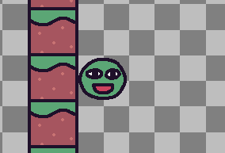
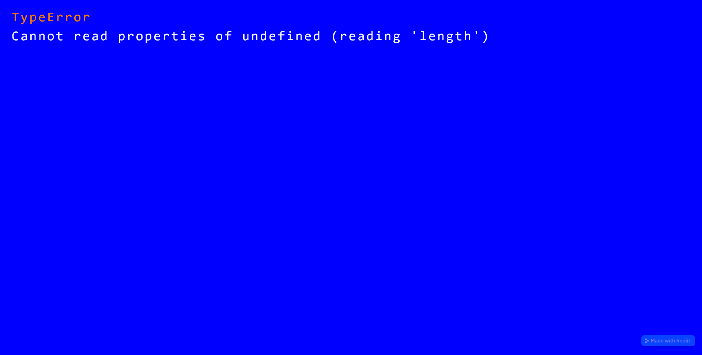
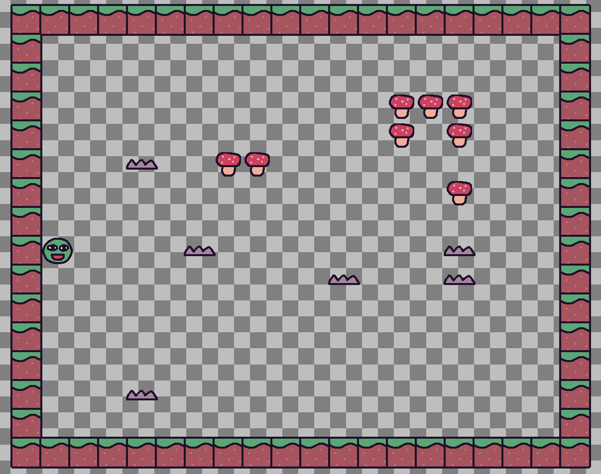

# 2.2.3 Cycle 3 - Room Generation & Collisions

## Design

### Objectives

My focus in this cycle is on room generation. My objectives are:

* [x] Create rooms in a grid system
* [x] Rooms consist of walls, spikes, and boxes
* [x] Every room is stored in an array so that the next one can be added when the last is defeated
* [x] Press t to start playing rooms (this will be replaced with a main menu system)
* [x] Press r to move on to the next room (this will be replaced with a door when all enemies have been defeated)
* [x] Add player collision for walls and boxes so the player can not walk through

### Usability Features

### Key Variables

| Variable Name    | Use                                                                                                                                                          |
| ---------------- | ------------------------------------------------------------------------------------------------------------------------------------------------------------ |
| `possibleLevels` | Is imported from the `./possibleLevels` file and is an array containing level data for the game.                                                             |
| `levelId`        | Represents the current level's identifier.                                                                                                                   |
| `level`          | Is the level object created using `addLevel()` function and contains the tile map for the current level. It is used to define the tiles and their behaviors. |
| `player`         | References the player entity in the level. It is obtained using `level.get("player")[0]`.                                                                    |

### Pseudocode

```
Import "possibleLevels" from "./possibleLevels"

Load sprite resources:
    loadSprite("door", "/sprites/door.png")
    loadSprite("grass", "/sprites/grass.png")
    loadSprite("spike", "/sprites/spike.png")
    loadSprite("mushroom", "/sprites/mushroom.png")

Define game start event:
    onKeyPress("t", () => {
        levelId = 0
        goToLevel(levelId)
    })

Define scene for each level:
    scene("level", (levelId) => {
        level = addLevel(possibleLevels[levelId], {
            tileWidth: 58,
            tileHeight: 58,
            pos: vec2(350, 45),
            tiles: {
                "=": () => [
                    sprite("grass"),
                    area(),
                    anchor("center"),
                    body({ isStatic: true }),
                    "entity",
                    "wall",
                ],
                "^": () => [
                    sprite("spike"),
                    area(),
                    anchor("center"),
                    "entity",
                    "spike",
                ],
                "+": () => [
                    sprite("mushroom"),
                    area(),
                    anchor("center"),
                    body({ isStatic: true }),
                    "entity",
                    "box",
                ],
                "8": () => [
                    sprite("door"),
                    area(),
                    anchor("center"),
                    body({ isStatic: true }),
                    "entity",
                    "door",
                ],
                "@": () => [
                    sprite("bean"),
                    area(),
                    anchor("center"),
                    body(),
                    "player",
                ],
            }
        })

        Define event to advance to the next level:
        onKeyPress("r", () => {
            levelId += 1
            destroyAll("entity")
            goToLevel(levelId)
        })

        Obtain player entity reference from the level:
        player = level.get("player")[0]

        // Movement and bullet code goes here

    })

Define function to go to a specific level:
    function goToLevel(levelId):
        destroyAll()
        go("level", levelId)

Start the game:
    init(() => {
        // Additional game initialization code
    })
```

## Development

### Outcome

The `possibleLevels` array is imported from another file and the necessary sprites are loaded.


```javascript
// Import the level data from "./possibleLevels"
import { possibleLevels } from "./possibleLevels";

// Load sprite resources
loadSprite("door", "/sprites/door.png");
loadSprite("grass", "/sprites/grass.png");
loadSprite("spike", "/sprites/spike.png");
loadSprite("mushroom", "/sprites/mushroom.png");
```


The `possibleLevels` array holds each level in symbol form which will then be translated into stationary sprites to form the level. It is called `possibleLevels` because I intend to modify the generation later to be randomly selected.


```javascript
export const possibleLevels = [
    [
    "====================",
    "=                  =",
    "=                  =",
    "=            +++   =",
    "=            + +   =",
    "=   ^  ++          =",
    "=              +   =",
    "=                  =",
    "=@    ^        ^   =",
    "=          ^   ^   =",
    "=                  =",
    "=                  =",
    "=                  =",
    "=   ^              =",
    "=                  =",
    "====================",
    ],
    [
    "====================",
    "=                  =",
    "=                  =",
    "=            + +   =",
    "=            + +   =",
    "=   ^              =",
    "=              +   =",
    "=                  =",
    "= @   ^        ^   =",
    "=          ^       =",
    "=                  =",
    "=                  =",
    "=                  =",
    "=   ^              =",
    "=                  =",
    "====================",
    ],
    ...
    //rest of the levels
    ]
```


Pressing 't' starts the level scene with an of `levelId` 0. I'm using scenes to organise the project since it makes it easy to understand what is happening.


```javascript
// Start the game when "t" key is pressed
onKeyPress("t", () => {
    let levelId = 0; // Initialize the level identifier
    go("level", levelId); // Go to the first level
});
```


The _x_th level from the `possibleLevels` array is added to the screen. Each character in the symbolic representation of the level is translated to a tile placed at that location, for example `=` corresponds to a grass block/wall. This creates the level on the screen.


```javascript
// Define the scene for each level
scene("level", (levelId) => {

    // Create the level object using the level data from possibleLevels
    const level = addLevel(possibleLevels[levelId], {
        tileWidth: 58, // Define the width of each tile block
        tileHeight: 58, // Define the height of each tile block
        pos: vec2(350, 45), // Define the position of the level's tile map on the screen
        tiles: {
            "=": () => [
                sprite("grass"), // Set the sprite for grass tiles
                area(),
                anchor("center"),
                body({ isStatic: true }), // Make the sprite solid and impassable
                "entity", // Add the entity component
                "wall", // Add the wall component
            ],
            "^": () => [
                sprite("spike"), // Set the sprite for spike tiles
                area(),
                anchor("center"),
                "entity", // Add the entity component
                "spike", // Add the spike component
            ],
            "+": () => [
                sprite("mushroom"), // Set the sprite for mushroom tiles
                area(),
                anchor("center"),
                body({ isStatic: true }), // Make the sprite solid
                "entity", // Add the entity component
                "box", // Add the box component
            ],
            "8": () => [
                sprite("door"), // Set the sprite for door tiles
                area(),
                anchor("center"),
                body({ isStatic: true }), // Make the sprite solid
                "entity", // Add the entity component
                "door", // Add the door component
            ],
            "@": () => [
                sprite("bean"), // Set the sprite for the player
                area(),
                anchor("center"),
                body(), // Enable physics for the player
                "player", // Add the player component
            ],
        }
    });
```


Pressing r will restart the scene with the next level from `possibleLevels`.


```javascript
    // Event handler for the "r" key press to advance to the next level
    onKeyPress("r", () => {
        levelId += 1; // Increment the level identifier
        destroyAll("entity"); // Destroy all entities
        go("level", levelId); // Go to the next level
    });
```


Defines the player from the player sprite which is placed when the level is added. This new system makes it easier to change the location the player appears for each level.


```javascript
    // Obtain a reference to the player entity
    const player = level.get("player")[0];
```


I moved the player movement and bullet code inside a scene so that key presses do not activate the code until the scene has been activated (levels have begun). This will be useful when I create a main menu at the start of the game.


```javascript
    // ... Movement and bullet code goes here

});
```


### Challenges

While adjusting the tile dimensions and the position of the level on the screen, the player's starting position was sometimes outside the level. To simplify things, I made the player's starting point part of the level so that it is always easy to control where the player starts. This will also make it easier in the future when I replace the test levels with some proper levels.

<figure><figcaption><p>The player sprites starts as part of the level</p></figcaption></figure>

## Testing

### Tests

| Test | Instructions                        | What I expect                                                         | What actually happens                                                     | Pass/Fail |
| ---- | ----------------------------------- | --------------------------------------------------------------------- | ------------------------------------------------------------------------- | --------- |
| 1    | Press t key.                        | Level and player appears.                                             | As expected.                                                              | Pass.     |
| 2    | Repeatedly press the r key.         | Game switches to the next level each time.                            | As expected however trying to go past the last level results in an error. | Pass.     |
| 3    | Move the player with WASD and dash. | Functions the same as in [Cycle 1](cycle-1-1.md) & [2](cycle-1-2.md). | As expected.                                                              | Pass.     |
| 4    | Shoot with mouse click.             | Functions the same as in [Cycle 2](cycle-1-2.md).                     | Bullet spawns far away from the player.                                   | Fail.     |

Unexpectedly the bullet appears far from the player sprite when the mouse is clicked, much further compared to in [Cycle 2](cycle-1-2.md). This is a major bug which I will address in the next cycle ([Cycle 4](cycle-1-4.md)).

Testing also revealed that trying to go past the last level resulted in an error as the code tried to pull from a position in `possibleLevels` which did not exist. I will also implement a catch for this in the next cycle.

### Images

<div data-full-width="false">

<figure><figcaption><p>Error shown when pressing r on the last level</p></figcaption></figure>

 

<figure><figcaption><p>Level successfully added</p></figcaption></figure>

</div>

### Evidence


