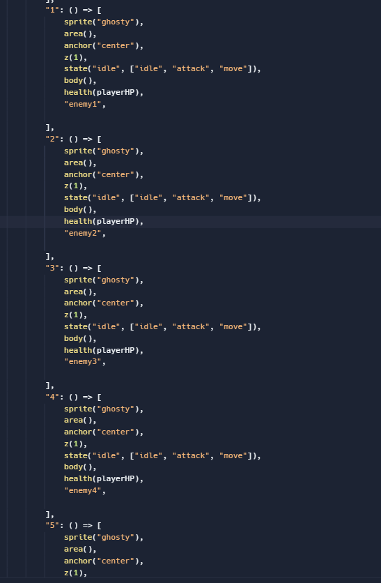
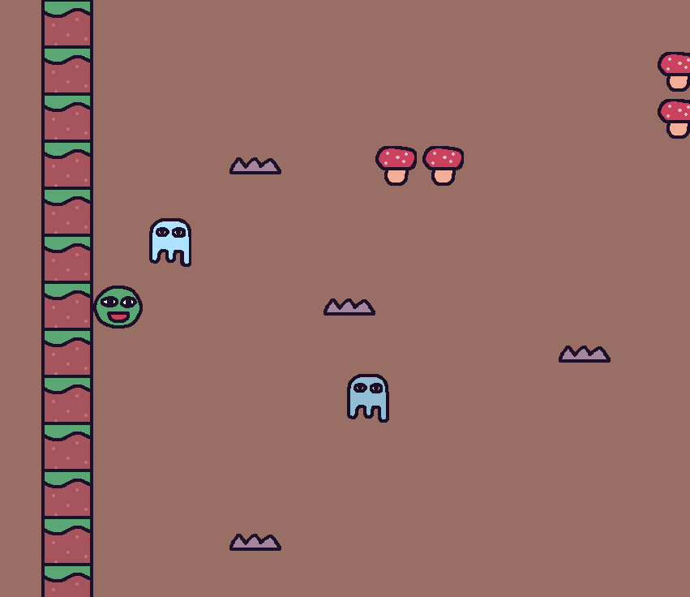
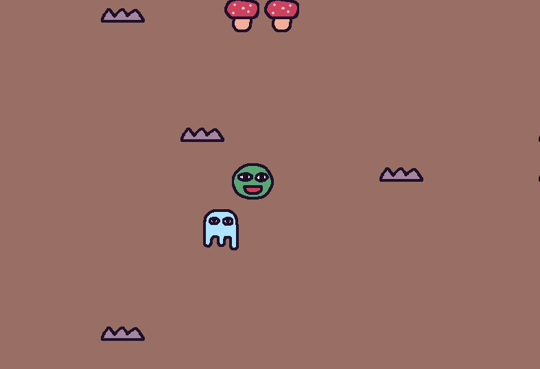

# 2.2.6 Cycle 6 - Basic Enemies

## Design

### Objectives

My focus in this cycle is to add some enemies. My objectives are:

* [x] Add enemies to the level generation so that they can appear in levels
* [x] Enemies will move toward the player
* [x] After a random amount of time, each enemy will stop and then move again
* [x] Enemies have set health and will take damage upon collision with bullets
* [x] Enemies die after all health is lost

### Key Variables

| Variable Name(s)                       | Use                                                                                                                                                                                                                                                  |
| -------------------------------------- | ---------------------------------------------------------------------------------------------------------------------------------------------------------------------------------------------------------------------------------------------------- |
| `ENEMY1HP`, `ENEMY2HP`  and `ENEMY3HP` | These constants represent the initial health points for different enemy types. They are used to set the initial health of enemies and determine when an enemy is defeated. For now, there is only 1 type of enemy so only `ENEMY1HP` is called upon. |
| `bulletDamage`                         | This variable represents the amount of damage inflicted by a bullet. It is used to subtract the bullet's damage from an enemy's health.                                                                                                              |
| `enemies1`                             | This variable stores an array of enemy objects of type "enemy1" present in the level. It is obtained using the `level.get` method.                                                                                                                   |
| `_t`                                   | This variable is a time counter used in the enemy's movement logic. It is incremented by the `dt()` function, which returns the time since the last frame.                                                                                           |
| `mobs`                                 | This variable represents a collection of mobile game objects. It is obtained using the `level.get` method and initially contains enemy objects. Later, it also stores additional mobile game objects collided with the player's bullets.             |

### Pseudocode

```
// Constants
const ENEMY1HP = 50
const ENEMY2HP = 50
const ENEMY3HP = 50
let bulletDamage = 10

// Level Setup
level = addLevel(possibleLevels[levelId], {
    tileWidth: 58,
    tileHeight: 58,
    pos: vec2(350, 45),
    tiles: {
        "=": () => [...],
        "^": () => [...],
        "+": () => [...],
        "8": () => [...],
        "@": () => [...],
        "1": () => [
            sprite("ghosty"),
            area(),
            anchor("center"),
            z(2),
            state("idle", ["idle", "move"]),
            body(),
            health(ENEMY1HP),
            "enemy1",
            "mob",
        ],
    },
})

// Enemy Movement
function activateEnemy1(enemy1):
    _t = 0

    enemy1.onStateEnter("idle", time):
        wait(time || rand(1, 3), () =>
            enemy1.enterState("move", rand(1, 3))
        )

    enemy1.onStateUpdate("idle"):
        _t += dt()
        t = _t % 2 - 1
        enemy1.color = lerp(
            rgb(255, 255, 255),
            rgb(128, 128, 128),
            t < 0 ? -t : t
        )

    enemy1.onStateEnter("move", time):
        wait(time, () => enemy1.enterState("idle", rand(1, 5)))
        enemy1.color = rgb(255, 255, 255)

    enemy1.onStateUpdate("move"):
        enemy1.moveTo(player.pos, 100)

    return enemy1

// Activate Enemy Movement for each enemy1
enemies1 = level.get("enemy1")
for i = 0 to enemies1.length:
    activateEnemy1(enemies1[i])

// Bullet-Mob Collision
mobs = level.get("mob")
onCollide("player_bullet", "mob", (b, m):
    destroy(b)
    if mobs[m]:
        mobs[m].health -= bulletDamage
        if mobs[m].health <= 0:
            destroy(m)
            delete mobs[m]
    else:
        initialHealth = 0
        if m.is("enemy1"):
            initialHealth = ENEMY1HP
        else if m.is("enemy2"):
            initialHealth = ENEMY2HP
        else if m.is("enemy3"):
            initialHealth = ENEMY3HP
        initialHealth -= bulletDamage
        mobs[m] = { health: initialHealth }
)

```

## Development

### Outcome

```javascript
// Define constants
const ENEMY1HP = 50;
const ENEMY2HP = 50;
const ENEMY3HP = 50;
let bulletDamage = 10;
```

I added a new tile definition to the level generation for enemies.

```javascript
// Level setup
const level = addLevel(possibleLevels[levelId], {
  tileWidth: 58,
  tileHeight: 58,
  pos: vec2(350, 45),
  tiles: { // Adding other tiles
    "=": () => [...],
    "^": () => [...],
    "+": () => [...],
    "8": () => [...],
    "@": () => [...],
    "1": () => [ // Enemies added as part of the tile map
      sprite("ghosty"),
      area(),
      anchor("center"),
      z(2),
      state("idle", ["idle", "move"]),
      body(),
      health(ENEMY1HP),
      "enemy1",
      "mob",
    ],
  },
});
```

The `activateEnemy1` function contains the idle and move states for an enemy and switches between them after a random time.

<pre class="language-javascript"><code class="lang-javascript"><strong>// Creat a list referencing every enemy
</strong><strong>const enemies1 = level.get("enemy1");
</strong>
// Enemy movement function
function activateEnemy1(enemy1) {
  let _t = 0;

  enemy1.onStateEnter("idle", (time) => {
    // Enemy goes into idle state for a random duration
    wait(time || rand(1, 3), () =>
      enemy1.enterState("move", rand(1, 3))
    );
  });

  enemy1.onStateUpdate("idle", () => {
    // Update enemy's appearance/color while idle
    _t += dt();
    const t = _t % 2 - 1;
    enemy1.color = lerp(
      rgb(255, 255, 255),
      rgb(128, 128, 128),
      t &#x3C; 0 ? -t : t
    );
  });

  enemy1.onStateEnter("move", (time) => {
    // Enemy goes into move state for a specified duration
    wait(time, () => enemy1.enterState("idle", rand(1, 5)));
    enemy1.color = rgb(255, 255, 255);
  });

  enemy1.onStateUpdate("move", () => {
    // Enemy moves towards the player's position
    enemy1.moveTo(player.pos, 100);
  });

  return enemy1;
};
</code></pre>

The `activateEnemy1` function is called for each `enemy1` present.

```javascript
// Activate Enemy Movement for each enemy1
const enemies1 = level.get("enemy1");
for (let i = 0; i < enemies1.length; i++) {
  activateEnemy1(enemies1[i]);
};
```

When a bullet collides with an enemy, the enemy loses `bulletDamage` health and if they lose all their health they die.

```javascript
// Bullet-mob collision
const mobs = level.get("mob");
onCollide("player_bullet", "mob", (b, m) => {
  destroy(b);
  if (mobs[m]) {
    // If the mob already exists in the mobs object, reduce its health
    mobs[m].health -= bulletDamage;
    if (mobs[m].health <= 0) {
      // If the mob's health reaches zero or below, destroy it
      destroy(m);
      delete mobs[m];
    };
  } else {
    // If the mob is a new enemy type, initialize its health
    let initialHealth = 0;
    if (m.is("enemy1")) {
      initialHealth = ENEMY1HP;
    } else if (m.is("enemy2")) {
      initialHealth = ENEMY2HP;
    } else if (m.is("enemy3")) {
      initialHealth = ENEMY3HP;
    };
    initialHealth -= bulletDamage;
    mobs[m] = { health: initialHealth };
  };
```

### Challenges

I faced severe challenges with making each enemy act independently. Initially, I attempted to add multiple enemies with one tag and add logic that operates on each one independently. However, I could not get this to work successfully as they would all wait the same random amount of time before stopping and moving again. This was a frustrating challenge as when approaching this problem, it seemed easy to implement. After a few days of trying to get things to work, I decided to take a different approach. I tried a different approach where I added multiple enemies to the level generation which each have a different tag, then I added state transitions for each one individually. However, I soon realised that this was an impractical and clunky approach.

<figure><figcaption><p>This was a bad approach</p></figcaption></figure>

So I went back to my old method and after a while, I managed to get it to work through the use of a function containing each state and calling that function for each enemy, as seen [above](cycle-1-5.md#outcome).

## Testing

### Tests

| Test | Instructions                                                   | What I expect                                                             | What actually happens | Pass/Fail |
| ---- | -------------------------------------------------------------- | ------------------------------------------------------------------------- | --------------------- | --------- |
| 1    | Run code and start level by pressing 'T'.                      | Enemies appear in the level.                                              | As expected.          | Pass.     |
| 2    | Wait.                                                          | Enemies swap between moving towards the player and standing still.        | As expected.          | Pass.     |
| 3    | Shoot an enemy 5 times.                                        | The bullet disappears each time and on the 5th shot the enemy disappears. | As expected.          | Pass.     |
| 4    | Go to the next level with 'R' and attempt to kill the enemies. | Enemies function and die the same as before.                              | As expected.          | Pass.     |

### Images

<div>

<figure><figcaption><p>Enemies</p></figcaption></figure>

 

<figure><figcaption><p>1 enemy was killed, 1 remains</p></figcaption></figure>

</div>

### Evidence


