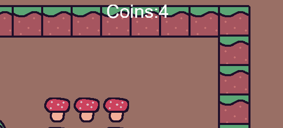

# 2.2.9 Cycle 9 - Bullet Damage & Coins

## Design

### Objectives

My main objective in this cycle is to add damage from the enemy bullets. I will also re-add features that I removed for simplicity while developing the enemy class in [Cycle 8b](cycle-1-8.md). My objectives are:

* [x] Re-add player health system and spikes
* [x] Re-add health bar
* [x] Re-add background colour
* [x] Enemy bullets can damage the player
* [x] Different enemy types deal different amounts of damage

My secondary objective is to add a coin system to the game:

* [x] Add a coin system where killing an enemy gives +1 coin
* [x] The number of coins is displayed by a counter in the corner of the screen
* [x] The coin counter accurately displays the number of coins, being updated after each enemy kill

#### Smaller Changes

* [x] Make the dash duration shorter but with a reduced cooldown time

### Usability Features

### Key Variables

| Variable Name      | Use                                                                                                                                                                                                                                                                                                                                        |
| ------------------ | ------------------------------------------------------------------------------------------------------------------------------------------------------------------------------------------------------------------------------------------------------------------------------------------------------------------------------------------ |
| `projectileSpeed`  | Defines the speed at which the projectile will move.                                                                                                                                                                                                                                                                                       |
| `coins`            | This variable keeps track of the number of coins collected by the player throughout the game. It's incremented by 1 each time the player defeats an enemy. The `updateCoinCounter()` function is then called to update the displayed coin count on the UI.                                                                                 |
| `coinCounter`      | This variable represents a UI element that displays the current coin count on the screen. It is positioned on the screen and is updated whenever the `coins` variable changes. This provides a visual representation of the current coin count to the player.                                                                              |
| `shootDamage`      | Represents the amount of damage dealt by the enemy's bullets to the player upon collision. This value is assigned to each bullet entity when it is created. It's used in the collision event handler between the bullets and the player to reduce the player's health points by the specified `shootDamage` value when a collision occurs. |
| `chosenLevelIndex` | Holds the index of the chosen level for the scene.                                                                                                                                                                                                                                                                                         |

### Pseudocode

```
function shootProjectile(targetPos):
    projectileSpeed = 500
    direction = targetPos - this.entity.pos

    create bullet entity with:
        sprite = "egg"
        position = this.entity.pos
        area component
        scale = (0.65, 0.65)
        color = (255, 0, 0)
        anchor = "center"
        rendering order = 2
        rotation = angle between this.entity.pos and targetPos + 270
        movement = move in direction with projectileSpeed
        tag "enemy_bullet"
        shootDamage = this.shootDamage
        destroy if offscreen

on collision between "enemy_bullet" and "player":
    destroy bullet
    reduce player's health by bullet's shootDamage
    playerHP = player's current health
    update health bar UI

function updateCoinCounter():
    increment coins by 1
    update coinCounter's text to "Coins:" + coins

scene "level" with chosenLevelIndex:
    create coinCounter UI element:
        text = "Coins:" + coins
        position = (1200, 10)
        rendering order = 10
        tag "coinCounter"

    ... // rest of scene code

    on destroy:
        destroy this entity
        update coin count using updateCoinCounter()
```

## Development

### Outcome

I re-added spikes and the health bar, content from [Cycle 5](cycle-1-4.md) after I removed them to develop [Cycle 8b](cycle-1-8.md).

I added `shootDamage` to the contructor and it is set to a different value for each enemy type. This value is then added to the bullets spawned by enemies.

<pre class="language-typescript" data-title="enemy class.ts"><code class="lang-typescript"><strong>    shootProjectile(targetPos: Vec2) {
</strong>        const projectileSpeed = 500; // Adjust as needed
        const direction = targetPos.sub(this.entity.pos);

        add([
            sprite("egg"),
            pos(this.entity.pos),
            area(),
            scale(0.65, 0.65),
            color(255, 0, 0),
            anchor("center"),
            z(2),
            rotate(this.entity.pos.angle(targetPos) + 270),
            move(direction, projectileSpeed),
            "enemy_bullet",
            { shootDamage: this.shootDamage },
            offscreen({ destroy: true }),
        ]);
    }
</code></pre>

When an enemy bullet and the player collide, the player will be damaged by the value of shootDamage.


```typescript
    onCollide("enemy_bullet", "player", (bullet, player) => {
        destroy(bullet);
        player.hurt(bullet.shootDamage);
        playerHP = player.hp();
        updateHealthBar();
    });
```


I created a coin counter which increments by 1 for each enemy killed and I placed the const inside the level scene so that it's only visible when the levels have started.


```typescript
export function updateCoinCounter() {
    coins += 1;
    const coinCounter = get("coinCounter")[0];
    coinCounter.text = "Coins:" + coins;
} //outside scene code

scene("level", (chosenLevelIndex) => { //scene start
//inside scene code
    const coinCounter = add([
        text("Coins:" + coins),
        pos(1200, 10),
        z(10), // Place on top of other elements
        "coinCounter",
    ]);
    
    ...//rest of scene
```


`updateCoinCounter()` is called from the enemy class when an enemy is killed.


```typescript
    destroy() {
        destroy(this.entity);
        updateCoinCounter();
    }
```


### Challenges

I found adding `shootDamage` to a bullet was a bit difficult at first, however, once I found out how to do it, it was quite simple.

## Testing

### Tests

| Test | Instructions                                        | What I expect                                                                     | What actually happens                                                                                                                                              | Pass/Fail   |
| ---- | --------------------------------------------------- | --------------------------------------------------------------------------------- | ------------------------------------------------------------------------------------------------------------------------------------------------------------------ | ----------- |
| 1    | Start level with t and get hit by enemy projectiles | Health bar decreases and enemy bullet is destroyed.                               | As expected.                                                                                                                                                       | Pass.       |
| 2    | Click to shoot at enemies.                          | Upon collision, the player bullet is destroyed.                                   | As expected.                                                                                                                                                       | Pass.       |
| 3    | Continue to shoot at enemies.                       | After being repeatedly hit, enemies die and the coin counter is incremented by 1. | As expected except sometimes if an enemy dies just before it is about to attack, the bullet will be spawned despite the enemy having been killed a second earlier. | Borderline. |
| 4    | Continue to get hit by enemy bullets.               | Health bar decreases until it is empty and the player dies.                       | As expected.                                                                                                                                                       | Pass.       |

All tests were successful except for a small bug in test 3.  In an upcoming cycle. will implement a check just before an enemy bullet is spawned which checks that the enemy is still alive before the bullet is shot.


Example of the bug


### Images

<figure><figcaption><p>Coin display after killing 4 enemies</p></figcaption></figure>

The coin counter displays correctly but I will move it more to the right in the next cycle so that it's in the corner more.

### Evidence


