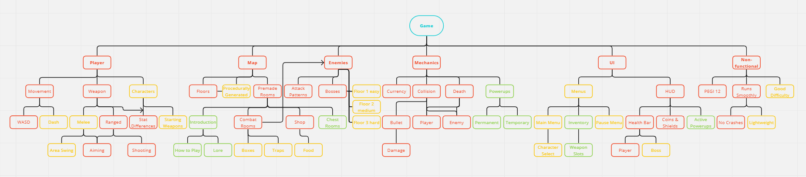
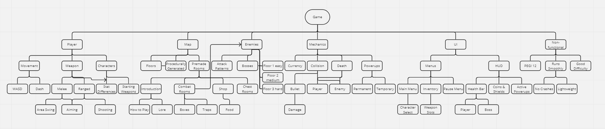

# 2.1 Design Frame

## Systems Diagram

<figure><figcaption></figcaption></figure>

This systems diagram shows the different parts of my game that I will focus on creating. I have split each section into smaller sub-sections. Throughout the development stage, I will pick one or two of these sections to focus on to build up the game gradually over time. I have broken the project down in this way as it roughly corresponds to my [success criteria](../analysis/1.5-success-criteria.md).

The diagram is colour-coded to show how important each feature is to my game, with the most important features in <mark style="color:red;">red</mark>, the least important in <mark style="color:green;">green</mark>, and those that are someh in <mark style="color:orange;">orange</mark>. A black-and-white version is also below for easier viewing.

<figure><figcaption></figcaption></figure>

## Usability Features

Usability is an important aspect of my game as I want it to be accessible to as many people as possible. I will be focusing on developing my project with a strong emphasis on 5 key points of usability to ensure I create the best possible user experience. These are:

### Effective

It's important that users are able to complete my game with completeness and accuracy. To do this, I will ensure it is easy for players to understand how to win by introducing the objective at the start of the game. Additionally, I will make the route through the game clear so that there is no confusion over where the players need to go.

#### Aims

* Create bosses as clear objectives to determine the end of a floor
* Make the overall objective and path of the game clear

### Efficiency

Efficiency refers to the speed and accuracy with which a user can complete the goal. To maximise efficiency, I will create a menu system that is easy to navigate through in order to find what you are looking for. Also, I will keep informational dialogue concise to avoid unnecessary complexity.

The controls must also be efficient in that they are intuitive to use and allow the user to carry out multiple actions.

#### Aims

* Create a menu system that is quick and easy to navigate through
* Create a control system that isn't too complicated but allows the player to do multiple actions

### Engaging

Creating a fun and engaging game is crucial. To achieve this, I'll design three levels and include a variety of weapons for players to enjoy and stay entertained. Furthermore, the game will stay exciting and engaging by including randomisation in chests and shop items, as well as randomly selected levels. This ensures that each playthrough offers a fresh and unique experience. Also, using a pixel art style may help draw in more people as pixel art games have become widely popular in recent years. [(Rocket Brush Studio, 2021)](../evaluation/reference-list.md#2.1-design-frame)

#### Aims

* Create a series of levels to work through
* Randomise map generation so the game feels different each time
* Incorporate a style of game art that suits the game

### Error Tolerant

My game should have as few errors as possible and if an error does occur, it should be corrected by my program. To do this, I will write my code so that my game will function in as many different game scenarios as possible to ensure that it will not crash when someone is playing it.

#### Aims

* The game doesn't crash
* The game does not contain any bugs that damage the user experience

### Easy To Learn

My game should be easy to play and not be overly complicated. To do this, I will create simple controls for the game as outlined [here](../analysis/1.4a-features-of-the-proposed-solution.md#controls). I will make sure that no more controls are added than are needed in order to keep them as simple as possible for the players.

#### Aims

* Create a list of controls for the game
* Create a simple tutorial that helps players learn how to play the game
