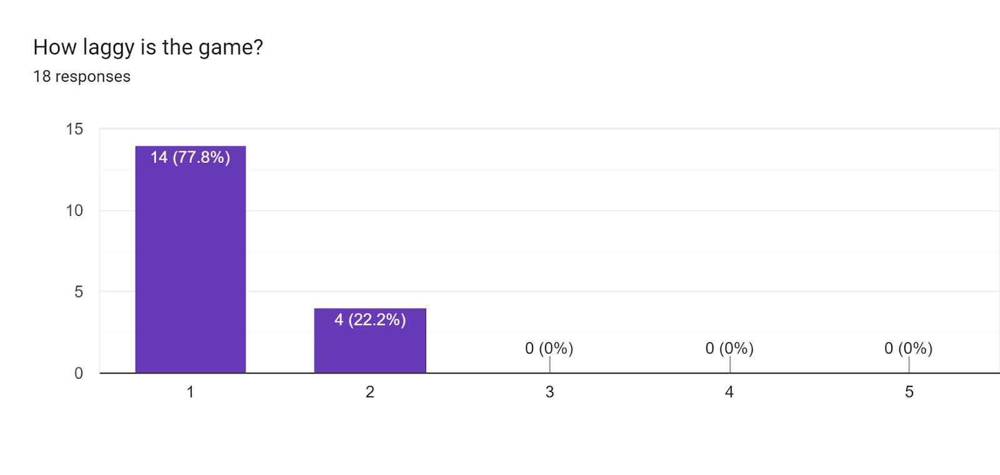
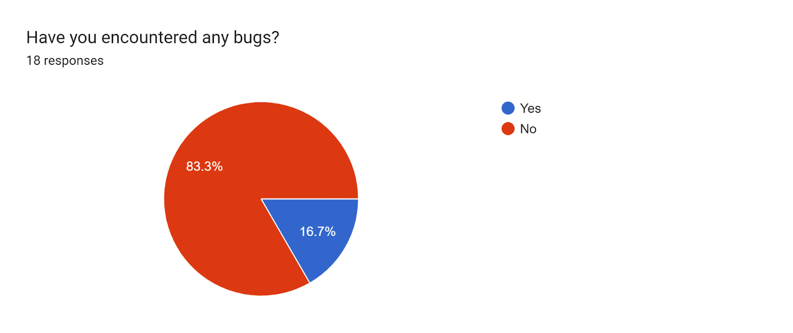
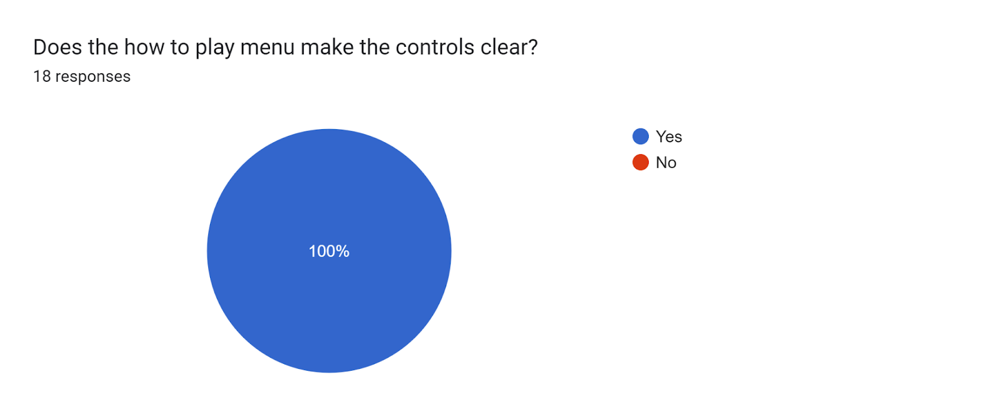

# 4.2 Evaluation of Usability Features

## Effective

| Feature No. | Description                                                       | Success/Fail |
| ----------- | ----------------------------------------------------------------- | ------------ |
| 1           | Create bosses as clear objectives to determine the end of a floor | Success      |
| 2           | Make the overall objective and path of the game clear             | Success      |

### Feature 1

I added boss fights in[ Cycle 14](../design-and-development/cycle-1-14.md) which the player must fight at the end of each floor before they can progress to the shop level. These serve as milestones in the game and a measurable form of progress that players can share with others which forms a social aspect of my game. When people were testing my game for my usability testing, I received a lot of verbal feedback such as "I made it quite far but died to the second boss" or "I beat the first boss, now I just need to kill the second". This suggests that the bosses in my game are good milestones and players get a sense of achievement when beating one. Also, I was very pleased that people liked playing my game and wanted to talk about it!

### Feature 2

I took many steps to make the overall objective of the game clear. There is an introduction level which I added in Cycle 13 where the shopkeeper will briefly explain that the goal of the game is to defeat the final boss. Also, if the player dies the loss screen displays the floor the player reached and the total number of floors (three) so the player knows how close they were. However, even if I didn't include these features, the objective of the game would still be somewhat clear because after each level you can only move forward to the next room so it is obvious that you need to get as far as possible.

Feedback from my usability testing was very positive. All of the 18 responses to the question "Is the objective of the game clear?" responded with 'Yes'. This shows that the objective and path through my game were well implemented and my game provides an effective solution with clear objectives.

<figure><figcaption></figcaption></figure>

## Efficient

| Feature No. | Description                                                                                                            | Success/Fail |
| ----------- | ---------------------------------------------------------------------------------------------------------------------- | ------------ |
| 1           | Create a menu system that is quick and easy to navigate through                                                        | Success      |
| 2           | Create a control system that is simple and not too complicated, while still allowinf the player to do multiple actions | Success      |

### Feature 1

I first added the menu and character selection system in Cycle 11 but I then improved it dramatically in Cycle 15 and Cycle 18 because it is very important that the menu system provides an optimal experience. I wanted to make the menus and character selection in my game as pleasant and easy as possible because you must interact with it at the start of every game and it is also going to be the first impression a player has of my game. I've made sure that the design is nice to look at and it is clear where you must click to do each action.

The feedback from my usability testing agreed. When asked the question "How easy are the menus to navigate?" 94% of respondents chose 1 on a scale of 1 to 5. This shows that the menu system in my game was clearly efficient and well-designed.

<figure><figcaption></figcaption></figure>

### Feature 2

The first player controls were added in the early cycles of my development: the movement controls in Cycle 1 and the aiming and shooting controls in Cycle 2. Later, weapon switching was added in Cycle 10 and pause menu functionality in Cycle 17. My goal was to add all of the necessary controls while keeping it simple. That's why I chose WASD movement and the mouse to aim and shoot since these controls feature a lot in other games. Also, switching items/tools is quite commonly done with the number keys in other games too. This means that I chose the tried-and-tested simplest way of implementing these features into my game.

The feedback for my usability testing was positive. When asked the question "How easy are the controls to use?" 17 of the 18 respondents chose either a 1 or 2 on a scale from 1 to 5. This shows that my controls were sufficiently simple and not too complicated. Perhaps a reason why more people didn't choose a 1 was because they did not read the how to play menu before playing. I have an idea to increase usability which I will discuss in [Maintenance and Future Development](4.3-maintenance-and-future-development.md).

<figure><figcaption></figcaption></figure>

## Engaging

| Feature No. | Description                                                      | Success/Fail |
| ----------- | ---------------------------------------------------------------- | ------------ |
| 1           | Ensure that players can play with different weapons              | Near success |
| 2           | Randomise floor generation so the game feels different each time | Success      |
| 3           | Incorporate an art style that suits the game                     | Success      |

### Feature 1

I've included multiple different weapons in my game which should keep the gameplay fresh and engaging for the player since each weapon is unique. I added the gear gun, brass spraygun and boomstick in Cycle 10 and the ironclad carbine and clockwork revolver in Cycle 13. Each weapon encourages different gameplay, for example, the boomstick encourages players to get up close and personal with enemies for maximum damage, while the ironclad carbine allows players to keep their distance and make use of the high accuracy.

Since using different weapons is a key part of my game, it's important that players know how to unlock them. When asked the question "Do you know how to get new weapons?", 80% of respondents said 'Yes'. While this question did not have as many responses as some of my other questions, it still suggests that there are some players who don't know how to unlock new weapons. This could be because some players didn't know to touch the shopkeeper in the intro level to make the introduction message appear. Some of the feedback I received suggested that this could be clearer and maybe that it could be more detailed.

<figure><figcaption></figcaption></figure>

<figure><figcaption>
Comment suggesting to make the introduction level clearer
</figcaption></figure>

<figure><figcaption>
Comment suggesting that some users weren't sure how the weapon system works
</figcaption></figure>

### Feature 2

The randomly generated levels are an important aspect of my game because they prevent the gameplay from being boring by always fighting the same enemies in the same order. The random generation means that players never quite know what they will encounter in the next room, which helps keep the game engaging. Random rooms and the floor layout were added in Cycle 7 and finished in Cycle 12 then later properly balanced at the end of development in Cycle 19.

There are only 5 possible levels on each floor so there is a chance that levels could sometimes be repeated. I could add more possible levels to the game to reduce the chance of repeats and add more diversity.

### Feature 3

I chose to use a pixel art style for my game because it makes it clear for players to differentiate key elements, sprites are quite simple to make, and it looks good. The art style of a game is really important because if it looks bad then players will not want to play. My game uses a mixture of default Kaboom sprites and sprites I made myself using a sprite maker tool. At first, everything in my game used a Kaboom sprite but over time during development, I began changing things to custom sprites which I made myself to fit better.

The feedback from my usability testing was positive. When asked the question "Did you like the art style?", all respondents said 'Yes'. This suggests that the art style in my game was a success and that it looked good. I was pleased that people liked the art style because I found it quite hard making sprites because it isn't something I feel naturally comfortable with.

<figure><figcaption></figcaption></figure>

## Error Tolerant

| Feature No. | Description                                                        | Success/Fail |
| ----------- | ------------------------------------------------------------------ | ------------ |
| 1           | The game doesn't crash or freeze                                   | Success      |
| 2           | The game does not contain any bugs that damage the user experience | Success      |

### Feature 1

If the game crashed or froze this would disrupt gameplay and potentially ruin the user's experience of my game if it is unplayable. Thankfully my usability testing showed that there were no issues, despite being tested on a variety of different machines. When asked the question "How laggy is the game?" all respondents chose either a 1 or a 2 on a scale of 1 to 5 where 1 is the least lag and 5 is the most lag. This suggests that the game ran smoothly without any freezing or crashing. In the written sections of my feedback form, there was also no mention of any issues.

<figure><figcaption></figcaption></figure>

### Feature 2

It's important that my game is as bug-free as possible so as to not harm the user's experience. During my cycles, I fixed all of the bugs I was aware of while developing, even dedicating a portion of Cycle 16 to fixing some issues which I'd picked up on. Therefore I was pleased that 83% (15 of 18) of players didn't encounter a single bug while playing my game. The issues reported to me highlighted that the game window doesn't scale properly on small screen sizes but this can be resolved by using the zoom tool to zoom out in your browser. While this issue may be out of my hands, I could include a message explaining what to do in the game if this happens to you. There was also a message claiming to have a problem with fullscreen but I couldn't replicate this and nobody else reported having a problem with it so I suspect that the problem was on their end.

Overall my game had very few bugs and they did not greatly harm the user experience because they could be easily resolved. This makes my game very error-resistant because I have produced a solution which does not have any major bugs which can harm gameplay.

<figure><figcaption></figcaption></figure>

<figure><figcaption>
Comment highlighting the issue on small screens
</figcaption></figure>

<figure><figcaption>
Another comment on the same issue
</figcaption></figure>

## Easy To Learn

| Feature No. | Description                                                        | Success/Fail |
| ----------- | ------------------------------------------------------------------ | ------------ |
| 1           | Create a how to play screen which helps players learn the controls | Success      |
| 2           | Create a simple tutorial that tells players the game's objective   | Success      |

### Feature 1

I added the how to play screen in Cycle 11 using text to describe the controls but then I updated the menu to use a visual graphic I made in Cycle 15 since this more clearly shows the controls. The aim of the how to play menu is to make the controls easy enough to learn. The feedback from my usability testing suggests I was successful because when asked "Does the how to play menu make the controls clear?", 100% of my 18 respondents chose 'Yes'. This shows that I designed the menu well because it helps the players quickly pick up the controls before jumping right into playing my game.

<figure><figcaption></figcaption></figure>

### Feature 2

I added the introduction level in Cycle 12 and tweaked it later in development. It has the shopkeeper in the centre of the level and when the player touches the shopkeeper, a message appears which explains the objective of the game. This makes the game easier to learn because the objective is clear from the start of the game, therefore the player knows what they are working towards and gains a basic feel understanding of the game. Below is the message which the shopkeeper says.

> The Evil Shapes are invading our world from another dimension! You must defeat The Evil Shapes through 3 floors and defeat the Shape King to restore balance before it is too late. Enemies get stronger the further you go. If you find me later I can sell you some items to help. Good luck!
