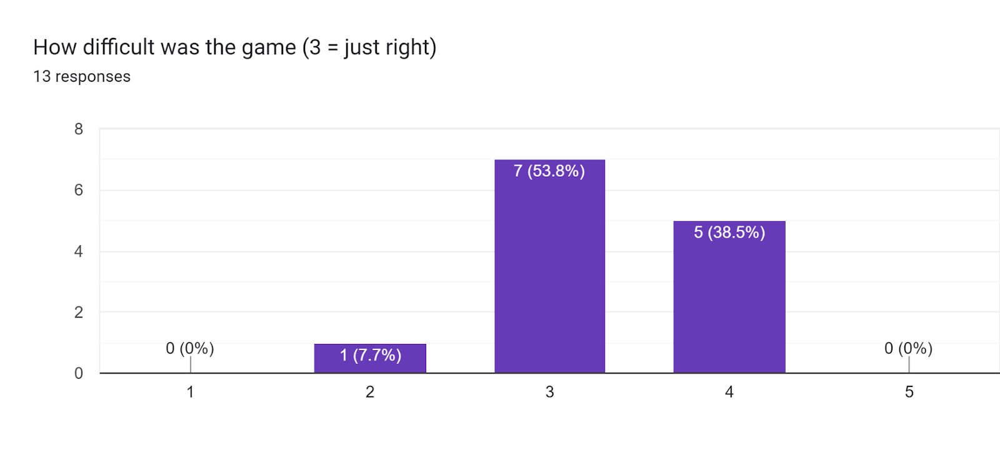

# 4.3 Maintenance and Future Development

## Current Limitations of the Project

* **Lack of enemy variety** - Different enemy types are too similar and there is not much to differentiate between them other than more health and damage.
* **Basic shop layout** - Due to time constraints I was not able to implement my initial plan for the shop into the game and instead it has a more basic setup.
* **Missing powerups** - Powerups are another feature which I would have liked to include if I had more time and I think that they would really add to the game.
* **Limited graphics** - My game's visuals are somewhat basic as there are no animations or particle effects.

## Maintenance

If I decided to keep the game fundamentally the same as it is now, then I would only need to implement short-term changes and fixes to address any tweaks which need to be made. The current limitations of the project would not need to be expanded or changed and after resolving any outstanding bugs, the game would be ready for final release. This could continue to be done by me as the game would not be expanding in a substantial way, and I have used inline comments to make sure that I can continue to understand how the code works even if it is something I worked on a while ago.

When considering the game's potential for growth, a lot of new features could be added. However, first I would still need to implement the short-term changes to ensure that my game has a solid foundation for future development cycles. Then I would review the current limitations of my project to decide the objectives of the upcoming cycles. As my project grows, it is really important that I maintain good code readability and continue to use comments to effectively explain each part so that it can easily be understood in the future. Additionally, at some point, it may become beneficial to bring others in to assist in developing the game and create a team to work collaboratively - resolving bugs and implementing new features.

## Future Development

### Short Term Plan

#### Game balancing

Feedback from my usability testing revealed that some users found some weapons were not properly balanced and that the game may be a bit too difficult. While the majority of users thought that the balance of the game was just right, the response to the question asking how difficult the game is was weighted more to the harder side, as shown below. Feedback told me that the increase in difficulty at floor 3 is too high. To fix this I could tone down some of the statistics for enemies 4, 5 and 6 and I could change some of the spawn locations on floor 3 so that enemies start further away from the player.

<figure><figcaption></figcaption></figure>

Another thing contributing to the balancing issue is how bosses spawn minions in boss fights. The system works on random chance but this means that sometimes a boss may spawn no minions and it is too easy, or a boss could spawn a lot of minions and it is too hard. To fix this I could change the percentage chance of spawning to a fixed spawning system where a boss will always spawn minions after shooting a certain number of times. This change would make boss fights more consistent and a fairer fight for players because their success in it would depend on their skill instead of random chance.

<figure><figcaption>
Feedback suggesting a boss change
</figcaption></figure>

I received lots of feedback regarding the weapons and pricing in the shop not being properly balanced. The price of each weapon in the shop doesn't accurately correspond to how good each weapon actually is. The more expensive weapons (the ironclad rifle and clockwork revolver) are too weak while one of the cheaper weapons (the brass spraygun) is too strong. To address this I would reduce the damage and rate of fire of the spraygun while increasing the rate of fire of the ironclad rifle and increasing the accuracy and damage of the clockwork revolver. The boomstick weapon is mostly balanced but I would still increase the number of projectiles it fires, while reducing the damage per projectile, to keep it roughly the same but making it feel more shotgun-like. Below are some examples of user feedback I received from my usability testing regarding weapon balance.

<figure><figcaption></figcaption></figure>

<figure><figcaption></figcaption></figure>

<figure><figcaption></figcaption></figure>

#### Unclear introduction level

Feedback from my usability testing suggested that the introduction level could benefit from being made clearer. As explored in my [Evaluation of Usability Features](4.2-evaluation-of-usability-features.md), some users may not have known how to interact with the shopkeeper and hence never seen the introduction message. To address this I could add a small '!' or '?' symbol above the shopkeeper's head, or a small message saying 'touch to interact'. This would make it clear to the players what they need to do.

<figure><figcaption>
Feedback suggesting making the introduction level clearer
</figcaption></figure>

I could also make the introduction level clearer by adding a bit more detail to the shopkeeper's message. I would add a sentence explaining more about the different weapons and another sentence saying to proceed through the door ahead of you to start the next level. This would just explain how the game works a bit better and make it easier for players to understand what to do.

#### Not enough levels for random selection&#x20;

While the levels on each floor are random, there are not that many possible levels to choose from so every so often there will be the same level twice in a row and it is possible to recognise some of the enemy spawn positions in a level you've seen a lot before. Adding more possible levels for each floor would solve this because it would reduce the chance of players seeing the same level twice. It would also make each run feel more unique because you wouldn't be able to recognise enemy spawn locations anymore. Adding more levels is very easy because I just need to write some more tile maps for each floor, it just takes some time.

### Long-Term Addressing Limitations

#### Enemy variety

Currently, all of the enemy types in the game are quite similar because they all move and attack in the same way. One of the key parts of my game is that players should be able to learn enemy patterns and it would make the game more engaging if there was more variety among enemies. For example, some enemy types could shoot two or three projectiles at once, or in quick bursts, like how the bosses do. It would be interesting for some enemies to be very quick and move fast before stopping, while other enemies move slowly but for a long time. One idea for a new enemy is one which does not shoot back but always moves towards the player and deals damage if it is able to touch them. There is a lot of potential with remodelling enemies in this way and it would definitely be a lot of fun if each enemy had some sort of unique mechanic.

#### Shop layout

When beginning the development of my game, I had planned to implement the shop similarly to in Enter the Gungeon or Soul Knight - where the player can see each item and then walk up and interact with the one they want to buy, as described in my [Features of the Proposed Solution](../analysis/1.4a-features-of-the-proposed-solution.md). If I had done this in my game, the shop would have been a lot more interesting and the shop room would not feel so empty. However, due to time constraints, I did not have enough time to do this so I settled for using a menu and key press system instead, which does the job, but doesn't effectively communicate what each item is before a player buys it.

Given future development, I would definitely modify the shop system to use some sort of table or pedestal with each item on, to which the player can walk up and press E to buy. A small window could appear when touching the item which tells the player the name and the price and briefly describes what it does. Below are examples of the shop layouts in Enter the Gungeon and Soul Knight, to which my shop would be similar.

<figure><figcaption>
Enter the Gungeon shop
</figcaption></figure>

 

<figure><figcaption>
Soul Knight shop
</figcaption></figure>

Additionally, by changing the shop in this way I could also randomise the items which appear to make it different each time. This would make the shop more interesting because sometimes players would have to change their strategy if the weapon they are looking for is not there.

#### Powerups

Including powerups formed part of the initial plan I had for my game, however, I didn't include them because I wanted to save time to work on other features. I think that adding powerups would really benefit my game because it would make it feel more dynamic and players would enjoy receiving boosts.

The way I would implement powerups in my game would be by boxes having a small chance of giving one when destroyed and also being able to purchase them in the shop for coins. It would be important to make it clear to the player how long the powerup is active, so a small icon and timer would appear on the side of the screen to count down the remaining powerup time.

There is a lot of potential with powerups and there are many different options for powerups which could be included, for example, attack boost, damage reduction, faster dashing or increased movement speed. Adding powerups would definitely be a priority in the future development of my game and would definitely improve it a lot.

#### Graphics

A way to improve the engagement of the game would be to expand on the limited graphics. While my game deliberately uses a simple art style, adding other things such as idle and attack animations or different particle effects would make gameplay feel more immersive and detailed.
