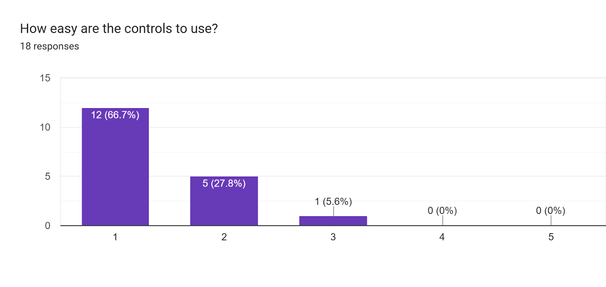
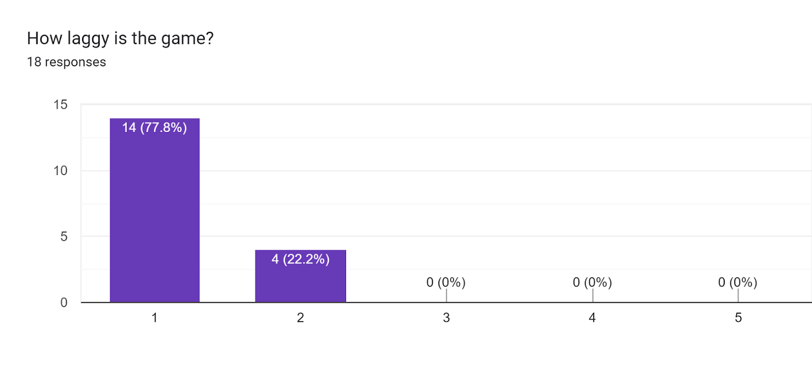
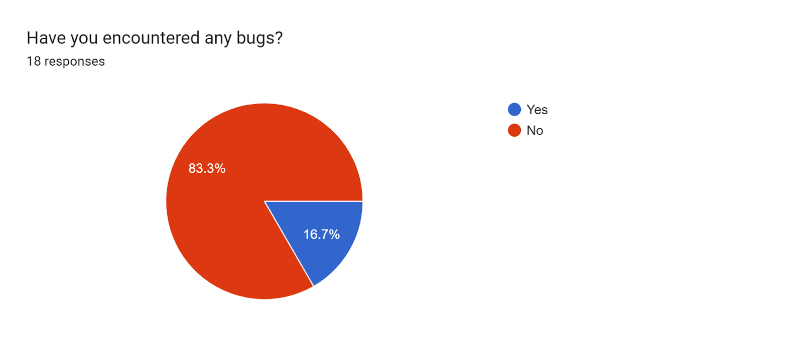
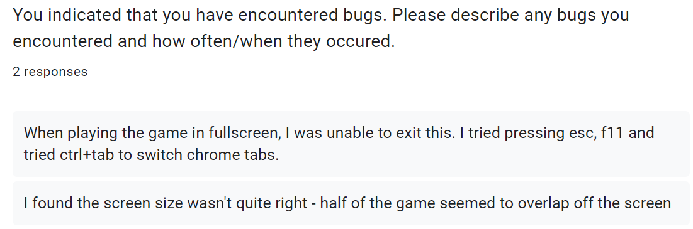
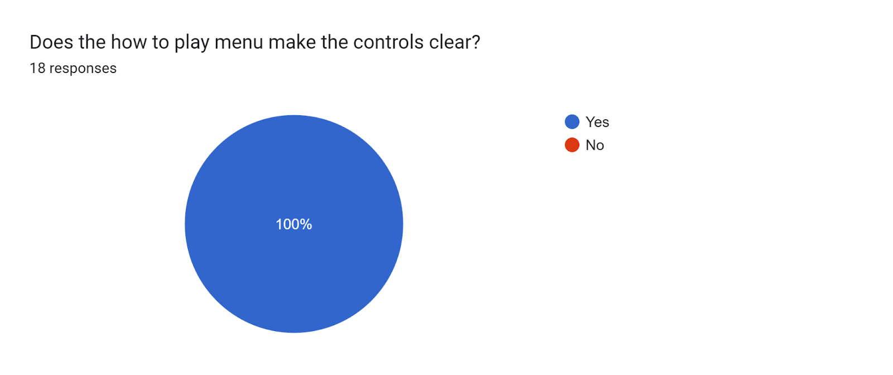
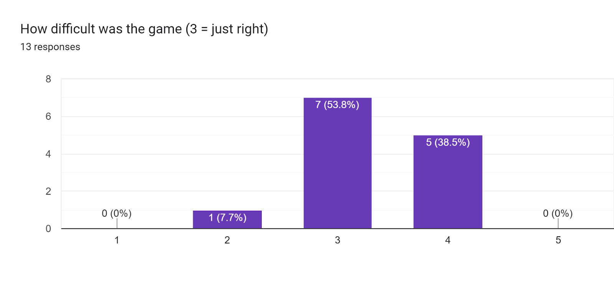

# 3.2 Usability Testing

## Criteria To Assess

| Test               | Test Details                                                                             |
| ------------------ | ---------------------------------------------------------------------------------------- |
| 1 - Effective      | Is the objective of the game clear?                                                      |
| 2 - Efficient      | 
Is the menu and character selection easy to use? Are the controls easy to use?
 |
| 3 - Engaging       | Is the game fun to play?                                                                 |
| 4 - Error Tolerant | 
Does the game lag? Have you encountered any bugs?
                              |
| 5 - Easy to Learn  | Does the how-to-play menu make it easy to learn the controls?                            |

To gather responses to these questions, I sent my game to friends and family and asked them to complete a survey after playing. Below are the results of each question.  In total, I received 18 responses to my form. I will go over the results in greater depth during my project evaluation.

### User Feedback

#### 1 -Effective

<figure><figcaption></figcaption></figure>

100% of respondents answered that the game's objective is clear, which is great. It's a fundamental necessity for players to know what to do and the fact that everyone knew what to do helped them jump right into playing the game. The success of this question is likely due to in part the introduction level at the start of the game which explains the key objective of the game.

#### 2 - Efficient

<figure><figcaption></figcaption></figure>

All respondents found the menus either very easy (94.4%) or easy (5.6%) to navigate. This means that it was easy for players to jump right into playing, or start a new game. It also shows that the menus were well-designed and easy to use, which is something I focussed on creating.

<figure><figcaption></figcaption></figure>

The vast majority of respondents found that the controls were either very easy (66.7%) or easy (27.8%) to use. Only one respondent said that the controls were neither easy nor difficult to use. Overall, this suggests that the controls for my game were sufficiently simple and not a challenge for new players. This means that players can focus on developing their skills and are not frustrated by an inefficient or complicated control scheme.

#### 3 - Engaging

<figure><figcaption></figcaption></figure>

22.2% of respondents said the game was 'fun' and the remaining 77.8% said the game was 'very fun'. It is great to see that everyone enjoyed my game and that I made it sufficiently engaging. I also received a lot of written comments which said the game was fun to play, a few of which I have added below.

<figure><figcaption></figcaption></figure>

<figure><figcaption></figcaption></figure>

<figure><figcaption></figcaption></figure>

#### 4 - Error Tolerant

<figure><figcaption></figcaption></figure>

All respondents either said that there was no lag at all (77.8%) or a small amount of lag (22.2%). This is great to see since it means that my game is not too computationally demanding or resource-intensive. Therefore it is possible to play it on lower-end computers, which increases the audience who can play my game.

<figure><figcaption></figcaption></figure>

The majority of players (83.3%) encountered no bugs at all which is great as it suggests that my game is largely bug-free. Of the 16.7% of responses that said they experienced at least one bug, most of the reported errors involved a problem with window sizing on very small laptop screens. The way to resolve this issue is by reducing the scale in your browser to zoom it out until everything fits in, perhaps at 75% zoom for example. I think this may be an issue out of my control but in future development, I could do my best to try and address it in any way I can.

<figure><figcaption></figcaption></figure>

#### 5 - Easy to Learn

<figure><figcaption></figcaption></figure>

100% of respondents found that the how to play menu makes the controls clear. This shows that I designed the how to play screen clearly well so players can easily learn the controls and jump right into playing my game.

## Usability Requirements in Success Criteria

Some of the success criteria requirements fall into the section of usability. These will also be tested now and are listed below:

| Criterion | Description                                               |
| --------- | --------------------------------------------------------- |
| 32        | The game should provide a challenge without being unfair. |
| 33        | The game should meet the PEGI 12 guidelines.              |

### Criterion 32

> The game should provide a challenge without being unfair.

<figure><figcaption></figcaption></figure>

The majority of respondents (53.8%) thought that the balance of the game was just right, a significant proportion of respondents (38.5%) thought that it was a bit too hard, and a small proportion (7.7%) thought that it was a bit too easy. This suggests that I could make the game slightly easier because players weighed it up more to the harder side but overall it was still good.

### Criterion 33

> The game should meet the PEGI 12 guidelines.

<figure><figcaption></figcaption></figure>

100% of respondents agreed that my game meets the requirements for a PEGI 12 rating. The violence in my game is mild and there is no graphic language or any scenes which could cause players to think that my game should have a higher age rating.
